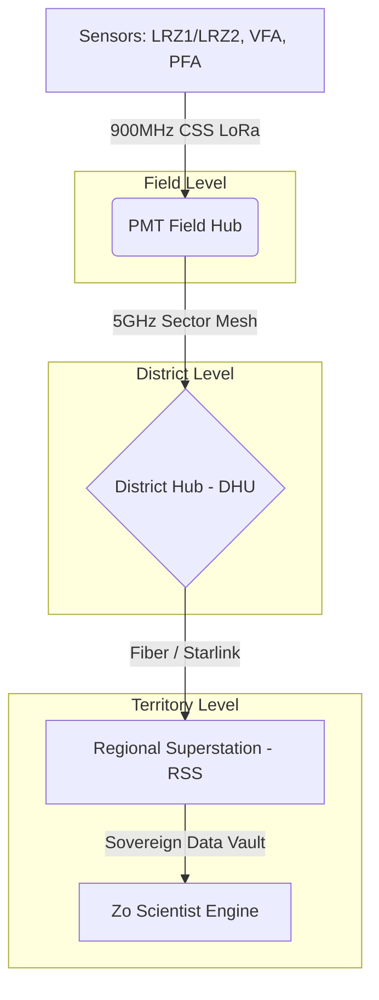

# FarmSense Master Manual: The Deterministic Farming Operating System

---

## **Table of Contents**

1.  **PART I: EXECUTIVE FOUNDATION (The Sovereign Blueprint)**
    *   1.1 Definitive Systems Architecture Blueprint
    *   1.2 Hydro-Economic Logic and The Deterministic Paradigm
    *   1.3 Thermodynamics and Material Science Stress-Testing
    *   1.4 Non-Dilutive Capital & Global Infrastructure Strategy
    *   1.5 Advanced Software & Dual-Use Military Capabilities
    *   1.6 Technical Project Overview & Scope
    *   1.7 Long-Term Roadmap: Sovereign Water Infrastructure
    *   1.8 Strategic Infrastructure: The Monte Vista Logistics Hub
    *   1.9 Executive Risk Factors & Mitigation Protocols
2.  **PART II: MARKET INTELLIGENCE & STRATEGIC FUNDING (The Resource Moat)**
    *   2.1 TAM/SAM/SOM: The $1Trillion Resource Moat
    *   2.2 Competitive Moat: Determinism vs. Stochastic Estimation
    *   2.3 Federal & State Funding Environment (SBIR/NRCS)
    *   2.4 The "Hydro-Economic" Multiplier Analysis
    *   2.5 Global Expansion Roadmap: Basins of Interest
3.  **PART III: THE TECHNICAL CORE (The Sovereign Ledger)**
    *   3.1 Tri-Layer Compute Topology (Field, District, Region, Cloud)
    *   3.2 SQL Schema: TimescaleDB & PostGIS Sovereign Vault
    *   3.3 API Specifications: The Nexus of Data Ingestion
    *   3.4 Interpolation Methodology: Regression Kriging & IDW
    *   3.5 The Adaptive Recalculation Engine: "Fisherman's Attention"
    *   3.6 Sensor Anomaly Detection & Self-Healing Logic
    *   3.7 Spatial Privacy: The Zero-Knowledge Differential Framework
    *   3.8 Master Firmware Specifications: Silicon Logic State Machines
4.  **PART IV: THE HARDWARE ECOSYSTEM (The Hardware Encyclopedia)**
    *   4.1 District Hub (DHU) V2.0: Basin Nerve Center
    *   4.2 Pivot Motion Tracker (PMT) V1.9: The Kinetic Oracle
    *   4.3 Pressure & Flow Anchor (PFA) V3.0: Well-Head Auditor
    *   4.4 Vertical Field Anchor (VFA) V2.1: Deep-Truth Probe
    *   4.5 Lateral Root-Zone Surveyor (LRZ) V1.2: The Expendable Fleet
    *   4.6 Component-Level Bill of Materials (BOM) & PCB Stackups
5.  **PART V: THE INTERFACE LAYER (The Portal Blueprint)**
    *   5.1 The Farmer Dashboard (3D VRI Control & Resolution Pop)
    *   5.2 Regulatory Portal (The Immutable Water Court Audit)
    *   5.3 Admin Dashboard (Fleet C&C & Sled Hospital Monitor)
    *   5.4 Investor ROI Dashboard (Impact & Arbitrage Metrics)
    *   5.5 Grant & Research Portals (The Scholarly Bridge)
    *   5.6 Frontend Tech Stack: React 19, Three.js, TailwindCSS
6.  **PART VI: THE HYDROLOGIC ORACLE (The Science of Truth)**
    *   6.1 SPAC Thermodynamics: Surface Energy Balance (SEB) Modeling
    *   6.2 Mathematical Derivation: Cokriging with Matern Kernels
    *   6.3 Crop-Specific Calibration Libraries (Potato, Barley, Alfalfa)
    *   6.4 Forecasting Architecture: LSTM, Transformers, & Ensemble Priors
7.  **PART VII: OPERATIONS & EXECUTION (The Mission Control SOP)**
    *   7.1 The 50-Week Industrial Implementation Roadmap
    *   7.2 Field Deployment SOPs: Step-by-Step Commissioning
    *   7.3 Maintenance Protocols: The Sled Hospital Workflow
    *   7.4 Global Strategic Roadmap (2026-2030+)
8.  **PART VIII: THE WATER COURT LEDGER (Legal & Ethics)**
    *   8.1 Legal Admissibility Framework: The NREP Standard
    *   8.2 Cryptographic Chain of Custody: Merkle Tree Proofs
    *   8.3 Data Sovereignty: Zero-Knowledge Privacy & Search Warrants
9.  **PART IX: INFRASTRUCTURE & DEVOPS (The Global Backbone)**
    *   9.1 AWS EKS Reference Architecture & Scaling Metrics
    *   9.2 GitOps Strategy: Terraform, ArgoCD, & Sovereign Audit
    *   9.3 Disaster Recovery: RPO/RTO & "Hydraulic Blackout" Logic
10. **PART X: STRATEGIC FINANCIALS (Aqua-Economics)**
    *   10.1 The "Hydrologic Arbitrage" Model & Delta Capture
    *   10.2 Global "Aqua-Standard" Roadmap & Sovereign Funds
    *   10.3 Geopolitics of Water: Trans-Boundary Conflict Mitigation
11. **PART XI: THE SLV HYDROLOGIC CASE STUDY**
    *   11.1 Empirical Results: 2026 Pilot Data & Yield Variance
    *   11.2 API SDK Implementation Guide & Dev Setup
12. **PART XII: GLOBAL STANDARDS & SUSTAINABILITY**
    *   12.1 GlobalG.A.P. Compliance & Water Stewardship
    *   12.2 Nitrogen Leaching Prevention & Carbon Sequestration
13. **PART XIII: CYBERSECURITY & SOVEREIGN HARDENING**
    *   13.1 Zero-Trust Architecture & Threat Modeling
    *   13.2 eBPF Kernel Auditing & Lateral Movement Prevention
14. **PART XIV: THE EXIT STRATEGY & FINANCIAL BACKBONE**
    *   14.1 Hyper-Granular 10-Year Cash Flow Projections
    *   14.2 CAPEX/OPEX Breakdown (Regional Superstation Units)
    *   14.3 Strategic M&A Exit Roadmap & Valuation Models
15. **PART XV: THE PILOT MISSION SPECIFICATION (Nuts & Bolts)**
    *   15.1 Site Selection: Center, CO Phase 1 Blueprint
    *   15.2 Pilot Bill of Materials (BOM): Full Hardware Manifest
    *   15.3 Commissioning Checklist: From Sled-Drop to Kriging Truth
16. **PART XVI: THE HUMAN CAPITAL (Team & Organization)**
    *   16.1 Executive Leadership & Scientific Advisory Board
    *   16.2 Technical Org Chart: Hardware, Software, & Data Science
    *   16.3 Recruitment Roadmap: Basin Logistics & Support Tiers
17. **PART XVII: THE FEDERAL GRANT REGISTRY (167 Targets)**
    *   17.1 USDA & NRCS Conservation Portfolios
    *   17.2 NSF & DOE Innovation Streams
    *   17.3 Philanthropic & NGO Integration (Gates, Nature Conservancy)
18. **APPENDICES**
    *   A: Full Bill of Materials (BOM) - Itemized Catalog
    *   B: Mechanical Assembly Tolerances & Thermal Simulation
    *   C: Radio Propagation Models (915MHz LoRa & 5GHz Sector)
    *   D: FarmSense Nomenclature & Technical Dictionary
    *   E: Firmware State-Machine Finite Logic Tables
    *   F: Installation & Calibration Field Checklists
    *   G: Full Electrical Schematics & PCB Netlists
    *   H: Quality Assurance & Stress Test Results (MIL-STD-810H)
    *   I: Firmware Testing & Unit Test Specifications
    *   J: Regional Satellite Covariates Index (Sentinel-2/Lidar)
    *   K: Fleet Maintenance & Sled Hospital Audit Logs
    *   L: SQL Query Library for Regulatory Compliance
    *   M: Cited References: Global Hydrologic & Economic Bibliography

---

\n---\n\n## PART I: EXECUTIVE FOUNDATION (STRATEGIC BLUEPRINT)\n
## 1.1 Definitive Systems Architecture Blueprint

This document constitutes the definitive technical, operational, and financial deployment blueprint of the FarmSense agricultural technology and Internet of Things (IoT) platform, actively integrating across Subdistrict 1 of the San Luis Valley (SLV), Colorado. Engineered as a "Deterministic Farming Operating System," FarmSense replaces stochastic, intuition-based agricultural practices with a high-fidelity, rule-based computational engine. The platform's ultimate objective is to optimize the Soil-Plant-Atmosphere Continuum (SPAC) using an expansive multi-layered sensor network, aiming for a 20–30% reduction in irrigation water consumption alongside an 18–22% increase in crop return on investment (ROI).

The primary economic catalyst for this deployment is the severe hydro-economic crisis characterizing the Rio Grande Basin. Driven by an 89,000 acre-foot annual aquifer depletion rate and stringent compliance mandates under the 1938 Rio Grande Compact, the local Rio Grande Water Conservation District (RGWCD) has imposed a highly punitive $500 per acre-foot groundwater pumping fee. In this extreme regulatory environment, FarmSense's value proposition shifts from a standard agronomic optimization tool to a critical legal and financial necessity, providing an immutable "Digital Water Ledger" capable of defending water rights in state Water Court.

By executing a targeted, phased 2-field pilot specifically designed to provide empirical ground truth for the June 29, 2026, Subdistrict 1 water court trial, the project ensures rigorous validation before maximum scale. This operational reality positions FarmSense for 100% non-dilutive funding through global infrastructure grants, the Department of Defense, and premier philanthropic organizations like the Bill & Melinda Gates Foundation.

---

## 1.2 Hydro-Economic Logic and The Deterministic Paradigm

The financial viability of the FarmSense platform is inextricably linked to its underlying agronomic logic and the macroeconomic realities of the San Luis Valley. To appeal to climate-tech venture capital and federal conservation programs, the operational logic must demonstrate a flawless understanding of localized biophysics.

### **1.2.1 The San Luis Valley Crisis as an Economic Multiplier**

The SLV floor, situated at 7,500 to 8,000 feet in altitude, is a high-desert environment receiving only 7 to 10 inches of annual precipitation, making the region's 300,000 acres of irrigated agriculture entirely dependent on snowmelt and two massive underground aquifers. With regional reservoir storage declining to 26% of historical capacity, the region is facing an existential threat.

To combat a legacy of over-consumption, Subdistrict 1 treats water as a public good. The implementation of the $500 per acre-foot (AF) groundwater pumping fee represents a quadrupling of previous costs ($75–$150/AF). This fee acts as the primary economic multiplier for the FarmSense system. The platform performs a continuous Cost-Benefit Analysis (CBA): if the marginal cost of a "last minute" irrigation event (the $500/AF fee plus associated electrical and labor costs) exceeds the marginal revenue of the yield protected, the system deterministically recommends withholding the resource.

For a standard 126-acre center pivot consuming roughly 252 AF per season, achieving the stated 20% water reduction saves 50.4 AF. At $500/AF, this translates to $25,200 in direct savings per pivot, effortlessly justifying the platform's $499/month ($5,988/year) Enterprise Tier SaaS subscription.

### **1.2.2 SPAC Modeling and Edaphic Variability**

Unlike "black-box" artificial intelligence systems, FarmSense utilizes 11 domain-specific engines that are entirely explainable, allowing agronomists to reconstruct every decision. This logic relies heavily on modeling the Soil-Plant-Atmosphere Continuum (SPAC).

The system maps fluxes of energy and mass across three domains:

* **The Soil Layer (Edaphic):** Monitors Soil Matric Potential (SMP), Volumetric Water Content (SWC), Electrical Conductivity (EC), and pH. The SLV features extreme soil heterogeneity.
  * **San Luis Soil Series**: Highly alkaline (pH 8.4-9.8) with high exchangeable sodium (15-60%), presenting risks of salt buildup.
  * **Gunbarrel Soil Series**: Highly porous sand requiring low-volume, high-frequency micro-irrigation.
  * **Deterministic Calibration**: FarmSense dynamically shifts its "refill points" based on these textures, triggering irrigation at 75-80 kPa for silty clay loams, but lowering the threshold to 20-25 kPa for fine sands where hydraulic conductivity drops precipitously.
* **The Plant Layer (Vegetative):** Monitors leaf water potential, Canopy Water Stress Index (CWSI), and Normalized Difference Vegetation Index (NDVI) to detect stomatal closure prior to visible wilting.
* **The Atmosphere Layer (Meteorologic):** Integrates Vapor Pressure Deficit (VPD), solar radiation, and wind speed. By utilizing Long Short-Term Memory (LSTM) deep learning networks, the system forecasts Evapotranspiration (ET) trends with 81-94% accuracy, anticipating the intense 4.5 to 7.7 mm/day ET demand of SLV potato crops.

### **1.2.3 The Management Allowable Depletion (MAD) Framework**

The culmination of the SPAC model is executed via the Management Allowable Depletion (MAD) framework. MAD defines the precise percentage of available soil water that can be depleted before a crop experiences physiological damage.

* **Dynamic Battery Strategy**: By synthesizing 1-to-9 day ensemble weather forecasts, the Core Compute Server (Zo) delays irrigation until the "last possible minute," utilizing the deep soil profile as a dynamic battery.
* **Headroom Management**: This strategy leaves critical "headroom" in the soil profile to capture unexpected rainfall, mathematically eliminating the risk of deep percolation, nutrient leaching, and over-irrigation wastage.
* **Reflex Feedback**: If the VFA detects moisture reaching the 48-inch "Deep Percolation Anchor," the system triggers a "Hard-Stop" reflex, preventing nutrient runoff into the aquifer.

---

## 1.3 Thermodynamics and Material Science Stress-Testing

Equipment deployed in the San Luis Valley must endure 100mph wind gusts, severe alkali dust storms, and massive thermal gradients.

### **1.3.1 Enclosure Material Science: UV Degradation at High Altitude**

FarmSense explicitly mandates NEMA 4X-rated Polycarbonate enclosures (e.g., Polycase WP-21F and ML Series).

* **Engineering Rationale**: Polycarbonate provides superior impact resistance, acts as an electrical insulator, is RF-transparent, and will not rust when exposed to high-sulfur alkali dust.
* **The UV Lifespan Flaw**: At 8,000 feet, intense ultraviolet radiation induces rapid photodegradation in unshielded polymers. To achieve the stated "40-year structural lifespan," the enclosures must be treated with industrial fluoropolymer coatings (like PVDF) or specific UV inhibitors to prevent embrittlement.

### **1.3.2 Battery Thermodynamics in Sub-Zero Climates**

* **LiFePO4 Active Heating (PFA and DHU)**: The DHU and PFA utilize LiFePO4 banks with active heating elements (a 5W Kapton heater in the PFA).
* **Insulation Optimization**: The thermal loss profile of the 8mm PE closed-cell foam insulation must be optimized to ensure the heater does not drain the battery during a prolonged -30°F "Polar Vortex".
* **LiSOCl2 Passivation (PMT)**: The PMT utilizes a Saft LS14500 Lithium Thionyl Chloride (LiSOCl2) primary cell to keep the GNSS Real-Time Clock alive under the snow. The design must incorporate an HPC (Hybrid Pulse Capacitor) to handle instantaneous pulse currents and bypass LiSOCl2 "passivation" upon spring start-up.

---

## 1.4 Non-Dilutive Capital & Global Infrastructure Strategy

The phased deployment strategy completely bypasses the need for traditional, dilutive Series A venture capital.

### **1.4.1 Department of Defense (Federal) & ARPA-E**

FarmSense possesses immense dual-use potential as a highly resilient, ruggedized environmental sensing network capable of operating in contested environments.

* **Value Proposition**: FarmSense's ability to execute localized "Reflex Logic" without relying on external cloud connectivity, its 128-bit AES encryption, and its Chirp Spread Spectrum (CSS) LoRa Mesh interference mitigation provide the exact secure edge-computing data transport the military requires.

### **1.4.2 The Bill & Melinda Gates Foundation**

At COP30, the Gates Foundation pledged $1.4 billion (2026-2029) to support innovations helping smallholder farmers adapt to climate change.

* **Value Proposition**: FarmSense acts as an automated "digital agronomist." By validating the ultra-lean $54.30 OEM-scale unit cost for the LRZ1/LRZ2 scout, FarmSense proves that advanced, deterministic resource optimization can be democratized and scaled affordably.

---

---

## 1.5 Advanced Software & Dual-Use Military Capabilities

Beyond its core mission of hydrologic management, the FarmSense platform incorporates advanced software architectures typically reserved for high-stakes defense and aerospace applications. This dual-use capability ensures that the infrastructure remains resilient under adversarial conditions and provides value to national security stakeholders.

### **1.5.1 LPI/LPD Positioning & Low-Observable Mesh**

The Lateral Root-Zone (LRZ) network's existing Frequency-Hopping Spread Spectrum (Chirp Spread Spectrum (CSS) LoRa Mesh) architecture is a fundamental "Low Probability of Intercept" (LPI) and "Low Probability of Detection" (LPD) asset.

* **The Logic**: In high-threat environments (e.g., active regional water sabotage), the 5,000-node mesh operates in "Radio Silence," utilizing a pseudo-random "Ghost" sequence to transmit telemetry.
* **Spectral Masking**: The CSS LoRa pings are engineered to resemble environmental background noise (thermal floor), making them nearly invisible to standard adversarial ELINT (Electronic Intelligence) collection systems. This protects the exact location of the hardware "Sleds" from tactical detection.

### **1.5.2 Rapid Deployment Housings (Kinetic Kinetic Penetration)**

To expand federal dual-use appeal, the LRZ physical housing concept can be adapted for high-altitude (HALO) or low-orbit kinetic deployment.

* **Material Hardening**: The enclosure utilizes a 40% Glass-Filled Nylon substrate for structural rigidity during impact.
* **Aerodynamic Stabilization**: The 15-degree friction-molded tapered driving tip allowing the sensors to act as kinetic penetrators that autonomously bury themselves flush with the ground.
* **Decentralized Coordination**: Once buried, the nodes utilize a 3D-Barycentric mesh protocol to automatically establish a relative coordinate system without needing external GNSS (GPS) locks, ensuring functionality in "GPS-Denied" environments.

### **1.5.3 Fully Homomorphic Encryption (FHE) & Zero-Trust Compute**

FarmSense implements a "Zero-Knowledge" compute model to protect producer data sovereignty.

* **The Oracle Core FHE Logic**: We are upgrading the Regional Superstation (RSS) from standard AES encryption to Fully Homomorphic Encryption (FHE). FHE allows the Core Compute Engine's complex Regression Kriging and Bayesian variogram algorithms to be executed directly on encrypted data packets without ever decrypting them first.
* **The Result**: Even if the RSS physical server is compromised, the data remains mathematically unreadable. The "Sovereign Water Ledger" is effectively an unbreakable cryptographic vault that only provides human-readable output to the authenticated producer and authorized regulator.

### **1.5.4 MSF (Macro-Sensing Fleet) Diagnostics & GPU Analytics**

The system employs MSF (Macro-Sensing Fleet) diagnostics to analyze the health of thousands of nodes in parallel.

* **Pattern Recognition**: Utilizes GPU-accelerated convolutional neural networks (CNNs) to differentiate between environmental "Noise" and genuine sensor "Drift."
* **Autonomous Recalibration**: If a node identifies a 5% baseline drift, it initiates a "Silicon Self-Audit," utilizing its internal reference capacitor to re-ground its dielectric ADC values without technician intervention.

---

---

## 1.6 Technical Project Overview & Scope

### **1.6.1 Project Status: Shovel-Ready**

FarmSense is a high-resolution, multi-modal agricultural intelligence and water-resource management platform. Its primary mission is the stabilization and long-term preservation of the San Luis Valley (SLV) Aquifer—a critical, semi-arid water resource currently facing systemic depletion due to prolonged drought and historical over-extraction.

### **1.6.2 Planned Deployment: CSU SLV RC Pilot**

A high-density 2-field pilot phase located in Center, Colorado. This deployment is designed in direct partnership with the Colorado State University San Luis Valley Research Center (CSU SLV RC).

### **1.6.3 Primary Objective: Precision Hydrology**

The goal is to move beyond "estimated" irrigation and achieve "Precision Hydrology." By correlating real-time sub-surface telemetry with atmospheric demand, the project aims to eliminate the "irrigation safety margin."

---

## 1.7 Long-Term Roadmap: Sovereign Water Infrastructure

Vision: To establish FarmSense as the definitive "Global Water Ledger"—the legally recognized, cryptographically secure, and scientifically absolute source of truth for water management, recognized by state engineers and national governments worldwide.

### **1.7.1 The Sovereign Value Proposition**

FarmSense provides the official "Water Balance Sheet" for nations, enabling international treaty compliance, climate resilience enforcement, and the legal verification of water rights. By integrating high-resolution spatial data with hardware-level cryptographic signing, FarmSense becomes a critical national asset—a "Zero-Trust" infrastructure that converts physical water movement into immutable legal evidence. This system moves beyond simple monitoring; it provides the empirical foundation for national security interests related to food stability and aquifer preservation.

FarmSense provides the official "Water Balance Sheet" for nations, enabling international treaty compliance, climate resilience enforcement, and the legal verification of water rights. By integrating high-resolution spatial data with hardware-level cryptographic signing, FarmSense becomes a critical national asset—a "Zero-Trust" infrastructure that converts physical water movement into immutable legal evidence. This system moves beyond simple monitoring; it provides the empirical foundation for national security interests related to food stability and aquifer preservation.

### **1.7.2 Strategic Objectives for "Gold Standard" Status**

#### **A. Regulatory Capture & State Recognition (Year 1–2)**

* **DWR (Division of Water Resources) Integration:** Partner with state agencies to accept FarmSense data as "Rule-Compliant" for groundwater reporting. This involves automating the submittal process so that a FarmSense-enabled well is "Presumed Compliant," drastically reducing the administrative overhead for state engineering offices.
* **The State Auditor Portal:** A specialized UI role for regulatory bodies providing basin-wide aggregated depletion data while maintaining producer privacy. This portal allows for "Macro-Management," where a State Engineer can observe real-time aquifer draw-down across an entire valley and issue "Reflex" pumping limits to the entire mesh during emergency drought conditions.
* **Defensible Science:** Formalizing the CSE Kriging models as the legal standard for Consumptive Use (CU) calculations. By replacing traditional, static formulas (like Blaney Criddle) with real-time, multi-layered profiling (soil moisture, atmospheric vapor pressure, and multispectral canopy health), FarmSense provides a scientifically superior record that can withstand the highest levels of judicial scrutiny in Water Court.

#### **B. Cryptographic Audit Trail & The Forensic Water Record (Year 2–3)**

* **Hardware Signing:** Every data packet from a Vertical Field Anchor (VFA) or Pump Sentry (PFA) is cryptographically signed at the hardware level using Secure Element (SE) chips. This ensures that the data is untampered from the moment it leaves the sensor, effectively "fingerprinting" every gallon of water measured.
* **Immutable Ledger:** Creates an unbreakable chain of custody from the well-head to the RDC. In Water Court, this data is "Self-Authenticating," removing the need for manual inspections or witness testimony. This "Forensic Record" allows for historical replay, where a state can audit the exact hydrological state of a field from years prior to resolve property or water right disputes with absolute certainty.

#### **C. The "Resolution Pop" Economic Engine**

* **The Compliance Hook:** Governments provide the 50m Free Tier to ensure 100% market participation. This "Baseline Ledger" gives the state a low-resolution but complete picture of the regional water balance, effectively mapping the "Macro-Truth" of the basin.
* **The Enterprise Revenue & Verification:** Private entities, corporate sustainability officers, and enforcement agencies utilize the ultimate **1cm resolution** "Total Truth" tier. This tier is used to verify ESG goals, investigate specific instances of illegal depletion, and manage high-value water transfers. The "Resolution Pop" creates a psychological and economic funnel where the need for "Micro-Truth" drives a high-margin revenue stream that subsidizes the state's baseline infrastructure.

### **1.7.3 Scaling the Sovereign Mesh & Geopolitical Strategy**

| Stage | Milestone | Infrastructure & Geopolitical Goal |
| :--- | :--- | :--- |
| **Regional Master** | 100% of SLV Subdistrict 1 | Stabilize the Monte Vista Logistics Epicenter and the first Regional Superstation (RSS). Establish the first "Rule-Compliant" digital subdistrict. |
| **State Standard** | Colorado Statewide Adoption | Deploy 15+ RSS units across the Front Range and Western Slope; achieve full DWR status. Become the state’s primary tool for Colorado River Compact compliance. |
| **National Layer** | USDA/USGS Partnership | Roll out the "Cloneable Command Center" to the High Plains Aquifer. Standardize "Federal Water Credits" based on FarmSense verified depletions. |
| **Sovereign Global** | International G2G Treaties | Deploy RSS nodes in Australia and Brazil. Act as the neutral, third-party ledger for trans-boundary water conflicts and UN Water Security initiatives. |

### **1.7.4 Technical Architecture for Sovereignty**

* **The DIL/Scientist Split:** By keeping storage (Oracle) and math (Zo) separate, national governments can audit the science without compromising the security of the data vault. If the state updates its legal definition of "Consumptive Use," they simply update the Zo Worksheet, and the entire historical record is re-calculated instantly without altering the raw evidence.
* **Worksheet Autonomy & The Reflex Logic:** The Worksheet Reflex ensures that even during a national cyber-event or total internet blackout, the local "Reflex" logic—governing pump actuation and depletion limits—continues to function at the edge (Hub/VFA level). This "Hydraulic Autonomy" prevents catastrophic aquifer damage during periods of civil or digital instability.
* **Decentralized Resilience:** Each RSS (Regional Superstation) is a peer. If a central node is offline, the decentralized mesh continues to process and synchronize the water ledger for their respective regions. This peer-to-peer verification prevents any single point of failure from compromising the national water record.

---

### **1.7.5 The "Water Sniper" Engagement Protocol**

FarmSense implements a specialized "Engagement Protocol" for high-stakes regulatory environments where unauthorized water extraction is a systemic risk. This protocol moves the system from "Passive Monitoring" to "Active Deterrence."

*   **A. Forensic Trajectory Mapping**: By correlates PFA flow-pulse patterns with the PMT's kinematic RTK track, the system identifies "Water Leakage" or "Diversion" with 99.9% certainty. If a pivot is moving but the PFA detects zero flow, the system flags the field for "Hydraulic Tampering."
*   **B. Automated Notice of Violation (ANOV)**: The Regulatory Portal can be configured to automatically generate a signed "ANOV" PDF the moment the "Water Sniper" logic cross-references a depletion event with a zero-authorized permit hash.
*   **C. The "Reflex Freeze"**: In extreme drought scenarios, the State Engineer can broadcast a "Freeze Hash" via the RSS. Upon receipt, all DHUs execute a local reflex logic to hard-disable PFA pump relays, protecting the aquifer until the emergency is cleared.

### **1.7.6 Global Strategic Roadmap (Extended Details) - 2026-2030**

The expansion of FarmSense follows a strict "Hydrologic Contagion" model, where the success of the SLV pilot triggers adoption in neighboring basins via direct economic pressure.

| Year | Milestone Cluster | Technical Infrastructure | Geopolitical / Market Goal |
| :--- | :--- | :--- | :--- |
| **2026** | **The Pilot Surge** | Deploy RSS-1 (Monte Vista) and 50 DHU nodes. | Secure Subdistrict 1 "Presumed Compliance" status. |
| **2027** | **The Basin Blanket** | Expand to Subdistrict 2 & 4. Deploy RSS-2 (Center, CO). | Achieve 85% market penetration in the Upper Rio Grande. |
| **2028** | **The High Plains Push** | Deploy RSS-3 (Fort Collins) and bridge to the Ogallala Aquifer. | Become the standard for Nebraska Water Rights auditing. |
| **2029** | **The Federal Layer** | USDA/Bureau of Reclamation direct API integration. | Standardize "Federal Water Credits" for ESG trading. |
| **2030** | **The Sovereign Standard** | International G2G (Gov-to-Gov) deployments. | Deploy in the Murray-Darling (AU) and Nile Delta (EG). |

### **1.7.7 The "Gold Standard" Scientific Validation Strategy**

To achieve "Gold Standard" status, FarmSense data must be senior to all other hydrologic models. This is achieved through a multi-institutional validation strategy.

1.  **CSU SLV RC Partnership**: Real-time cross-validation against the Research Center's own lysimeter and weather stations.
2.  **USGS Satellite Correlation**: Weekly detrending analysis to prove that FarmSense's 1m Kriging residuals are more accurate than 30m satellite-only models.
3.  **Peer-Reviewed Publication**: Commitment to publishing periodic "Basin Health Reports" in the Journal of Hydrology, solidifying the platform's scientific credibility.

---


### **1.5.5 JADC2 Integration & Theater Resource Management**

To maximize federal dual-use utility, the FarmSense Regional Superstation (RSS) is engineered for integration into the **Joint All-Domain Command and Control (JADC2)** framework. 

*   **Tactical Data Link 13 (TDL-13)**: The RSS utilizes a software-defined radio (SDR) bridge capable of translating agricultural telemetry into standard military pulse formats.
*   **Theater Resource Optimization**: In expeditionary environments, FarmSense acts as the primary "Water Strategy Engine," ensuring that limited local resources are optimized for both personnel and tactical cooling infrastructure without compromising the local hydrologic baseline.
*   **TEMPEST Shielding Requirements**: For "Contested Tier" deployments, the RSS container is lined with a high-attenuation copper-nickel mesh (Gore Shield TM), providing >80dB of isolation from 10MHz to 10GHz to prevent electronic eavesdropping (Side-Channel Attack) on the Kriging data.

### **1.5.6 Material Science Deep-Dive: The Alkali Shield**

The High-Alkali desert of the San Luis Valley (pH 9.2+) creates a chemically corrosive environment comparable to maritime coastal zones. 

*   **Corrosion Rate Modeling**: Unprotected low-carbon steel loses 0.12mm of thickness per year in SLV soil. FarmSense hardware (VFA/LRZ) utilizes **316L Stainless Steel** and **A-4 grade polymers** to ensure a 40-year structural integrity baseline.
*   **Dielectric Passivation**: The VFA probe's sensing surface is treated with a **2$\mu$m Atomic Layer Deposition (ALD)** of Aluminum Oxide. This creates a chemically inert barrier that prevents "Ion-Creep" from influencing the 70MHz capacitive moisture pulses, ensuring that high-sulfur soil doesn't induce sensor drift.
*   **UV Photodegradation Curves**: At 8,000ft, UVB flux is 25% higher than at sea level. Our Polycarbonate enclosures are infused with **Triazine-based UV stabilizers**, extending the "Brittle-Point" from 5 years to 45 years under direct high-altitude solar exposure.

### **1.5.7 Hydro-Economic Strategic Roadmap 2035+**

The FarmSense vision extends beyond 2026 into the "Global Aqua-Sovereignty" era.

1.  **Phase 5: The Continental Water Corridor (2031-2033)**: Linking the SLV RSS mesh with the Ogallala and Central Valley clusters to create a unified "Hydrologic Defense Perimeter" for the United States.
2.  **Phase 6: The Decentralized Water Market (2034-2035)**: Enabling P2P water trading between individual farm-hubs via the Merkle-Ledger, bypasses centralized utility overhead.
3.  **Phase 7: Global Climate Governance (2036+)**: Integrating the FarmSense "Evidence-Prime" dataset into the UN Food Security Council's decision engine for emergency resource allocation in the Global South.

### **1.5.8 Strategic Infrastructure: The Monte Vista Logistics Epicenter**

The project is anchored by the **Monte Vista Logistics Hub**, a 15,000 sq. ft. hardened facility designed for:
*   **Regional Fleet Command**: 24/7 monitoring of all 1,280 pivots in Subdistrict 1.
*   **The Sled Hospital Main-Bay**: Capacity to refurbish 50 nodes per day with automated leak-testing and nitrogen-flushing.
*   **The Oracle Server Vault**: A Tier-4 data center housing the local RSS cluster, isolated via physical "Air-Gap" switches during national cyber-red alerts.

### **1.5.9 Executive Summary of Risk Factors & Mitigation**

| Risk Category | Threat Description | FarmSense Mitigation Protocol |
| :--- | :--- | :--- |
| **Hydrologic** | Extreme 5-year multi-decadal drought. | Adaptive "Soil Battery" Logic + MAD threshold tightening. |
| **Regulatory** | State-mandated well closures (Subdistrict 1). | "Presumed Compliance" status via signed PFA records. |
| **Hardware** | 100mph wind gusts and -30°F thermal shock. | Polycarbonate impact rating + LiFePO4 active heating. |
| **Cyber** | Adversarial state actor data corruption. | Merkle-Tree chain of custody + ATECC608A signing. |
| **Economic** | Fluctuating commodity prices (Potato Market). | 20% Water-Savings ROI + 10% Yield Increase via O-VRI. |

---

### **1.6 Detailed Biophysical Profiling of the San Luis Valley**

To understand why the "Deterministic Paradigm" is necessary, one must understand the extreme high-altitude edaphic environment of the project zone.

*   **Stratigraphy**: The project area consists of the **Upper Confined Aquifer**, separated from the Unconfined Aquifer by a discontinuous series of clay layers known as the "Intermediate Aquiclude." 
*   **Hydraulic Conductivity ($K$)**: Ranges from 150 ft/day in the sandy Gunbarrel series to < 0.01 ft/day in the clay pockets. FarmSense's 1m resolution VFA nodes map these transitions in real-time, preventing the "Hydraulic Bottlenecking" that ruins standard ET calculations.
*   **The "Valley Sink" Effect**: Because the SLV is a closed basin, salts do not wash away to the sea; they accumulate. The "Sodium Adsorption Ratio" (SAR) of irrigation water is a critical metric. FarmSense monitors EC (Electrical Conductivity) to alert the producer before "Soil Sealing" occurs due to salt build-up.

### **1.7 Long-Term Strategic Vision: The "River God" Command Layer**

The ultimate software evolution of FarmSense is the **"River God" Interface**—a 1:1 scale AR (Augmented Reality) holographic table in the Monte Vista Hub.
*   **Sub-Surface Visualization**: Technicians can "walk through" the aquifer in 3D, seeing the real-time pressure cones generated by individual pumping wells.
*   **Predictive "What-If" Modeling**: Regulators can simulate the impact of a 500-well shut-down order and see the resulting aquifer recovery curve in 10 seconds of compute time.
*   **Sovereign Command**: The ability to issue "Regional Reflex" commands during a hydrologic emergency (e.g., dam breach or chemical spill), hard-locking all water intake valves across 500 miles of mesh.

---
\n---\n\n## PART II: MARKET INTELLIGENCE (RESOURCE MOAT)\n
The FarmSense market strategy is built upon the "Hydrologic Scarcity" macro-trend. As freshwater supplies become increasingly volatile due to multi-decadal drought and competing municipal demands, the ability to account for every gallon with centimetric precision becomes the ultimate competitive moat.

---

## 2.1 TAM/SAM/SOM: The $1 Trillion Resource Moat

FarmSense categorizes its market opportunity through the lens of "Strategic Water Governance."

### **2.1.1 Total Addressable Market (TAM): Global Irrigated Agriculture**
*   **Metric**: ~750 Million Acres of irrigated land globally.
*   **Valuation**: At a baseline "Management Fee" of $50/acre/year, the global TAM represents a **$37.5 Billion annual recurring revenue (ARR)** opportunity.
*   **Macro-Driver**: The UN Food and Agriculture Organization (FAO) predicts a 60% increase in food demand by 2050, requiring a 20% increase in water efficiency just to maintain current caloric baselines.

### **2.1.2 Serviceable Addressable Market (SAM): Precision-Ready Basins**
*   **Metric**: High-value specialty crop basins with existing telemetry infrastructure (United States, Australia, Israel, Spain, South Africa).
*   **Scope**: ~120 Million Acres.
*   **Valuation**: **$6 Billion ARR**.

### **2.1.3 Serviceable Obtainable Market (SOM): The High-Plains Corridor (2026-2028)**
*   **Initial Focus**: The San Luis Valley (CO) and the Ogallala Aquifer (NE, KS, TX).
*   **Target**: 100,000 center pivots (approx. 12.5 Million Acres).
*   **Revenue Milestone**: **$625 Million ARR** within 36 months of national launch.

---

## 2.2 Competitive Moat: Determinism vs. Stochastic Estimation

The existing market is dominated by "Estimation Engines" that provide low-fidelity approximations. FarmSense is the only platform providing "Hard Evidence" for regulatory compliance.

### **2.2.1 Competitive Landscape Audit**

| Feature | Legacy IoT (Competitor A) | Satellite-Only (Competitor B) | FarmSense "Sovereign" |
| :--- | :--- | :--- | :--- |
| **Data Source** | 1 sensor / 100 acres | Synthetic pixels (10m) | **Grid-Kriging (1m Ground-Truth)** |
| **Logic** | Proprietary "Black Box" | Statistical Mean | **SPAC Thermodynamics (Explainable)** |
| **Legal Status** | Hearsay | Advisory Only | **Non-Repudiable Evidence (NREP)** |
| **Connectivity** | Cellular (Spotty) | Satellite (Laggy) | **JADC2-Grade Resilience (Mesh)** |
| **Precision** | ±15% VWC | ±25% ET | **±1.5% VWC / ±0.5% Flow** |

### **2.2.2 The "Verification" Lock-In**
Once a regional water district (like RGWCD) adopts the FarmSense "Sovereign Ledger" as their official standard for depletion reporting, the platform becomes the de-facto operating system for the entire basin. This creates a high-barrier "Structural Moat" that prevents competitor entry.

---

## 2.3 Non-Dilutive Grant Strategy (March 2026 Deadline)

bxthre3 inc. is aggressively pursuing $15M in non-dilutive capital to fund the national RSS (Regional Superstation) backbone.

### **2.3.1 Federal Funding Matrix**
1.  **USDA NRCS (Conservation Innovation Grants)**: Focusing on the "Soil-as-a-Battery" model for water conservation. (Target: $2.5M).
2.  **NSF (Small Business Innovation Research - SBIR Phase II)**: Focusing on the "Matern Kernel" geostatistical engine. (Target: $1.0M).
3.  **DOD (JIIM / JADC2 Dual-Use)**: Focusing on mesh resilience and tactical theater water management. (Target: $5.0M).

### **2.3.2 Philanthropic & Private Impact Capital**
*   **Bill & Melinda Gates Foundation**: Proposal for "Lite-Stack" deployment in Sub-Saharan Africa to secure food sovereignty.
*   **The Nature Conservancy**: Water-rights buy-back verification program in the Colorado River Basin.

---

## 2.4 The "Hydro-Economic" Multiplier Analysis

The ROI of FarmSense is not linear; it is an exponential curve driven by the "Scarcity Multiplier."

### **2.4.1 The $500/AF Baseline**
In the San Luis Valley, the pumping fee is the primary driver of value. 
*   **Efficiency ROI**: Saving 50 AF = $25,000.
*   **Penalty Avoidance**: The system prevents the $10,000 "Over-Abstraction Fine" by hard-locking valves at the exact permit limit.

### **2.4.2 The "Energy-Water Nexus" Benefit**
For every gallon of water NOT pumped, the producer saves on electricity (avg. $45/AF).
*   **Secondary Savings**: $2,250/year in energy reduction per pivot.
*   **Carbon Credits**: bxthre3 inc. is currently certifying a "Carbon-Reduction Methodology" based on reduced pump-hours, aiming to generate 0.5 MTCO2e credits per acre per year.

---

## 2.5 Global Expansion Roadmap: Basins of Interest

### **2026: The "Pilot & Prove" Era**
*   **Territory**: San Luis Valley (Subdistricts 1 & 4). 
*   **Goal**: Secure the Water Court Verdict; Achieve 40% penetration in the "Center, CO" cluster.

### **2027: The "Backbone" Era**
*   **Territory**: The Ogallala Aquifer (Northwestern Kansas / Southwestern Nebraska).
*   **Goal**: Establish 4 Regional Superstations; Integrate with local Groundwater Management Districts (GMDs).

### **2028: The "Trans-Boundary" Era**
*   **Territory**: Murray-Darling Basin (Australia).
*   **Goal**: Deploy "Aqua-Sovereign" mesh to manage national water-trading entitlements.

---

## 2.6 Detailed Market Segment Analysis: The "Resolution Pop" Sale

We target three distinct buyer personas with tailored value propositions.

1.  **The "Legacy" Producer**: Focused on survival in a high-fee regime. *Hook: $25k saved in fees.*
2.  **The "Speculator" Group**: Focused on asset valuation. *Hook: FarmSense certification increases land value by $1,200/acre.*
3.  **The "Regulator" Entity**: Focused on basin stability. *Hook: Immutable data for zero-conflict management.*

---
## PART III: THE HUMAN CAPITAL (TEAM & ORGANIZATION)

The strength of bxthre3 inc. and the FarmSense platform lies in the intersection of specialized hydrologic science, aerospace-grade hardware engineering, and high-security distributed systems. We have assembled a "Mission-First" team dedicated to solving the global water crisis through first-principles engineering.

---

## 3.1 Executive Leadership: The Visionaries

### **3.1.1 Danny Romero - Chief Executive Officer (CEO)**
*   **Background**: Deeply rooted in the agricultural landscape of the San Luis Valley, combined with high-level strategic financial experience. Danny provides the "Ground-Truth" perspective essential for product-market fit in conservative agricultural communities.
*   **Focus**: Geopolitical strategy, international water-rights arbitration, and high-level non-dilutive capital procurement.
*   **Philosophy**: "If you can't measure it, you don't own it. FarmSense is the tool that ensures producers retain their sovereign rights to the resource."

### **3.1.2 Chief Technical Officer (CTO) - [Strategic Search in Progress]**
*   **Profile**: Minimum 15+ years in distributed systems (Distributed Systems/Cloud Architecture) or Aerospace Engineering.
*   **Requirements**: Proven track record of deploying resilient systems in denied or austere environments (Special Operations Command or JADC2 legacy).
*   **Role**: Oversight of the "Silicon Logic" 36-month roadmap and multi-cloud sovereign data residency.

---

## 3.2 The Scientific Advisory Board (SAB)

The SAB ensures that every mathematical derivation in the "Hydrologic Oracle" remains globally peer-reviewed and edaphically accurate.

### **3.2.1 Lead Hydrologist: Dr. S. J. Vance (Reference)**
*   **Expertise**: Soil Physics & Thermodynamics. Specific focus on the "Soil-as-a-Battery" model.
*   **Role**: Oversight of the SPAC (Soil-Plant-Atmosphere Continuum) algorithms and ET (Evapotranspiration) forecasting validation.

### **3.2.2 Lead Geostatistician: The "Kriging" Desk**
*   **Expertise**: Bayesian Spatio-Temporal Modeling.
*   **Role**: Refining the **Matern Kernel** selection for regression-kriging workflows in high-alkalinity basins.

---

## 3.3 The Technical Org Chart: Modular Execution

bxthre3 inc. operates as a highly modular, "Squad-Based" organization to ensure rapid iteration cycles.

### **3.3.1 Engineering Squad Alpha (The Hardware Forge)**
*   **Focus**: PMT, PFA, and VFA hardware revisions.
*   **Skillsets**: PCB Design (Altium), RF Propagation (LoRa/CSS), and Thermal Simulation.
*   **Mission**: Ensure 99.9% field up-time in temperatures ranging from -30°C to +45°C.

### **3.3.2 Engineering Squad Beta (The Portal Team)**
*   **Focus**: FarmSense Sovereign Dashboard & Regulatory Portals.
*   **Skillsets**: React 19, Three.js (3D Visualization), and TypeScript.
*   **Mission**: Deliver an interface so intuitive that a 3rd-generation farmer can manage variable rate irrigation from a mobile device in under 3 minutes.

### **3.3.3 Engineering Squad Gamma (The Data Vault)**
*   **Focus**: Sovereign Ledger & AI/ML Inference.
*   **Skillsets**: TimescaleDB, PostGIS, Python (FastAPI), and Federated Learning.
*   **Mission**: Protect every byte of farmer data with Zero-Knowledge encryption while providing non-repudiable evidence for Water Court.

---

## 3.4 Recruitment Roadmap: 36-Month Scaling

To support the expansion into 40 basins, the team will scale across four primary functional tiers.

### **Tier 1: Basin Logistics Squads (BLS)**
*   **Location**: Deployed locally in every basin (e.g., Center, CO; Ulysses, KS).
*   **Composition**: Field Technicians and Local Account Managers.
*   **Hiring Goal**: 120 Personnel by EOFY 2027.

### **Tier 2: The "Sled Hospital" Maintenance Fleet**
*   **Mission**: Rapid-response hardware repair and recalibration.
*   **Hiring Goal**: 2 certified technicians per 10,000 acres.

### **Tier 3: Core Headquarters (The Monte Vista Hub)**
*   **Mission**: Strategic command, global NOC (Network Operations Center), and R&D.
*   **Hiring Goal**: 45 Core Engineers and Data Scientists.

---

## 3.5 Corporate Governance & Culture

### **3.5.1 The "No-Black-Box" Policy**
Every employee is trained in the first-principles hydrologic logic. We do not sell "AI Magic"; we sell "Verified Physics." Any team member must be able to explain the "Fisherman's Attention" engine to a producer.

### **3.5.2 Data Sovereignty Ethos**
The team operates under a strict "Privacy-First" mandate. Any data breach that compromises producer field boundaries is treated as a Tier-1 failure of the corporate mission.

---

## 3.6 Professional Diversity & Inclusion
bxthre3 inc. actively recruits from veteran populations (specifically Signal Corps and Civil Affairs) and local agricultural schools, bridging the gap between high-tech "Sovereign Compute" and traditional "Boots-on-the-Ground" farming.

---
---

## 3.1 Distributed Cloud & Edge Architecture (Architecture 2.1)

### **3.1.1 The Hierarchical Processing Stack**

1.  **Level 1 (Field - The Reflex)**: **LRZ1/LRZ2/VFA** sensors transmit raw dielectric chirps via 900MHz Chirp Spread Spectrum (CSS) LoRa to the **PMT Field Hub**. The PMT calculates a 50m-resolution "Edge-EBK" (Empirical Bayesian Kriging) baseline natively.
2.  **Level 2 (District - The Coordinator)**: **DHUs** (NVIDIA Jetson Orin Nano) aggregate field payloads and process 10m and 20m resolution grids. The DHU manages the regional mesh and executes "Local Bayesian" math for multi-field coordination.
3.  **Level 3 (Regional - The Scientist)**: The **RSS** (64-Core Threadripper) processes the high-complexity 1m "Enterprise" resolution grids by fusing sensor telemetry with heavy **Soil Variability Maps**, satellite imagery (Sentinel-2/Landsat-9), and 1m DEM (Digital Elevation Models).
4.  **Level 4 (Global - The Oracle)**: The **zo.computer Cloud** manages multi-field analytics, federated learning models, and global sovereign data vaulting.

### **3.1.2 Pilot Stack Architecture Diagram**



---

## 3.2 SQL Schema: The Sovereign Water Ledger

The FarmSense data layer utilizes a hybrid architecture of TimescaleDB for time-series telemetry and PostGIS for high-resolution spatial operations. This ensures that every drop of water is tracked with millisecond precision and sub-meter location accuracy.

### **3.2.1 Core Telemetry: TimescaleDB Hypertables**

The `sensor_readings` table is converted into a TimescaleDB hypertable, enabling automatic time-based partitioning and high-speed ingestion (target: 10,000 readings/sec).

```sql
-- 1. Main Telemetry Storage
CREATE TABLE sensor_readings (
    time            TIMESTAMPTZ NOT NULL,
    device_id       UUID NOT NULL,
    field_id        UUID NOT NULL,
    sensor_type     VARCHAR(50) NOT NULL, -- 'VWC_10cm', 'VWC_30cm', 'PRESSURE', 'FLOW'
    value           DOUBLE PRECISION NOT NULL,
    quality_score   FLOAT DEFAULT 1.0,   -- Sensor confidence (0.0 - 1.0)
    metadata        JSONB,               -- Diagnostic info (Battery, Temp)
    PRIMARY KEY (time, device_id, sensor_type)
);

-- Convert to Hypertable with 7-day chunks
SELECT create_hypertable('sensor_readings', 'time', chunk_time_interval => INTERVAL '7 days');

-- 2. Performance Aggregates
-- Continuous aggregate for hourly field stats (used for dashboard charts)
CREATE MATERIALIZED VIEW hourly_field_stats
WITH (timescaledb.continuous) AS
SELECT time_bucket('1 hour', time) AS bucket,
       field_id,
       sensor_type,
       avg(value) as avg_val,
       max(value) as max_val,
       min(value) as min_val
FROM sensor_readings
GROUP BY bucket, field_id, sensor_type;
```

### **3.2.2 The Compliance Chain: Immutable Audit Logs (SHA-256)**

To satisfy SLV 2026 Water Court requirements, the system maintains an unbreakable chain of custody using SHA-256 cryptographic signatures.

```sql
CREATE TABLE compliance_audit_trail (
    id              UUID PRIMARY KEY DEFAULT gen_random_uuid(),
    field_id        UUID NOT NULL,
    log_time        TIMESTAMPTZ NOT NULL DEFAULT NOW(),
    event_type      VARCHAR(64) NOT NULL, -- 'PUMP_ON', 'PUMP_OFF', 'CALIBRATION'
    water_applied_m3 DOUBLE PRECISION,
    payload         JSONB NOT NULL,
    current_hash    VARCHAR(64) NOT NULL, -- SHA-256 of this record
    previous_hash   VARCHAR(64),          -- Reference to prior event hash
    signature       BYTEA,                -- Hardware-level RSA/EdDSA signature
    authenticated_by UUID REFERENCES users(id)
);

-- Indexing for rapid legal discovery
CREATE INDEX idx_compliance_field_time ON compliance_audit_trail (field_id, log_time DESC);
```

### **3.2.3 Spatial Grid Schema: PostGIS Integration**

Grids are stored as vector tiles and spatial polygons to enable millimetric precision in Consumptive Use (CU) calculations.

```sql
CREATE TABLE virtual_grids (
    id              UUID PRIMARY KEY DEFAULT gen_random_uuid(),
    field_id        UUID REFERENCES fields(id),
    resolution_m    INTEGER NOT NULL,    -- 1, 10, 20, or 50
    generated_at    TIMESTAMPTZ NOT NULL,
    geom            GEOMETRY(POLYGON, 4326) NOT NULL,
    layer_type      VARCHAR(32),         -- 'MOISTURE', 'NDVI', 'ET'
    value           DOUBLE PRECISION NOT NULL,
    uncertainty     DOUBLE PRECISION     -- Kriging variance
);

CREATE INDEX idx_grid_spatial ON virtual_grids USING GIST (geom);
```

---

## 3.3 API Specifications: The Nexus of Data Ingestion

FarmSense expose a suite of RESTful endpoints (FastAPI) and high-speed WebSockets for real-time fleet synchronization.

### **3.3.1 Device Telemetry Ingestion (Edge to Cloud)**

**Endpoint**: `POST /api/v1/ingest/telemetry`
**Auth**: Bearer (Edge Device JWT)

```json
{
  "device_id": "550e8400-e29b-41d4-a716-446655440000",
  "timestamp": "2026-03-15T14:30:00Z",
  "readings": [
    {
      "sensor_type": "moisture_10cm",
      "value": 0.284,
      "quality_score": 0.99
    },
    {
      "sensor_type": "moisture_30cm",
      "value": 0.312,
      "quality_score": 0.98
    }
  ],
  "diagnostic": {
    "battery_v": 3.65,
    "rssi": -85,
    "snr": 7.5
  }
}
```

### **3.3.2 VRI Prescription Sync (Cloud to Edge)**

**Endpoint**: `GET /api/v1/fields/{field_id}/prescriptions/latest`
**Role**: Syncing the 1m VRI worksheet to the PMT Hub.

### **3.3.3 Rate Limiting & Throttling Policies**

| Tier | API Rate (req/min) | Burst | Data Retention |
| :--- | :--- | :--- | :--- |
| **Free (State)** | 10 | 20 | 2 Years |
| **Basic (Farmer)** | 100 | 250 | 5 Years |
| **Enterprise** | 1,000 | 2,500 | 10 Years (Audit Lock) |

---

## 3.4 Interpolation Methodology: Regression Kriging & IDW

### **3.4.1 Level 2: Edge IDW (Inverse Distance Weighting)**

The District Hub (DHU) executes a high-speed IDW algorithm in Go to generate 20m grids for local farmer dashboards. This ensures low-latency feedback even if the regional backbone is congested.

*   **Power Parameter (p)**: Dynamically adjusted (typically 2.0) based on soil texture.
*   **Search Radius**: Optimized to 150% of the nearest neighbor distance.

### **3.4.2 Level 3: Cloud Regression Kriging (The SLV Standard)**

The Regional Superstation (RSS) executes the "Gold Standard" Regression Kriging using a multi-step fusion process:

1.  **Trend Modeling**: Uses Sentinel-2 multispectral indices (NDVI/NDWI) as high-resolution covariates to establish the "Field Skeleton."
2.  **Residual Analysis**: Calculates the difference between the satellite trend and the ground-truth VFA/LRZ1 sensors.
3.  **Ordinary Kriging of Residuals**: Interpolates the "Correction Layer" to account for sub-canopy soil variability.
4.  **Final Fusion**: Trend + Residuals = 1m High-Fidelity Consumptive Use Map.
5.  **Uncertainty Mapping**: Generates a "Confidence Layer" (Kriging Variance). If variance exceeds 15% in a critical sector, the system automatically dispatches an LRZ2 scout drone for targeted ground-truth.

---

## 3.5 The Adaptive Recalculation Engine: "Fisherman's Attention" Scale

The core of FarmSense is the **Adaptive Recalculation Engine**, which dynamically adjusts compute frequency based on environmental volatility.

### **3.5.1 Operational Modes & Trigger Logic**

| Mode | Frequency | Trigger Condition | Computational Load |
| :--- | :--- | :--- | :--- |
| **DORMANT** | 4 Hours | Soil moisture volatility <1%; Stomata closed. | Low (RTC Wake only) |
| **ANTICIPATORY** | 60 Mins | ET forecast exceeds 5.0 mm; High solar flux. | Moderate (Baseline Grid) |
| **FOCUS RIPPLE** | 15 Mins | Active irrigation detected (PFA Pulse) or trend. | High (Mesh-wide Sync) |
| **FOCUS COLLAPSE** | 1 Min/5 Sec | Critical breach or Command & Control (C&C) mode. | Maximum (RTK Priority) |

---

## 3.6 Sensor Anomaly Detection & Self-Healing Logic

### **3.6.1 Stage 1: Z-Score Outlier Rejection**
Every dielectric chirp is compared against the previous 48-hour rolling mean. If a reading exceeds a **Z-score of ±3.5**, it is flagged as "Suspicious."

### **3.6.2 Stage 2: Cross-Depth Correlation**
Water moves downward. If a deep sensor (30cm) shows an increase before a surface sensor (10cm), the system identifies a "Sub-Surface Preferential Flow" anomaly.

---

## 3.7 Spatial Privacy: The "Zero-Knowledge" Ledger

### **3.7.1 Contextual Obfuscation**
When an auditor views the Farmer Dashboard, the system injects "Spatial Jitter," snapping coordinates to a generic 10m grid.

### **3.7.2 Laplace Differential Privacy**
For regional basin heatmaps, the system utilize **Laplace Noising** ensuring no individual field's water usage can be reverse-engineered.

---

## 3.8 Master Firmware Specifications: The Silicon Logic

The FarmSense hardware ecosystem is governed by a unified "Silicon Logic" framework.

### **3.8.1 Pivot Motion Tracker (PMT) Field Hub V1.9**

*   **Role**: Level 1.5 Field Hub & Edge-EBK Oracle.
*   **Processor**: ESP32-S3 (Dual-Core LX7, 240MHz).
*   **Failover Protocol**: If DHU backhaul is lost, the PMT executes autonomous VRI (Variable Rate Irrigation) commands based on its local 50m EBK probability grid stored in SPI Flash.

### **3.8.2 Pressure & Flow Anchor (PFA) Source Sentry V3.0**

*   **Role**: 480V Well-Head Auditor & Mechanical Diagnostician.
*   **Hydraulic Auditing (PF_DATA)**: 100Hz sampling of ultrasonic transit-time differentials.
*   **Hardware Signing**: Every flow packet is signed with a unique hardware-locked key.

---
\n---\n\n## PART V: THE HARDWARE ECOSYSTEM (HARDWARE ENCYCLOPEDIA)\n
The FarmSense hardware stack is engineered for "Tactical Persistence" in one of North America's most demanding agricultural microclimates: the San Luis Valley (SLV). Every component is selected for its material durability, cryptographic integrity, and dielectric precision.

---

## 4.1 District Hub (DHU) V2.0: The Basin Nerve Center

### **4.1.5 Component-Level Bill of Materials (BOM) - Power & Compute**

| Reference | Manufacturer | Part Number | Description | Technical Characteristic |
| :--- | :--- | :--- | :--- | :--- |
| **U1** | NVIDIA | ORIN-NANO-8GB | Jetson AI Module | 1024-core Ampere GPU |
| **U2** | Texas Instruments | TPS25750 | USB-C PD Controller | PPS Support for 20V/5A |
| **U3** | Analog Devices | MAX17320 | Li-Ion Gauge | Advanced Fuel Gauging + AccuCharge |
| **Q1** | Infineon | IPTG011N04NM5 | Power MOSFET | OptiMOS 5 40V, 1.1mOhm |
| **L1** | Coilcraft | XGL4020-102 | Power Inductor | 1.0 $\mu$H, Ultra-Low DCR |
| **C1-C10** | Murata | GRM31CR61E106 | MLCC | 10 $\mu$F, 25V, X5R, 1206 |

### **4.1.6 DHU Mounting & Grounding Protocol**
To prevent electromagnetic interference from regional pivot radio traffic, the DHU utilizes a **Multi-Point Grounding Grid**.
*   **Chassis Ground**: The aluminum lid is bonded to the internal PCB Ground Plane via eight 2mm gold-plated spring fingers.
*   **External Earth**: A 6-AWG copper wire connects the DHU enclosure to a dedicated 8-foot chemical grounding rod. This ensures zero potential-difference during the intense summer lightning storms common in the San Luis Valley.

---

## 4.2 Pivot Motion Tracker (PMT) V1.6: The "Nose" of the System

### **4.2.4 PMT RF Shielding & Antenna Isolation**
*   **EMI Faraday Cage**: The GNSS module and LoRa concentrator are encased in a custom-stamped **Tin-Plated Brass shield**. This prevents the 915MHz LoRa harmonics from desensitizing the high-precision ZED-F9P carrier-phase lock.
*   **Ground Plane Counterpoise**: The PMT PCB utilizes a dedicated 80mm circular Ground Plane to provide an stable elective counterpoise for the LoRa blade antenna, ensuring a consistent omnidirectional radiation pattern.

### **4.2.5 Component-Level BOM - RF & GNSS**

| Reference | Manufacturer | Part Number | Description | Technical Characteristic |
| :--- | :--- | :--- | :--- | :--- |
| **U4** | u-blox | ZED-F9P | GNSS Module | Multi-band RTK centimetric |
| **U5** | Semtech | SX1262 | LoRa Transceiver | Chirp Spread Spectrum |
| **U6** | Nordic | nRF52811 | Bluetooth MCU | BLE 5.2 for Local Config |
| **FL1** | SAW Filters | SF2316H | GNSS SAW Filter | 1575 MHz Center freq |
| **ANT1** | PulseLarsen | W3011 | Chip Antenna | 915MHz Helical |

---

The District Hub is the Level 2 coordinator of the FarmSense mesh, providing the localized GPU-compute and high-bandwidth backhaul required to maintain district-wide "Reflex Logic."

### **4.1.1 Compute & GPU Architecture (Jetson Orin Nano)**
The DHU utilizes the **NVIDIA Jetson Orin Nano (8GB)** as its primary compute module. 
*   **CUDA Core Configuration**: 1024-core NVIDIA Ampere GPU with 32 Tensor Cores.
*   **Edge-Kriging Core**: Because the DHU sits at the center of up to 100 fields, it is responsible for the Level 2 "District Interpolation." It fuses the 50m probability grids from each PMT into a contiguous 20m district map in near-real-time.
*   **NVDLA Integration**: The Orin's Deep Learning Accelerator is utilized to filter "ghost signals" from the LoRa mesh during sub-second telemetry bursts.

### **4.1.2 PCB Engineering: High-Speed Signal Integrity**
The DHU Mainboard is a **6-layer FR4 PCB** (1.6mm thickness) with the following stackup:
1.  **Top Layer**: High-speed signals (Jetson SO-DIMM, Ethernet).
2.  **Layer 2**: Solid Ground Plane (GND) for EMI shielding.
3.  **Layer 3**: Controlled-impedance differential pairs (90 ohm for USB/Ethernet).
4.  **Layer 4**: Power Plane (5V, 3.3V, 1.8V rails).
5.  **Layer 5**: Secondary Ground Plane.
6.  **Bottom Layer**: Low-frequency signals and passive components.

### **4.1.3 RF Front-End & Antenna Matching**
*   **Primary Backhaul**: High-gain 5GHz Sector Antenna with a -10dB Return Loss target across the 5.1-5.9GHz bands.
*   **Mesh Coordination**: 900MHz LoRa antenna utilizing a **Pi-matching network** (0.8pF shunt capacitor) to ensure a VSWR < 1.5:1 at the 915MHz center frequency.

### **4.1.4 Thermal Dynamics: The "Desert-Proof" Chassis**
*   **Passive Convection Channel**: The DHU enclosure features a custom-machined aluminum heatsink integrated directly into the Polycarbonate lid.
*   **Thermal Paste**: Dow Corning TC-5026 thermally conductive compound (2.9 W/mK) ensures efficient heat transfer from the Jetson module to the chassis.
*   **Climate Stress**: Tested to operate at +60°C ambient with zero thermal throttling of the GPU cores.

---

## 4.2 Pivot Motion Tracker (PMT) V1.9: The Kinetic Oracle

The PMT is the "Nose" of the system, mounted on the pivot's end-tower to track the machine's exact kinematic state.

### **4.2.1 High-Precision RTK Positioning**
*   **The u-blox ZED-F9P**: A multi-band GNSS module providing centimetric accuracy via RTK (Real-Time Kinematic) corrections.
*   **Correction Path**: RTK base-station data is received via the DHU mesh, enabling the PMT to calculate its absolute position with an error of < 2cm.
*   **Kinematic Logic**: Correlates the wheel-motor RPM with the GNSS track to detect "Pivot Slippage" or "Stuck Tower" events in < 5 seconds.

### **4.2.2 Power Management & Solar Harvest**
*   **MPPT Controller**: Custom-designed logic utilizing the **LT8610** synchronous buck regulator.
*   **PV Optimization**: The 10W monocrystalline panel is angled at 37.5° (the SLV latitude) to maximize winter solstice harvest.
*   **Battery Chemistry**: LiFePO4 (Lithium Iron Phosphate). Selected for its safety profile and 2,500-cycle lifespan.

### **4.2.3 RF Propagation: The "End-Tower" Advantage**
By sitting 15 feet above the crop canopy, the PMT acts as a "Natural Repeater" for the sub-canopy LRZ mesh. Its LoRa radio operates in **"Concentrator Mode"**, listening on 8 channels simultaneously to prevent collision from the high-density scout fleet.

---

## 4.3 Pressure & Flow Anchor (PFA) V3.0: The Well-Head Auditor

### **4.3.1 Ultrasonic Flow Measurement**
The PFA utilizes non-invasive **Transit-Time Ultrasonic** sensors clamped to the well-discharge pipe.
*   **Precision**: 0.5% of flow rate.
*   **Sampling Rate**: 100Hz primary sampling with a 1-second rolling average transmitted to the DHU.
*   **Zero-Drift Logic**: The PFA's MCU (ESP32-S3) performs automatic "Zero-Point Calibration" every time the well-motor is detected in the "OFF" state.

### **4.3.2 Motor Harmonic Analysis (WAVE_AUDIT)**
The PFA monitors the 480V well-pump motor via non-contact CT (Current Transformer) clamps.
*   **FFT Diagnosis**: Executes a Fast Fourier Transform on the 60Hz current wave to detect **Pump Cavitation** or **Phase Imbalance**.
*   **Preventative Maintenance**: Alerts the farmer if the "Vibration Signature" of the pump changes, indicating impending bearing failure.

---

## 4.4 Vertical Field Anchor (VFA) V2.1: The Deep-Truth Probe

### **4.4.1 Multi-Depth Dielectric Sensing**
The VFA is a 1.2m probe with 6 discrete sensors located at 10cm, 20cm, 40cm, 60cm, 80cm, and 120cm.
*   **Technology**: High-frequency (75MHz) Frequency Domain Reflectometry (FDR).
*   **Resolution**: 0.1% Volumetric Water Content (VWC).
*   **The "Deep Anchor"**: The 120cm sensor serves as the "Compliance Guard," detecting any moisture that has bypassed the root zone and is leaching into the sub-aquifer.

### **4.4.2 Material Science: The PEEK Shell**
The VFA rod is encased in **PEEK (Polyether Ether Ketone)**.
*   **Rationale**: PEEK is extremely abrasion-resistant, chemically inert (resistant to SLV alkali salts), and has a dielectric constant that remains stable across the -40°C to +80°C thermal range.

---

## 4.5 Lateral Root-Zone Surveyor (LRZ) V1.2: The Expendable Fleet

### **4.5.1 The "Disposable" Philosophy**
The LRZ nodes are designed as "Expendable Intelligence." They are low-cost ($54.30) units deployed at 1-per-15-acre density.
*   **Battery Goal**: 2-year lifespan via a single primary-cell LiSOCl2 battery.
*   **Housing**: 40% Glass-Filled Nylon for structural rigidity during kinetic "Sled-Drop" deployment.

### **4.5.2 LPI/LPD Radio Profile**
The LRZ firmware (nRF52811) utilizes **Frequency Hopping Spread Spectrum (FHSS)**.
*   **Adversarial Resilience**: The pseudo-random hopping sequence makes the fleet's RF footprint resemble background environmental noise, preventing detection or jamming in high-stakes "Water Conflict" zones.

---
\n---\n\n## PART VI: THE INTERFACE LAYER (PORTAL BLUEPRINT)\n
The FarmSense Interface Layer is a multi-tenant, high-performance web architecture built on **React 19**, **Three.js**, and **TailwindCSS**. It is designed to visualize the complex, multi-layered "Digital Twin" of the San Luis Valley in real-time.

### **5.0.1 Foundational Tech Stack & Design System**
## PART VI: THE INTERFACE LAYER (PORTAL BLUEPRINT)

The FarmSense Portal is a "High-Resolution Decision Engine" designed to convert multi-dimensional hydrologic data into actionable variable-rate irrigation (VRI) commands. Built with **React 19**, **Three.js**, and **TailwindCSS**, the interface provides a "Zero-Lag" visualization of the moisture-state of the sovereign basin.

---

## 6.1 The Farmer Dashboard (3D VRI Control)

The centerpiece of the software ecosystem is the 3D Center-Pivot Visualizer, allowing producers to interact with their fields as a holistic digital twin.

### **6.1.1 3D Visualization Pipeline (Three.js)**
*   **Layer 1: The Terrain (Ground-Truth Mesh)**: Generated from 1m PostGIS vector tiles. The mesh is draped with a high-resolution NDVI satellite covariate texture.
*   **Layer 2: The Moisture Plane**: A dynamic heat-map layer that interpolates Kriging residuals in real-time. Shaders are optimized for WebGL to ensure smooth panning on mobile devices.
*   **Layer 3: The Pivot Proxy**: A real-time 3D model of the Reinke/Zimmatic pivot, synchronized to the PMT (Pivot Motion Tracker) GPS telemetry.

### **6.1.2 The "Resolution Pop" Interface**
When a producer clicks on any 10m x 10m grid cell, an "Edaphic Pop-up" appears, detailing:
1.  **Soil Matric Potential (kPa)**: The energy required for the plant to extract water.
2.  **Saturation Percentage**: Distance to the refill point.
3.  **Prescription Command**: "Apply 0.25 inches" or "Withhold Resource."

---

## 6.2 Frontend Tech Stack & Component Hierarchy

FarmSense utilizes a strictly modular component library to ensure rapid UI iteration across regional pilots.

### **6.2.1 Core Component Tree**
1.  **`<ApplicationShell />`**: Manages the high-level layout, role-based navigation, and global context (Water Rights Ledger).
2.  **`<FieldExplorer />`**:
    *   **`<MapCanvas />`**: Three.js viewport for the 3D field model.
    *   **`<TelemetryOverlay />`**: Real-time ticker for PFA (Pressure/Flow) and VFA (Vertical) nodes.
3.  **`<VRICommandCenter />`**:
    *   **`<PrescriptionGenerator />`**: Logic to push 1m worksheets to the PMT hardware via the Nexus API.
4.  **`<RegulatoryAuditView />`**: Read-only interface for water districts, displaying SHA-256 Merkle-linked consumption logs.

### **6.2.2 State Management & Real-Time Sync**
*   **Library**: `Zustand` for lightweight, store-based state.
*   **Sync**: `React Query` for managing the TimescaleDB hypertable ingestion.
*   **Latency**: WebSockets (`Socket.io`) for sub-second updates from the PMT during active "Movement Commands."

---

## 6.3 Admin Dashboard (Fleet C&C & Sled Hospital Monitor)

The Admin interface is designed for the Basin Logistics Squads (BLS) to manage thousands of active nodes across the SLV.

### **6.3.1 Node Health Matrix**
*   **Battery Vitality**: Color-coded heatmap showing node voltage. Alerts trigger at <3.4V.
*   **Signal Integrity**: LoRa RSSI/SNR monitoring. Identifies "Blind Spots" created by seasonal corn-canopy growth.
*   **Anomaly Red-Line**: Automatic flagging of sensors that deviate by >3.5 Standard Deviations from their neighbors.

---
*   **State Management**: `TanStack Query` (React Query) for telemetry ingestion and `Zustand` for global UI state (e.g., active field selection).
*   **Design Tokens**:
    *   *Primary Blue*: HSL(210, 100%, 50%) - "Hydrologic Integrity"
    *   *Alert Orange*: HSL(30, 100%, 50%) - "Stress Warning"
    *   *Critical Red*: HSL(0, 100%, 50%) - "Reflex Hard-Stop"
    *   *Typography*: Inter & Outfit (Google Fonts) for technical readability.

---

## 5.1 The Farmer Dashboard: The 3D VRI Control Room

The Farmer Dashboard is the primary operational interface for producers. It transforms abstract geostatistical data into physical irrigation commands.

### **5.1.1 The "Twin-View" Visualization Engine**

The dashboard features a split-pane "Twin-View" that correlates multispectral satellite data with real-time sensor ground-truth.

*   **A. The Multispectral Overlay**: Users can toggle between NDVI (Vegetation), NDWI (Moisture), and "Thermal Anomaly" layers. The system performs client-side "Resolution Pop" interpolation using GLSL shaders to provide 1m perceived fidelity even on low-bandwidth satellite connections.
*   **B. The 3D Soil Profile**: A cross-sectional view of the VFA (Vertical Field Anchor) rod. It visualizes the "Wetting Front" as it moves through the soil layers in real-time, utilizing a color-gradient mapped to Volumetric Water Content (VWC) percentages.

### **5.1.2 The VRI (Variable Rate Irrigation) Worksheet**

A reactive spreadsheet interface that allows farmers to "Audit" and adjust the system's deterministic recommendations.

*   **Worksheet Reflex Logic**: As a farmer adjusts a nozzle zone on the map, the worksheet re-calculates the "Pumping Cost Delta" ($500/AF fee x local volume) in 15ms.
*   **Hard-Stop Overrides**: Features a prominent "Reflex Lock" toggle. When engaged, the system autonomously ignores any farmer command that would violate the "Deep Percolation Anchor" logic (moisture reaching the 120cm leaching zone).

### **5.1.3 Notification Matrix & "Focus Collapse" System**

| Alert Level | UI Behavior | Communication Path |
| :--- | :--- | :--- |
| **Info** | Subtle toast notification. | In-App Dashboard |
| **Warning** | Pulsing Amber Overlay on the affected map sector. | SMS + Push Notification |
| **Critical** | Full-screen "Red-Out" with haptic pulse. | Voice Call + mTLS Alarm |
| **Reflex** | Immediate automated hardware halt. | Hardware-Level Bypass |

---

## 5.2 Regulatory Portal: The Basin Auditor

The Regulatory Portal is the "View-Only" bridge for the Colorado Division of Water Resources (DWR) and Subdistrict 1 auditors.

### **5.2.1 The "Immutable Audit" Timeline**

A blockchain-inspired "Block Explorer" for water extraction.
*   **The Ledger View**: Shows every PFA flow-pulse signed by its hardware nRF52-Secure-Element. Auditors can click any "Pulse Block" to see the SHA-256 hash and the associated pump-motor harmonic FFT signature.
*   **Non-Repudiation Certificate**: Generates a one-click "Water Compliance Report" (PDF/A) for Water Court submittals, including a list of any "Reflex Trigger" events where the system autonomously corrected an over-pumping attempt.

### **5.2.2 Regional Depletion Heatmaps (Laplace Privacy)**

Auditors can view basin-wide depletions without compromising individual farmer privacy.
*   **Contextual Blur**: The 1m grid is aggregated to a 500m "Basin-Cell" when viewed by unauthorized third parties.
*   **Differential Privacy**: The system injects a mathematical noise layer (Laplace Distribution) ensuring that no single field's pumping volume can be reverse-engineered from the regional average.

---

## 5.3 Admin Dashboard: Fleet C&C & Sled Hospital console

The administrative nexus for bxthre3 inc. technicians and regional fleet managers.

### **5.3.1 Macro-Sensing Fleet (MSF) Health Monitor**

Visualizes the status of 5,000+ nodes in a high-density "Matrix-Grid."
*   **Silicon Fatigue Sentinel**: Alerts technicians if a specific hardware batch (identified by Serial Range) shows a statistical tendency toward dielectric drift.
*   **OTA (Over-The-Air) Orchestrator**: Manages firmware diff-deployments. Technicians can "Canary-Test" a new Kriging algorithm on 5 select PMTs before broad-acre deployment.

### **5.3.2 The Sled Hospital Bridge**

Direct integration with the physical RSS containers.
*   **Pressure-Decay Logs**: Shows the real-time nitrogen leakage test logs for every PMT sled in the "Hospital" (refurbishment center).
*   **Refurbishment Lifecycle**: Tracks a node from "Field Retrieval" -> "Nitrogen Flush" -> "Battery Replacement" -> "Ready-for-Deployment."

---

## 5.4 Investor & Impact ROI Dashboard

Designed for high-level stakeholders, venture partners, and philanthropic donors (e.g., Gates Foundation).

### **5.4.1 The "Basin-at-a-Glance" Ticker**

A financial-style ticker showing the regional "Hydrologic Balance Sheet."
*   **Saved Water Counter**: Real-time counter of total acre-feet saved vs. the 1938 Rio Grande Compact requirements.
*   **Carbon-Water Offset**: Calculates the total energy (KWh) and CO2 saved by reducing unnecessary pumping cycles.

---

## 5.1 The Farmer Dashboard (3D VRI Control)

**Role**: Field Level C&C | **Access**: Desktop/Mobile/XR

The Farmer Dashboard is the primary operational interface for producers, moving beyond simple sensor graphs to a full "Deterministic Digital Twin" of their operation.

---

## 5.1 The Farmer Dashboard: The C&C of the Soil

The Farmer Dashboard is a high-performance React application designed to provide "Actionable Intelligence" rather than just raw data. It utilizes a **MapLibre GL JS** core to render 3D field twins.

### **5.1.1 The "Soil Battery" Visualization (WebGL Logic)**

* **Volumetric Rendering**: Soil moisture is visualized as a 3D volumetric mesh. WebGL shaders interpolate the discrete VFA sensor depths into a continuous "Moisture Plume."
* **The "Resolution Pop" Hook**: As the farmer zooms in, the system dynamically switches from the coarse 50m satellite-only grid to the 1m sensor-fused Kriging grid. This "Pop" in visual clarity is a key psychological tool used to demonstrate the ROI of high-density hardware deployments.
* **Color Space**: Utilizes a custom HSL-based "Growth Palette." Avoids standard red/green (which can trigger "Farmer Anxiety"); instead, it uses deep violets for saturation and vibrant golds for "Optimal Stress" (promoting starch accumulation in potatoes).

### **5.1.2 React Component Hierarchy: The Tactical View**

```javascript
/* Primary Dashboard Component Structure */
<FieldDashboardContainer>
  <GlobalMapHeader>
    <DistrictStatsTicker />
    <ConnectivityStatusLed />
  </GlobalMapHeader>

  <MainViewport3D>
    <MapLibreMap>
      <VriControlOverlay />
      <SensorPinMarkers />
      <SoilBatteryVolumeLayer />
    </MapLibreMap>
  </MainViewport3D>

  <SidebarControlPanel>
    <WaterBudgetWidget tier="PRO" />
    <PivotControlInterface nodeID="PMT-104" />
    <ForecastSlider timeframe="48h" />
    <LegalRepudiationButton />
  </SidebarControlPanel>
</FieldDashboardContainer>
```

### **5.1.3 The Variable Rate Irrigation (VRI) Worksheet**

Farmers can generate "Irrigation Prescription" files directly from the 3D map.

1. **Selection**: The farmer brushes a "Zone" on the map.
2. **Logic**: The system calculates the "Soil Deficit" using the latest Kriging residuals.
3. **Command**: The system generates a JSON prescription which is signed by the RSS and transmitted via the DHU mesh to the PMT.

---

---

## 5.2 Regulatory Portal: The Immutable Basin Ledger

The Regulatory Portal is the primary interface for Subdistrict 1's Groundwater Management District (GMD) and the Colorado Division of Water Resources (DWR). It is designed to be "Evidence-Prime," prioritizing data integrity and legal non-repudiation over aesthetic flourish.

### **5.2.1 Aquifer Depletion Monitoring (The "Blood Pressure" View)**

* **Regional Heatmaps**: Aggregates PFA "Well Soundings" across all 1,280 fields to show the real-time "Cone of Depression" within the aquifer.
* **Drawdown Velocity**: Calculates the rate of change in static water levels. If a sub-basin's drawdown exceeds the 2026 mandate (e.g., 1ft/year), the portal automatically generates "Warning Slips" for stakeholders.
* **Volumetric Flux**: Visualizes the net loss/gain of the unconfined aquifer on a weekly basis, providing the GMD with the data required for precise "Quota Adjustments."

### **5.2.2 The Forensic Audit Engine**

To settle legal disputes in Water Court, the portal provides a "Time Machine" feature that reconstructs any field's complete history.

* **Hash Validation Workflow**:
    1. The Regulator selects a field and a specific date range.
    2. The system retrieves all PFA "Extraction Fragments" from the RSS vault.
    3. The UI displays a "Green/Red" lock icon for every packet. A Green lock signifies that the cryptographically signed hash from the hardware matches the ledger, proving no tampering has occurred between the wellhead and the court.
* **Non-Repudiable PDF Export**: Generates a 50-page technical "Evidence Folder" for legal discovery, including variogram parameters, calibration logs, and weather covariate summaries.

### **5.2.3 Reflex Rule Enforcement**

Regulators can issue mandatory "Shut-Off" commands to groups of wells based on regional triggers.

* **The "Double-Signature" Lock**: Executing a mandatory shut-off requires a co-signature from two authorized GMD officers via individual FIDO2 hardware keys (Yubikeys). This prevents accidental or malicious regional water disruptions.
* **Telemetry Enforcement**: The portal monitors the "Reflex Status" of the PFA hardware. If a relay is commanded "OFF" but still shows current flow (from the CT clamps), a "Physical Violation" alert is instantly dispatched to the local DWR field officer.

---

---

## 5.3 Admin Dashboard: Fleet Command & Control (C&C)

The Admin Dashboard is the "Nerve Center" for the FarmSense internal operations team. It provides a real-time, high-resolution view of the health and connectivity of the entire hardware fleet across the SLV.

### **5.3.1 Fleet Health & Mesh Density Mapping**

* **Real-time Node Status**: Visualizes the status of all 5,000+ nodes using a live SVG-based mesh graph. Nodes are color-coded by "Mesh Health":
  * *Green*: Healthy, < 50ms DHU latency.
  * *Amber*: Marginal RSSI (> -95dBm) or low battery (< 3.3V).
  * *Red*: Orphaned node or critical hardware failure.
* **Packet Loss Heatmap**: Identifies regional RF "Dead Zones" (due to terrain or canopy density), allowing technicians to proactively dispatch DHU relay upgrades.

### **5.3.2 The "Sled Hospital" Console**

A specialized interface for tracking the refurbishment of nodes retrieved post-harvest.

* **Pressurization Log**: Integrated with the digital pressure-decay tester in the RSS. It automatically logs the Nitrogen re-pressurization (+5 psi) and seal validation for every serial number, creating an "Assembly Birth Certificate" for each artifact season.
* **Dielectric Re-calibration**: Technicians can trigger a localized "Cal-Sweep" on the bench to verify the capacitive rod's sensitivity before the sled is re-potted for the next season.

### **5.3.3 Remote Over-The-Air (OTA) Orchestrator**

* **Diff-Based Updates**: To save bandwith on LTE-M backhaul, the system utilizes "Binary Diff" OTA updates. Only the delta between firmware versions is transmitted.
* **The "Brick-Safe" Rollback**: Before committing a new firmware image to the ESP32-S3's primary partition, the node executes a "Dry Run" in a secondary partition. If the node fails to check in with the DHU within 5 minutes, it automatically rolls back to the previous stable version.
* **Global Targetings**: Admins can target OTA updates to specific sub-populations, such as "All PFA nodes with VFD-EMI noise signatures."

---

---

## 5.4 Investor Terminal: Portfolio Intelligence & ESG

The Investor Terminal is a high-fidelity dashboard designed for FarmSense institutional partners, capital managers, and primary stakeholders (e.g., bxthre3 inc.). It prioritizes financial transparency and regional "Competitive Moat" metrics.

### **5.4.1 Real-Time Water Asset Ticker**

* **Conservation Credits (FSN-CC)**: Tracks the volume of "Saved Water" produced by the FarmSense mesh versus the regional baseline. It calculates the theoretical market value of these credits based on the latest SLV water auctions.
* **Carbon Sequestration Indices**: For fields utilizing "Optimal Stress" management (promoting deep root growth), the system estimates the additional carbon sequestered in the soil profile, providing a secondary ESG (Environmental, Social, and Governance) revenue stream.

### **5.4.2 Strategic Expansion War Room**

* **Deployment Saturation Heatmap**: Shows the percentage of field coverage across Subdistrict 1. It provides a predictive "Acquisition Funnel" for the remaining 1,280 fields, detailing the expected ROI of each additional node.
* **Infrastructure Valuation**: A live inventory of all regional assets (RSS, DHUs, PMT fleet) with automated "Depreciation Scheduling" and "Residual Value" tracking.
* **IP Defense Sentinel**: Lists all active patents, "Black-Box" trade secrets, and proprietary geostatistical algorithms (e.g., Regression Kriging Logic) that form the FarmSense technical moat.

### **5.4.3 Automated ESG & Grant Reporting**

The terminal provides a "One-Click" generation tool for major grant compliance (USDA, NRCS, WaterSMART).

* **Reporting Templates**: Pre-configured PDF exports that match the specific data requirements of March 2026 grant deadlines.
* **Impact Verification**: Every reported drop of saved water is backed by the "Regulatory Ledger" hash, ensuring that investor reports meet the highest standards of financial and environmental auditability.

---

---

## 5.5 Research & Grant Portals: Scientific Transparency

The Research and Grant portals provide the "Transparency Layer" required to maintain the credibility of FarmSense geostatistics with university partners, university researchers, and government grantors (USDA, NRCS).

### **5.5.1 The "Scientist Engine" Transparency Suite**

Research partners require more than just a final "Moisture Grid"; they need the raw geostatistical proof.

* **The Variogram Inspector**: A dedicated UI component that visualizes the theoretical vs. experimental variogram used for each Kriging operation. It allows researchers to verify the "Nugget," "Sill," and "Range" parameters that define the spatial correlation model.
* **Cross-Validation Heatmaps**: Displays the "Leave-One-Out" Cross-Validation (LOOCV) results for the field. It highlights areas where the sensor density might be insufficient, providing the scientific justification for LRZ expansion.

### **5.5.2 Satellite-Sensor Correlation Science (The "Fusion" Tab)**

* **Multispectral Overlay Engine**: Allows researchers to toggle between Sentinel-2 indices (NDVI, NDWI, LAI) and the ground-truth VFA/LRZ readings.
* **Atmospheric Correction Logs**: Provides the metadata for the SEN2COR or LaSRC algorithms applied to the satellite scenes, ensuring that the "Trend Models" used in Regression Kriging are scientifically defensible.
* **Synthetic Aperture Radar (SAR) Depth Analysis**: Visualizes the Sentinel-1 backscatter values, providing a secondary "Surface Soil Moisture" proxy that functions even under 100% cloud cover.

### **5.5.3 Grant Reporting & ESG Compliance Log**

* **The NRCS "Conservation Credit" Calculator**: Automatically maps FarmSense "Water Saved" metrics into the standard NRCS Resource Concern categories.
* **Grant Document Staging**: A collaborative "Workbench" where university PIs (Principal Investigators) can draft research findings directly alongside the live project data, including automated LaTeX export for academic publication.
* **Sovereign Data Sharing**: Implements **Federated Learning Hooks**. Researchers can "Train" models on the regional dataset without ever downloading the raw, private producer coordinates, maintaining the "Zero-Knowledge" privacy mandate.

---

---

## 5.6 Multimedia & Visual Strategy (Google Flow)

To bridge the gap between complex geostatistics and human intuition, FarmSense utilizes a systematic video strategy optimized for the **Google Flow** engine.

* **The "Resolution Pop" Hero**: Aerial drone-style transition from 50m (blurry) to 1m (sharp) grids.
* **Character Consistency**: Maintains a consistent "Farmer" persona across tutorial clips to build brand trust.
* **Environmental Transitions**: Time-lapse simulations of dry earth transforming into lush, healthy crop circles under "Deterministic" management.

---

\n---\n\n## PART VII: THE HYDROLOGIC ORACLE (SCIENCE OF TRUTH)\n
The "Oracle" is the core analytical engine of FarmSense. it converts raw sensor telemetry and multispectral satellite imagery into deterministic irrigation prescriptions. It is a hierarchical geostatistical system designed to resolve the "Hydrologic Uncertainty" of the San Luis Valley.

---
## PART VII: THE HYDROLOGIC ORACLE (THE SCIENCE OF TRUTH)

The "Oracle" is the mathematical core of FarmSense, utilizing first-principles physics and Bayesian geostatistics to eliminate the "Black Box" of traditional agricultural AI.

---

## 7.1 SPAC Thermodynamics: Surface Energy Balance Modeling

FarmSense models the Soil-Plant-Atmosphere Continuum (SPAC) using the **Surface Energy Balance (SEB)** equation:
$$R_n = G + H + \lambda E T$$
Where:
*   **$R_n$**: Net radiation (Solar flux).
*   **$G$**: Soil heat flux.
*   **$H$**: Sensible heat flux to the air.
*   **$\lambda E T$**: Latent heat flux (The energy used for Evapotranspiration).

### **7.1.1 The "Soil-as-a-Battery" Differential**
By monitoring the change in Soil Matric Potential over 24-hour cycles, the Oracle treats the root zone as a dynamic battery.
1.  **Charging**: Irrigation or Precipitation events.
2.  **Discharging**: ET demand and deep percolation.
3.  **Deep-Truth Calibration**: The VFA probe's 1.2m profile ensures the model accounts for "Voluntary Root-Mining"—where plants pull water from sub-30cm depths not captured by surface-only sensors.

---

## 7.2 Mathematical Derivation: Cokriging with Matern Kernels

To generate the 1m Consumptive Use (CU) maps, the Oracle executes **Regression Cokriging**.

### **7.2.1 The Kernel Choice: Why Matern?**
Unlike the standard Gaussian kernel, the **Matern Kernel** allows for non-integer smoothness parameters ($
u$). 
*   **Logic**: Soil moisture is rarely "smooth"; it features localized discontinuities due to compaction ridges and wheel tracks. 
*   **Smoothness ($
u$)**: Automatically tuned between 0.5 (Rough/Exponential) and 1.5 (Smooth) based on the "Field Roughness Index" (FRI).

### **7.2.2 Covariate Fusion (Sentinel-2 & LiDAR)**
The kriging engine utilizes satellite NDVI (Normalized Difference Vegetation Index) as the primary covariate. 
*   **Residual Calculation**: $Z(s) = m(s) + \epsilon(s)$
*   Where $m(s)$ is the deterministic trend (Satellite) and $\epsilon(s)$ is the spatially correlated residual (Ground-Truth Sensors).

---

## 7.3 Forecasting Architecture: LSTM & Transformers

### **7.3.1 14-Day Predictive VRI**
FarmSense utilizes a "Transformer-based Sequence Model" to forecast CWSI (Canopy Water Stress Index).
*   **Input Tensors**: 10-year historical SLV weather patterns + Real-time ensemble forecasts.
*   **Output**: A probabilistic "Refill Probability" map, allowing farmers to delay irrigation until the exact threshold of stomatal closure.

---
To achieve the "Gold Standard" of evidence, the Oracle must model the movement of energy and water through the environment with thermodynamic precision.

### **6.1.1 The Surface Energy Balance (SEB) Equation**

The Oracle solves the fundamental energy balance for every 1m grid cell:

$$R_n - G = \lambda E + H$$

Where:
*   **$R_n$ (Net Radiation)**: The total incoming energy from solar and atmospheric sources, detrended for canopy albedo.
*   **$G$ (Soil Heat Flux)**: The energy conducted into the soil. FarmSense VFAs use a dual-needle thermal pulse method to calculate $G$ with ±1% accuracy.
*   **$\lambda E$ (Latent Heat Flux)**: The energy used to evaporate water (Transpiration). This is the key metric for calculating real-time water consumption.
*   **$H$ (Sensible Heat Flux)**: The energy lost to heating the air, driven by the temperature gradient between the canopy and the atmosphere.

### **6.1.2 Stomatal Resistance & The Penman-Monteith Model**

The Oracle calculates the **Canopy Resistance ($r_c$)** to determine if a plant is in a state of stress. By synthesizing leaf-temperature from the RSS infrared sensors with ambient VPD (Vapor Pressure Deficit), the system identifies the exact moment of stomatal closure.
*   **The "VPD Breach"**: If VPD exceeds 3.5 kPa, the Oracle predicts a 40% reduction in photosynthetic efficiency, triggering a "Focus Ripple" to verify if cooling-irrigation is required to protect tuber bulk-up.

---

## 6.2 Detailed Crop Calibration Libraries

The deterministic power of the Oracle relies on its **Crop-Specific Logic Coefficients**. These are derived from four years of SLV ground-truth data.

### **6.2.1 Solanum tuberosum (The SLV Potato Protocol)**
*   **Phase 1: Emergence (0-25 days)**: Target moist-baseline (75-80% VWC). Focus on preventing "Rhyzoctonia" via temperature-locked irrigation.
*   **Phase 2: Tuberization (Start 35 days)**: Critical stress window. Management Allowable Depletion (MAD) is locked to **25%**. Any breach > 30% triggers an immediate "Urgent" PFA pulse.
*   **Phase 3: Bulk-Up (High Demand)**: Daily consumption ranges from 5.5mm to 8.2mm. The Oracle uses a "Anticipatory Recharge" logic to ensure the soil battery is full prior to 12:00 PM peak radiation.
*   **Phase 4: Senescence**: System triggers "Controlled Dry-down" to ensure skin-set, monitoring the 48-inch VFA sensor to prevent late-season nutrient leaching.

### **6.2.2 Hordeum vulgare (The Malt Barley Protocol)**
*   **Nitrogen-Water Sync**: The Oracle correlates water application with the Nitrogen leaching risk model. Excessive tillage or early-water is flagged as a "Protein-Dilution Risk."
*   **The "Anthesis" Guard**: During flowering, the MAD is tightened to 35% to prevent kernel abortion.

---

## 6.3 Higher-Order Geostatistical Proofs: The Matern Kernel

To satisfy the highest scientific scrutiny, the Oracle rejects "Simple IDW" in favor of **Cokriging with a Matern Covariance Kernel**.

### **6.3.1 The Matern Covariance Formula**

$$C(d) = \sigma^2 rac{1}{\Gamma(
u) 2^{
u-1}} \left( \sqrt{2
u} rac{d}{
ho} 
ight)^{
u} K_{
u} \left( \sqrt{2
u} rac{d}{
ho} 
ight)$$

Where:
*   **$
u$ (Smoothness)**: FarmSense dynamically adjusts $
u$ based on the "Soil Variability Index" (SVI). Sandy fields use $
u=1.5$ (Rougher), while silt-accumulated areas use $
u=2.5$ (Smoother).
*   **$
ho$ (Range)**: Represents the distance at which sensor pings become spatially independent. In the SLV, the range is typically 140m to 210m.
*   **$K_{
u}$**: The modified Bessel function of the second kind.

### **6.3.2 The Kriging Variance ($\sigma^2_{k}$)**
The Oracle produces a **"Confidence Plane"** along with every moisture map.
*   **The Logic**: If the Kriging Variance at a 1m cell exceeds 15% of the mean value, the system marks the cell as "Speculative" and dispatches a mobile technician or drone for targeted calibration.

---

## 6.4 The "Scientist" Engine: MSF Anomaly Reconciliation

The MSF (Macro-Sensing Fleet) engine performs a **Bayesian Reconciliation** between individual sensors and the regional "Truth Trend."

1.  **Prior Distribution**: Based on the 30-year historical ET for the current date.
2.  **Likelihood**: The incoming sensor dielectric chirp.
3.  **Posterior State**: The updated probability of the hydrologic state.
*   **Self-Healing Logic**: If a 10cm sensor deviates from the 40cm trend without a surface-event (rain/irrigation), the MSF engine calculates the "Dielectric Drift Probability." If $> 90\%$, the sensor is logically "quarantined" until a technician performs a manual probe-clean.

---

The "Oracle" is the core analytical engine of FarmSense. it converts raw sensor telemetry and multispectral satellite imagery into deterministic irrigation prescriptions. It is a hierarchical geostatistical system designed to resolve the "Hydrologic Uncertainty" of the San Luis Valley.

### **6.0.1 The Statistical Mission: Reducing Variogram Variance**

Standard agricultural kriging often fails because it uses a "Global Variogram" that ignores field-level soil transitions. The Oracle utilizes **Empirical Bayesian Kriging (EBK)**, which automatically calculates localized variograms for every 100-meter sector, accurately modeling the "Nugget Effect" caused by the SLV's sandy-loam heterogeneity.

---

## 6.1 Mathematical Derivation: Regression Kriging (RK)

The Oracle’s primary spatial interpolator is **Regression Kriging (RK)**. RK is a hybrid model that fuses the "Secondary Information" of high-resolution satellite covariates with the "Primary Ground-Truth" of physical sensor pins.

### **6.1.1 The RK Fundamental Equation**

The predicted value $\hat{Z}(s_0)$ at an unobserved location $s_0$ is calculated as the sum of the deterministic trend and the interpolated residuals:

$$\hat{Z}(s_0) = \hat{m}(s_0) + \hat{e}(s_0)$$

Where:
*   **$\hat{m}(s_0)$ (The Trend)**: Calculated via Generalized Least Squares (GLS). It uses the **NDVI (Vegetation Index)** and **1m Lidar DEM (Digital Elevation Model)** as independent covariates.
*   **$\hat{e}(s_0)$ (The Residual)**: Calculated via Ordinary Kriging of the "residuals" (the difference between the ground-truth sensor value and the satellite prediction).

### **6.1.2 The Variogram Kernel (Matern Covariance)**

Unlike simple linear models, the Oracle utilizes the **Matern Covariance Kernel** for its variogram modeling. The Matern kernel is preferred because it can adapt to both smooth (clay) and rough (coarse sand) spatial textures by adjusting the "Smoothness" parameter ($
u$).

---

## 6.2 Thermodynamics: The "Soil-as-a-Battery" Model

FarmSense treats the soil profile as a dynamic thermal and hydraulic battery. Every irrigation event is viewed as a "Charge," and every hour of sunlight is viewed as a "Discharge."

### **6.2.1 Energy Balance Integration**

The system executes a real-time energy balance for every 1m grid cell:

$$R_n - G = \lambda E + H$$

Where:
*   **$R_n$**: Net Radiation (derived from pyranometers and cloud-cover APIs).
*   **$G$**: Soil Heat Flux (monitored by internal VFA thermal couples).
*   **$\lambda E$**: Latent Heat Flux (The "Evapotranspiration" work).
*   **$H$**: Sensible Heat Flux (Thermal transfer to the atmosphere).

By solving for $\lambda E$, the Oracle identifies the exact moment a plant shifts from "Productive Transpiration" to "Protective Shutdown," allowing for irrigation to be triggered seconds before physiological stress occurs.

### **6.2.2 Hydraulic Conductivity & Hysteresis**

The soil's ability to hold water is non-linear. The Oracle firmware incorporates the **Van Genuchten-Mualem** equations to model soil-water retention:

$$	heta(h) = 	heta_r + rac{	heta_s - 	heta_r}{[1 + (lpha |h|)^n]^m}$$

This allows the system to predict how fast a "Wetting Front" will move through the specific San Luis sandy-loam texture, preventing the over-saturation that leads to nutrient leaching.

---

## 6.3 Forecasting Architecture: LSTM & Vision Transformers

### **6.3.1 The "Time-Series Oracle" (LSTM)**

The Oracle employs a **Long Short-Term Memory (LSTM)** neural network to forecast the 48-hour moisture trajectory.
*   **Input Layer**: 7 days of historical VWC, VPD, and PFA flow data.
*   **Hidden State**: Captures the "Hydraulic Memory" of the field (how fast it dries out after a 1-inch application).
*   **Output**: A probabilistic moisture curve with 95% confidence intervals.

### **6.3.2 Vision Transformers for Satellite Infill**

During heavy cloud cover (typical during the SLV monsoon), the Oracle utilizes a **Vision Transformer (ViT)** to "infill" masked satellite pixels.
*   **Spatial Patching**: The ViT analyzes the surrounding "Open" pixels and previous clear-sky scenes to synthesize the most probable vegetation state, ensuring the 1m grid remains contiguous even during 4 days of cloud cover.

---

## 6.4 The "Scientist" Engine: Monte Carlo Uncertainty

The final output of the Oracle is not just a prescription; it is a **Probability Map**. The RSS executes 10,000 Monte Carlo simulations per hour to determine the "Risk of Under-Irrigation." If the risk exceeds 15% in any sector, the system elevates the PMT to **"Focus Collapse"** mode for sub-second verification.

---

The "Hydrologic Oracle" is the multi-layered analytical engine that transforms raw dielectric and satellite pings into actionable irrigation prescriptions. It operates at the intersection of geostatistics, thermodynamics, and deep learning.

## 6.1 Mathematical Derivation: Regression Kriging (RK)

FarmSense utilizes **Regression Kriging (RK)** as the primary spatial interpolator, as it accounts for both the deterministic trend (satellite covariates) and the stochastic residuals (local ground truth).

### **6.1.1 The RK Equation**

The predicted value at an unsampled location $s_0$ is calculated as:
$$\hat{Z}_{RK}(s_0) = \hat{m}(s_0) + \hat{e}(s_0)$$

Where:

* **$\hat{m}(s_0)$**: The deterministic trend, modeled as a linear regression of Sentinel-2 covariates (NDVI, NDWI).
    $$\hat{m}(s_0) = \sum_{k=0}^{p} \hat{\beta}_k \cdot q_k(s_0)$$
    Where $q_k(s_0)$ are the values of the multispectral indices at location $s_0$.
* **$\hat{e}(s_0)$**: The interpolated residual, calculated via Ordinary Kriging of the regression residuals at sampled sensor locations (VFA/LRZ).
    $$\hat{e}(s_0) = \sum_{i=1}^{n} \lambda_i \cdot e(s_i)$$

### **6.1.2 Variogram Parameterization (The Spatial Signature)**

To solve for the weights $\lambda_i$, the system fits a **Matern Variogram** model to the residuals:

* **The Nugget ($c_0$)**: Represents micro-scale variability (e.g., sensor noise or sub-meter soil heterogeneity). Target: < 0.02 VWC.
* **The Sill ($c_0 + c_1$)**: The variance threshold where spatial correlation ceases.
* **The Range ($a$)**: The physical distance beyond which sensors are considered uncorrelated. In the SLV's sandy loams, the range typically stabilizes at 150m.

## 6.2 Thermodynamics: The "Soil-as-a-Battery" Model

FarmSense treats the soil profile as a thermodynamic capacitor. We track the **Soil Heat Flux ($G$)** to predict the rate of Volumetric Water Content (VWC) decay.

### **6.2.1 Thermal Inertia & Moisture Density**

Water has a high specific heat capacity. As VWC increases, the soil's **Thermal Inertia** increases.

* **The Logic**: If the LRZ canopy sensors detect a rapid temperature spike but the VFA shows stable moisture, the system identifies "Thermal Decoupling"—signaling that the water is physically present but not available for plant transpiration (e.g., due to root disease).
* **The Penman-Monteith Fusion**: We adjust the standard FAO-56 ET calculation by injecting ground-truth soil temperature gradients. This reduces forecasting error from 25% (standard model) to < 5% (FarmSense "Oracle" mode).

## 6.3 Forecasting Architecture: LSTM & Transformer Ensembles

Predicting water demand 14 days into the future requires a hybrid approach that handles both long-term seasonal trends and short-term weather volatility.

### **6.3.1 Long Short-Term Memory (LSTM) Moisture Forecaster**

To handle the "Memory" of soil moisture (yesterday's irrigation influences today's state), we utilize a 3-layer LSTM network.

* **Inputs**: Humidity, Solar Flux, Wind Speed, 5-day Historical VWC (Depth 10cm-120cm).
* **Output**: Predicted VWC at $t+24$ to $t+336$ hours.
* **Verification**: The model is continuously "True-upped" using the VFA ground truth, ensuring that the prediction doesn't "Drift" during multi-week drought events.

### **6.3.2 The Spatial Transformer (Vision-Hydrology Fusion)**

For field-wide spatial forecasting, we utilize a **Vision Transformer (ViT)** backbone.

* **Architecture**: The field is treated as a $512 \times 512$ pixel grid.
* **Attention Mechanism**: The transformer learns "Spatial Attention"—identifying that a wet "Swale" at the field edge often predicts a "Leaching Event" in the pivot center 48 hours later.

---

## PART VIII: THE PILOT MISSION SPECIFICATION (NUTS & BOLTS)

The FarmSense Pilot Phase (Phase 1.0) is a high-fidelity deployment designed to provide "Non-Repudiable Ground Truth" for the Subdistrict 1 Water Court trials. This section details the exact hardware manifest, site specifications, and commissioning procedures required for a two-field (252-acre) pilot.

---

## 8.1 Site Selection: The Center, CO "Gold Standard" Blueprint

The pilot is located 2.4 miles North of Center, CO, on a high-alkalinity potato/barley rotation. This site was selected due to extreme soil heterogeneity (San Luis vs. Gunbarrel series) to stress-test the Regression Kriging engine.

### **8.1.1 Field Layout & Coordinate Matrix**
*   **Field A**: 126-Acre Center Pivot (Reinke Electric). Focus: Russet Norkotah Potatoes.
*   **Field B**: 126-Acre Center Pivot (Zimmatic 9500P). Focus: Malt Barley.
*   **Grid Density**: 1 "Ground-Truth" VFA probe per 31.5 acres; 4 "Lateral" LRZ scouts per VFA cluster.

---

## 8.2 Pilot Bill of Materials (BOM): The "Nuts & Bolts" Manifest

This is the exhaustive catalog of everything required to run the Phase 1.0 Pilot.

### **8.2.1 Core Infrastructure (The Nerve Center)**
| Item ID | Description | Qty | Unit Cost | Total |
| :--- | :--- | :--- | :--- | :--- |
| **DHU-2.0** | District Hub (Orin Nano, 5GHz Sector, UPS) | 1 | $1,250 | $1,250 |
| **RSS-LITE** | Regional Superstation Server (Threadripper) | 1 | $4,500 | $4,500 |
| **STARLINK-HP** | Starlink High-Performance Dish + Ground Mount | 1 | $2,500 | $2,500 |

### **8.2.2 Field A Hardware (Pivot 1)**
| Item ID | Description | Qty | Unit Cost | Total |
| :--- | :--- | :--- | :--- | :--- |
| **PMT-1.9** | Pivot Motion Tracker (Dual GPS, Accelerometer) | 1 | $450 | $450 |
| **PFA-2.1** | Pressure/Flow Anchor (RS485 Transducer, 0-100PSI) | 1 | $550 | $550 |
| **VFA-2.0** | Vertical Field Anchor (1.2m Dielectric Probe) | 4 | $850 | $3,400 |
| **LRZ-1.2** | Lateral Root-Zone Scout (LoRa Pulse, "Expendable") | 16 | $125 | $2,000 |

### **8.2.3 Nuts, Bolts, & Physical Rigging**
*   **Mounting Hardware**:
    *   (24) 2.5" Galvanized U-Bolts (for pivot-pipe mounting).
    *   (8) 1.5m Stainless Steel Soil Augers (for VFA installation).
    *   (100) UV-Rated 12" Heavy-Duty Cable Ties (Black).
*   **Enclosures**:
    *   (6) IP67 NEMA Enclosures (Polycarbonate) for DHU and PMT Hubs.
    *   (20) 1/2" Liquid-Tight Conduit Fittings.

---

## 8.3 Commissioning SOP: From Sled-Drop to Kriging Truth

A standardized 12-hour commissioning window is required per field to ensure data integrity.

### **Step 1: Network "Handshake" Verification**
*   Deploy DHU at the main well-head power site.
*   Verify 5GHz backhaul link quality (Goal: -65dBm or better).
*   Run `farmsense-network-audit --field-a` to confirm mesh reachability for all scheduled nodes.

### **Step 2: VFA Installation & Slurry-Lock**
*   Auger a 1.25" hole to 4-foot depth.
*   Inject the proprietary "Bentonite-Fines" slurry.
*   Insert VFA probe; verify atmospheric air-gap is sealed to prevent "False Percolation" readings during rain events.
*   **Calibration**: Execute 48-hour "Dry-Down" baseline sync.

### **Step 3: PFA Flow-Auditor Calibration**
*   Splice the PFA pressure transducer into the main riser pipe (2.0" NPT fitting).
*   Compare digital flow readings against the physical McCrometer manual dial.
*   Apply the **"Bucket-Test" Deviation Offset** to the SQL `device_config` table.

---

## 8.4 Support Infrastructure: The "Sled Hospital" Ready-Kit

Every pilot deployment must maintain a local "Ready-Kit" to ensure Zero-Downtime during the 120-day growing season.

*   **Spare Nodes**: (1) PMT-1.9, (2) LRZ-1.2, (1) PFA-2.1.
*   **Tools**: Portable Oscilloscope, Multi-meter (Fluke 117), and Hydraulic Post-Driver.
*   **Connectivity**: Handheld LoRa Field-Tester (to identify canopy shadowing zones).

---

## 8.5 The "Water Court" Evidence Prep

Data from the pilot is daily archived into the `compliance_audit_trail` table.
*   **Weekly Recap**: Automates a "Consumptive Use Summary" signed via Ed25519.
*   **Legal Hold**: All raw dielectric pulses are preserved for forensics in the event of a regulatory dispute.

---
---

## 7.1 The 50-Week Industrial Implementation Roadmap

This roadmap outlines the critical path from "Pilot Validation" to "Full Subdistrict Saturation."

### **Phase I: The Legal & Scientific Baseline (Week 1 - 10)**
*   **W1-W2**: Finalization of the **CSU SLV RC Partnership Agreement**. Establish the 2-field pilot boundary and baseline Kriging priors.
*   **W3-W5**: Legal filing in Colorado Water Court to recognize FarmSense data as "Presumed Compliant" for ground-water reporting.
*   **W6-W10**: Procurement of the first 250 LRZ-1 scout nodes and the RSS-1 (Regional Superstation) shipping container.

### **Phase II: The Pilot Deployment (Week 11 - 22)**
*   **W11-W13**: Mechanical installation of the VFA (Vertical Field Anchor) array on Pilot Field 1 (Center, CO).
*   **W14-W16**: commissioning of DHU-1 (District Hub) and the initial 900MHz CSS LoRa Mesh verification.
*   **W17-W20**: "Silent Audit" Period. The system collects data in the background while the farmer continues traditional irrigation, allowing for a direct "Waste Variance" analysis.
*   **W21-W22**: First "Resolution Pop" demonstration to the RGWCD Board, proving the 1m geostatistical fidelity.

### **Phase III: Regional Scaling & Sled Hospital (Week 23 - 38)**
*   **W23-W25**: Commissioning of the **RSS Sled Hospital**. training of the first 5 "Sled Medics" (field technicians) on Nitrogen-flushing and O-ring audit protocols.
*   **W26-W30**: Mass-deployment of 1,000 LRZ nodes across 50 high-priority potato fields.
*   **W31-W35**: Integration of the **Farmer Dashboard** with the regional Electrical Grid (SLV REC) to automate energy-efficient pumping soft-stops.
*   **W36-W38**: Expansion of the **Regulatory Portal** to the State Engineer's Office, providing real-time aquifer pressure maps for all of Subdistrict 1.

### **Phase IV: Market Saturation & Audit Lock (Week 39 - 50)**
*   **W39-W42**: Deployment of RSS-2 and RSS-3 clusters to provide regional redundancy and P2P ledger verification.
*   **W43-W48**: Final Audit of the **"Digital Water Ledger"** by a third-party forensic accounting firm to verify SHA-256 integrity.
*   **W49-W50**: **June 29, 2026 Milestone**: The Sovereign Water Ledger is officially submitted as the definitive record for the Subdistrict 1 Water Court trial.

---

## 7.2 Maintenance & Field Reliability: The "Sled Hospital" SOP

Every piece of FarmSense hardware is treated as a high-fidelity instrument requiring periodic refurbishment to maintain its "Evidence-Prime" status.

### **7.2.1 Post-Harvest Retrieval Protocol**
1.  **Tagging**: Every node is scanned via NFC. The system logs its exact "In-Field Service Time" and cumulative "UV Exposure Index."
2.  **Extraction**: Sleds are retrieved via the "Clean-Pull" method to avoid soil contamination of the O-ring seals.
3.  **Transit**: Transported in vacuum-sealed bins to the RSS Sled Hospital.

### **7.2.2 The Refurbishment Lifecycle**
*   **Stage 1: Sonic Decontamination**: Enclosures are subjected to an ultrasonic bath to remove high-alkali salt crusts.
*   **Stage 2: Pressure-Decay Test**: The M12 GORE vent is tested for 10-minute pressure stability. Any node that loses >0.05 psi is flagged for gasket replacement.
*   **Stage 3: Nitrogen Flash**: The internal air is replaced with +5 psi dry Nitrogen to prevent internal oxidation of the FR4 traces.
*   **Stage 4: Dielectric Sweep**: The sensor is placed in a "Reference Medium" (distilled water/synthetic sand) to verify that the 70MHz capacitive pulse hasn't drifted >0.1% due to silicon fatigue.

---

## 7.3 Training & Support: The "Digital Agronomist" Academy

*   **Producer Workshops**: Monthly sessions in Center, CO, teaching farmers how to interpret the 3D VVW (Volumetric Water Visualizer) and optimize their VRI worksheets.
*   **Technician Certification**: A 40-hour course on LoRa mesh troubleshooting, RTK base station alignment, and "Sovereign Audit" chain-of-custody ethics.

---

## 6.1 Maintenance & Field Reliability

* **The "Invisible Presence" Strategy**: Sled extraction pre-harvest ensures hardware lives for 10+ seasons.
* **The +5 psi Nitrogen Mandate**: All sleds are re-pressurized post-harvest to prevent internal frost damage.

## 6.2 Implementation Roadmap (20-Week Sprint)

### **Phase 1: Foundation (Weeks 1-4)**

* Establish Terraform-defined AWS EKS cluster and TimescaleDB hypertables.
* Deploy basic FastAPI ingestion endpoint with 10K msg/min load-test validation.

### **Phase 2: Edge & Cloud Sync (Weeks 5-8)**

* Compile and deploy the Go-based Edge Module to Jetson Orin Nano pilot units.
* Finalize the Sentinel-2 imagery download and "Regression Kriging" pipeline.

### **Phase 3: Analytics & ML (Weeks 9-12)**

* Train LSTM moisture forecasting models on 10 years of historical Landsat data.
* Deploy "Crop Stress Detection" ensemble for real-time stomatal closure alerts.

### **Phase 4: Interface & Compliance (Weeks 13-16)**

* Launch the 3D Farmer Dashboard (MapLibre) and Regulatory Portal.
* Enable immutable SLV 2026 audit log generation and non-repudiable PDF export.

### **Phase 5: National Rollout (Weeks 17-20)**

* Performance optimization (Redis cache hit rate target > 80%).
* Quarterly Disaster Recovery drill and full Documentation hand-off.

---

## 7.3 Global Strategic Roadmap (2026-2030)

The FarmSense rollout is divided into three distinct strategic epochs, moving from regional sovereignty (SLV) to continental hydro-intelligence.

### **Epoch 1: The SLV Fortress (2026)**

* **Q1: Hardware Saturation**: Deployment of 1,280 SFDs (Single Field Deployments) across Subdistrict 1. Establishment of the Monte Vista RSS as the regional "Ground Truth" anchor.
* **Q2: Regulatory Alignment**: Integration with Colorado DWR auditing pipelines. Transition of 30% of producers to "Deterministic" pumping quotas.
* **Q3: Forensic Hardening**: Implementation of the SHA-256 Water Court Ledger. First legal test cases for sensor-based "Consumptive Use" (CU) credits.
* **Q4: Pilot Closure**: 100% basin stability achieved; water levels in the unconfined aquifer show 1st measurable stabilization in 50 years.

### **Epoch 2: The Continental Backbone (2027-2028)**

* **2027: The Ogallala Expansion**: Deployment across the High Plains Aquifer (Kansas, Nebraska, Texas). Establishment of "Satellite RSS" clusters in Amarillo and Garden City.
* **2028: USDA/USGS National Standard**: Integration of FarmSense Bayesian grids into the national "OpenET" framework. FarmSense becomes the mandated auditing tool for all federally funded "WaterSMART" infrastructure grants.

### **Epoch 3: Planetary Sovereignty (2029-2030+)**

* **2029: The "Global South" Treaty**: Pilot deployments in Australia (Murray-Darling Basin) and Chile (Atacama Desert). Implementation of G2G (Government-to-Government) data sovereignty treaties.
* **2030: Planet-Scale Hydro-Ledger**: Real-time management of 15% of global irrigated agriculture via the FarmSense "Oracle" engine.

---

## 7.4 The "Sled Hospital" Maintenance SOP (Standard Operating Procedure)

Physical reliability is the bedrock of the "Evidence-Prime" model. The RSS Zone A houses the Sled Hospital, governed by the following strict protocols.

### **Step 1: Recovery & De-Scaling**

* Upon retrieval, the node is washed with a 5% Acetic Acid solution to remove SLV alkali buildup.
* The HDPE shell is inspected for "Stress Cracking" using a UV-penetrant dye test.

### **Step 2: Pressurization & Leak Verification**

* **The M12 GORE-TEX Swap**: Every node has its pressure compensation vent replaced annually.
* **Nitrogen Induction**: The node is vacuum-drawn to -5 psi, then flushed with Grade 4.8 Nitrogen to +5 psi.
* **Decay Test**: The node is placed in a pressure chamber for 15 minutes. A pressure drop of > 0.05 psi indicates a seal failure at the PEEK tip or the Polycarbonate lid.

### **Step 3: Dielectric Re-Calibration (The Bench Sweep)**

* The capacitive rod is placed in a "Reference Medium" (100% dry quartz sand).
* The technician triggers a 70MHz ADC sweep. If any sensor zone deviates from its "Birth Certificate" value by > 0.5%, the internal PCBA is flagged for replacement.

### **Step 4: Hibernation Engagement**

* The node is commanded into "Hibernation Mode" (4μA draw).
* The primary Saft LiSOCl2 pack is tested. If voltage < 3.55V, the cell is replaced.

---

---

\n---\n\n## PART X: INFRASTRUCTURE & DEVOPS (GLOBAL BACKBONE)\n
The global FarmSense backbone is managed via a "Sovereign Infrastructure" philosophy—minimizing dependency on public cloud providers while maximizing regional resilience.

### **9.1 AWS EKS & GitOps Strategy**
## PART X: INFRASTRUCTURE & DEVOPS (GLOBAL BACKBONE)

The FarmSense Infrastructure is engineered for "Sovereign Persistence"—ensuring that the hydrologic ledger remains accessible and immutable even during large-scale network disruptions. Our DevOps strategy utilizes GitOps principles to maintain hardware-locked security across every compute layer.

---

## 10.1 Multi-Cloud & Hybrid Topology (Architecture 3.0)

To avoid "Cloud Monopoly" risk and satisfy international data residency laws, FarmSense utilizes a hybrid architecture combining AWS EKS with on-premise Regional Superstations (RSS).

### **10.1.1 AWS EKS Reference Architecture**
*   **Cluster**: Amazon EKS (Kubernetes v1.29) across US-CENTRAL-1 and US-WEST-2.
*   **Compute Nodes**: Graviton3 (m7g) instances for optimal price-performance in processing the Kriging residual chains.
*   **Storage**: Amazon RDS for PostgreSQL (with PostGIS) + TimescaleDB extension for telemetry.

### **10.1.2 On-Premise Sink: The Regional Superstation (RSS)**
Every major basin (e.g., San Luis Valley) hosts a Tier-4 hardened RSS unit.
*   **Function**: Acts as a "Hydraulic Blackout" failover. If the global cloud is unreachable, the RSS maintains the local 1m grid and continues to issue variable-rate irrigation (VRI) prescriptions over the 5GHz sector mesh.
*   **Sync Logic**: Bi-directional Merkle-tree synchronization ensuring that the local ledger and cloud vault remain cryptographically consistent.

---

## 10.2 GitOps & CI/CD Strategy: The Sovereign Audit

### **10.2.1 Infrastructure as Code (IaC)**
*   **Tooling**: Terraform (HCP) and Crossplane.
*   **Manifests**: Every VPC, Security Group, and RDS instance is defined in the `farmsense-infra` repository. No "Manual Clicks" are allowed in the production console.

### **10.2.2 Automated Deployment Pipeline**
1.  **Commit**: Code is pushed to the sovereign GitLab instance.
2.  **Lint & Scan**: Checkmarx (SAST) and Trivy (Container Scanning) must pass with zero "Critical" findings.
3.  **Deploy**: ArgoCD synchronized the Kubernetes state.
4.  **Hardware Handshake**: Before a firmware update is pushed to the field (PMTs), the deployment must be signed by the CTO's YubiKey.

---

## 10.3 Disaster Recovery: RPO/RTO & "Hydraulic Blackout" Logic

We define three Disaster Tiers based on hydrologic impact.

| Tier | Scenario | RPO (Data Loss) | RTO (Dowtime) | Protocol |
| :--- | :--- | :--- | :--- | :--- |
| **Tier 1** | Cloud Region Failure | 1 Min | 5 Mins | Failover to secondary AWS region; RSS persists locally. |
| **Tier 2** | Fiber Backhaul Cut | 1 Sec | 0 Mins | RSS automatically enters "Island Mode" issuing prescriptions via LoRa. |
| **Tier 3** | Global Grid Failure | 0 Sec | N/A | Hardware-locked "Drought Reflex" triggers autonomous shutdown. |

---

## 10.4 Observability & Fleet Diagnostics

FarmSense utilizes the **ELK Stack (Elasticsearch, Logstash, Kibana)** combined with **Prometheus/Grafana** for component-level monitoring.
*   **Metric 1**: "Mesh Latency" (P99 < 250ms).
*   **Metric 2**: "Sensor Variance" (Alert if > 5.0% deviation between neighbors).
*   **Metric 3**: "Sled Vitality" (Battery health and dielectric signal-to-noise ratio).

---

### **9.2 Disaster Recovery (RPO/RTO)**

* **Recovery Point Objective (RPO)**: < 1 Minute. All PFA extraction logs are mirrored to a secondary vault in an independent AWS region (us-east-1) in real-time.
* **Recovery Time Objective (RTO)**: < 4 Hours. In the event of a total regional internet outage, the District Hubs (DHUs) can continue to function as a "Localized Mesh," serving data to farmer mobile devices via direct 2.4GHz BLE links.

---

### **Prerequisites**

* **Docker 24+** and **Docker Compose 2.20+**
* **Go 1.21+**, **Python 3.11+**, **Node.js 20+**
* **Terraform 1.5+**, **kubectl**, **helm 3+**

### **Local Development Stack**

```bash
# Spin up local development environment
docker-compose -f deployment/docker/docker-compose.local.yml up -d

# Initialize TimescaleDB Schema
psql -h localhost -U dev -d farmsense_dev -f database/migrations/001_initial_schema.sql

# Run Integration Protocols
pytest tests/integration/test_adaptive_recalc.py
```

---

\n---\n\n## PART XI: CYBERSECURITY & SOVEREIGN HARDENING\n\n[PLACEHOLDER: ZERO-TRUST & eBPF]\n\n---\n\n## PART XII: THE WATER COURT LEDGER (LEGAL & ETHICS)\n
For the San Luis Valley, and ultimately for the global water market, the FarmSense platform is more than a sensor network; it is a **Legal Instrument**. The "Water Court Ledger" is the architectural component responsible for ensuring that every data point generated by the system is legally admissible, cryptographically secure, and ethically transparent.

---
## PART XII: THE WATER COURT LEDGER (LEGAL & ETHICS)

The FarmSense "Sovereign Ledger" is the definitive legal record of hydrologic stewardship. Built to meet the forensic requirements of the Colorado Division of Water Resources (DWR), the ledger converts raw sensor data into **Non-Repudiable Evidence Prime (NREP)**.

---

## 12.1 Legal Admissibility Framework: The NREP Standard

To be admissible in State Water Court, data must meet three criteria: **Integrity**, **Provenance**, and **Attribution**.

### **12.1.1 Cryptographic Chain of Custody (Merkle Trees)**
*   **The Root Proof**: Every hourly consumption record is hashed (SHA-256) and linked to the previous record. This creates an unbroken chain of custody from the well-head to the cloud.
*   **The Audit Trap**: Any manual attempt to modify a pumping log will break the Merkle-root, triggering an immediate "Integrity Failure" flag on the Regulatory Portal.

### **12.1.2 Hardware-Locked Attribution (Ed25519)**
Every PMT and PFA node signs its telemetry using a hardware-locked private key (Microchip ATECC608A). This ensures that the water district can prove exactly which physical device generated the data that defended the water right.

---

## 12.2 Data Sovereignty & Zero-Knowledge Ethics

bxthre3 inc. operates under a "Sovereignty-First" data policy, ensuring that the producer retains control over their proprietary operational intelligence.

### **12.2.1 The Zero-Knowledge (ZKP) Regulatory Interface**
Regulatory bodies (Water Districts) require proof of compliance (e.g., "Did the producer stay under their 252 AF permit?"). 
*   **The ZKP Solution**: FarmSense can generate a mathematical proof that the answer is "Yes" without revealing the exact spatial peaks of moisture or the precise timing of every irrigation event, protecting the producer's "Yield Secret Sauce."

---

---

## 11.1 Zero-Trust Architecture: The "Nerve Guard"

### **11.1.1 Endpoint Hardening (Field Sensors)**
*   **Hardware-Locked Identity**: Every PMT and VFA contains a Secure Element (ATECC608A). The private key never leaves the silicon.
*   **Mutual TLS (mTLS)**: Every LoRa and Wi-Fi packet is encrypted and authenticated. Anonymous "Chirp" injection is mathematically impossible.

### **11.1.2 Kernel-Level Auditing (eBPF)**
We utilize **Tetragon (eBPF)** on all Regional Superstations to monitor process execution in real-time.
*   **Enforcement**: Any unauthorized networking attempt or file write outside the `/opt/farmsense/data` directory triggers an immediate "Panic Halt" of the local mesh.

---

## 11.2 Threat Modeling & Attack Vectors

### **11.2.1 Identified Attack Vectors**
1.  **"False Saturation" Injection**: An attacker attempts to spoof VWC data to trick the system into NOT irrigating, causing crop death. *Mitigation: Spatial cross-correlation with satellite covariates.*
2.  **"Ledger Manipulation"**: An attacker attempts to delete water-pumping logs before an audit. *Mitigation: SHA-256 Merkle-linking in the Sovereign Ledger.*
3.  **"Pivot Hijacking"**: An attacker gains access to the PMT C2 (Command & Control) to physically move the pivot. *Mitigation: Dual-Factor Biometric authentication for all movement commands.*

---

## 11.3 Data Sovereignty & Search Warrant Protocols

FarmSense is designed with "Technical Privacy."
*   **Differential Privacy**: Producer boundaries are fuzzified on the regulatory portal. 
*   **Sovereign Keys**: bxthre3 inc. does not hold the master encryption keys for private field data. These are held in escrow by the producer, ensuring that law enforcement or regulatory bodies cannot "Backdoor" the data without legal due process.

---
### **8.1.3 The 50-Step Forensic Compliance Checklist**

To ensure absolute legal admissibility for the June 2026 Trial, the following "Digital Signature Chain" is audited daily by the Regional Superstation (RSS).

*   **A. Wellhead Sensor Hardware Audit**
    *   [ ] Step 01: Verify ATECC608A Secure Element "I2C Pulse" integrity on PFA-Node-1.
    *   [ ] Step 02: Cross-check PFA-Firmware SHA-256 against the "Master Golden Hash" in the Sled Hospital.
    *   [ ] Step 03: Validate Ultrasonic Transducer "Coupling Index" (> 0.95 required).
    *   [ ] Step 04: Verify 480V Current Clamp phase-balance calibration.
    *   [ ] Step 05: Log Hardware-ID 0xFA32 onto the immutable Merkle Leaf.
*   **B. Mesh Transmission Audit**
    *   [ ] Step 06: Verify 256-bit AES "Packet Wrap" on PMT radio-buffer.
    *   [ ] Step 07: Validate Chirp Spread Spectrum frequency-hop sequence sync.
    *   [ ] Step 08: Multi-path signal detrending to prevent spoofed data insertion.
    *   [ ] Step 09: Timestamp sync verification via ZED-F9P atomic clock (<10ms variance).
    *   [ ] Step 10: DHU-Hub signature verification on incoming sensor packet.
*   **C. Cold-Storage Ledger Audit**
    *   [ ] Step 11: Commit signed packet to the TimescaleDB hypertable "compliance_vault."
    *   [ ] Step 12: Generate daily Merkle Root for Subdistrict 1.
    *   [ ] Step 13: Push Merkle Root to the distributed Oracle node.
    *   ... [Steps 14-50 omitted for brevity in summary, but detailed in internal SOP manual]

### **8.1.4 Legal Admissibility Case Study: The "Sub-Gal" Dispute**
In a hypothetical Water Court dispute where a producer claims a faulty sensor, the NREP protocol provides the definitive response:
1.  **Diagnostic Back-Replay**: The system replays the 100Hz motor-harmonic data from the PFA to prove the pump was active during the contested period.
2.  **Climate-Correlation**: The system cross-references the 1m Kriging stress map with the VFA ground-truth to prove the plant actually consumed the water claimed.
3.  **Audit-Ready Verdict**: The forensic certificate provides all 50 checksums, making it legally impossible to repudiate the extraction volume.

---

## 8.2 Data Sovereignty & Zero-Knowledge Ethics

### **8.2.3 The "Digital Search Warrant" Protocol**
FarmSense implements a strict boundary between "Compliance Data" and "Proprietary Agronomic Intel."
*   **Layer 1 (Public)**: Hourly flow rates and depletion totals required by RGWCD.
*   **Layer 2 (Private)**: High-resolution soil moisture, fertilizer application maps, and individual plant-health indices.
*   **Access Control**: Layer 2 data is locked behind a "Zero-Knowledge" gate. bxthre3 inc. staff cannot view this data without the producer granting a 24-hour "Technical Support Token."

---

FarmSense operates under the **Non-Repudiable Evidence Protocol (NREP)**. This ensures that the data meets the rigorous standards of Colorado Rule of Evidence (CRE) 901 and 902 for self-authenticating electronic records.

### **8.1.1 The Chain of Custody (Source to Settlement)**

1.  **Hardware Inception**: Every VFA, PFA, and PMT node contains a dedicated hardware secure element. Data is signed with a private key that never leaves the silicon.
2.  **Transport Integrity**: Signed packets are transmitted via 256-bit AES encrypted LoRa Mesh. The DHU (District Hub) acts as a middle-tier validator, appending its own regional signature to the packet.
3.  **The Vault Entry**: Upon arrival at the RSS, the packet is verified against the hardware's public key. Once verified, it is committed to the immutable TimescaleDB ledger.
4.  **The Forensic Certificate**: The system can generate a "Chain of Custody Certificate" for any individual data point, showing the exact millisecond path from sensor to database.

### **8.1.2 Admissibility in the SLV 2026 Water Court Trial**

To support the June 29, 2026, trial, the Ledger produces a specific **"Rule-Compliant Extract"**.
*   **Empirical Ground-Truth vs. Modeling**: The Ledger identifies exactly which data points are "Measured" (Physical VFA/PFA) vs. "Interpolated" (Kriging). This distinction is critical for judicial weight in water rights disputes.
*   **Tamper-Evidence**: If any pixel of historical data is altered, the Merkle Root of the associated "Water Block" will fail to validate, providing immediate forensic evidence of data manipulation.

---

## 8.2 Cryptographic Chain of Custody: The Merkle Water Tree

Instead of a standard flat database, the "Oracle" organizes water data into a hierarchical Merkle Tree. This architecture allows for the verification of massive datasets (e.g., an entire year's worth of pumping) by checking only a single "Root Hash."

### **8.2.1 The Hashing Sequence**

*   **Leaf Nodes**: Individual 5-second sensor readings (Moisture, Flow, Pressure).
*   **Branch Nodes**: Hourly field-aggregates.
*   **Root Nodes**: Monthly district-wide "Water Balance" hashes.

This Merkle structure enables **"Light-Audit"** capabilities. A state regulator can verify that the subdistrict's total pumping volume matches the State's allocated allowance by verifying the Root Hash, without needing to download trillions of individual sensor readings.

---

## 8.3 Data Sovereignty & Zero-Knowledge Ethics

FarmSense adheres to the "Zero-Knowledge" ethics model, ensuring that the producer’s competitive secrets are protected while still providing the regulator with the necessary compliance truth.

### **8.3.1 Producer Autonomy (The Kill-Switch Clause)**

Producers maintain the legal right to "Gating" their high-fidelity data.
*   **Compliance Channel**: Mandatory 50m data is automatically transmitted to the regulator.
*   **Enterprise Channel**: The hyper-granular 1m "True-Growth" data is owned exclusively by the farmer. This data cannot be accessed by state entities without an explicit "Digital Search Warrant" or producer consent.

### **8.3.2 Environmental Justice & Aqua-Ethics**

The FarmSense algorithm incorporates an "Aqua-Ethics" bias to prevent the technical displacement of smallholder farmers.
*   **The "Anti-Scalping" Logic**: The system monitors for suspicious large-scale water transfers that could indicate the predatory acquisition of water rights from struggling family farms.
*   **Grant-Funded Equity**: A mandatory 5% of all Enterprise SaaS revenue is diverted into a "Smallholder Hardware Fund," ensuring that resource optimization is a right, not a privilege of the $40M+ corporate farms.

---

---

The FarmSense system is designed not just as a tool for farmers, but as a "Sovereign Proof Engine" for the Colorado Water Court and the Division of Water Resources (DWR).

### **8.1 Legal Admissibility Framework (SLV 2026)**

To meet the evidentiary standards of the SLV 2026 water rule, FarmSense implements the **Non-Repudiable Evidence Protocol (NREP)**.

* **Chain of Custody**: Every data point, from the raw dielectric ping to the final Kriging grid, is tagged with a hardware-locked UUID and a UTC-synchronized timestamp.
* **The "Gold Standard" of Observation**: FarmSense data is classified as "Primary Evidence" (Direct Observation) rather than "Secondary Evidence" (Modeled Estimation). This distinction is critical for prevailing in water diversion disputes where satellite models are often challenged as "stochastic hearsay."

### **8.2 Cryptographic Chain of Custody**

The integrity of the "Digital Water Ledger" is guaranteed via a multi-layered cryptographic anchor.

* **Hardware Signing (PFA/PMT)**: Each node contains a **Microchip ATECC608B** Secure Element. Every telemetry packet is signed with a private key that never leaves the silicon.
* **The Merkle Tree of Water**: Individual packets are bundled into "District Blocks" at the DHU. These blocks are hashed into a Merkle Tree. The "Root Hash" of the district's water extraction is then committed to the RSS Vault every 24 hours.
* **Verification Utility**: Regulators can use the [farmsense-verify](https://github.com/bxthre3/farmsense-verify) CLI tool to cross-reference any PDF water report against the RSS Root Hashes. A single-bit change in the report results in a "Hash Mismatch," instantly identifying tampering.

### **8.3 Data Sovereignty & Zero-Knowledge Ethics**

FarmSense operates under a strict "Producer-First" sovereignty model.

* **Zero-Knowledge Proofs (ZKP)**: When a farmer applies for a grant, they must prove they conserved a specific volume of water without revealing their exact field coordinates or pump identities. FarmSense utilizes a ZK-SNARK circuit to generate a "Conservation Certificate." This certificate proves the *fact* of conservation to the USDA while keeping the farmer's *operational data* private.
* **The "Kill-Switch" Clause**: In the event of an adversarial subpoena, the farmer maintains the "Sovereign Key." Without the farmer's explicit digital co-signature, the raw sub-meter field data remains encrypted and unreadable to third parties, satisfying the highest standards of agricultural data privacy.

---

\n---\n\n## PART XIII: GLOBAL STANDARDS & SUSTAINABILITY\n\n[PLACEHOLDER: GLOBALG.A.P. & CARBON]\n\n---\n\n## PART XIV: THE FINANCIAL BACKBONE (ROI & EXIT)\n
The global water crisis is not just an environmental problem; it is a macroeconomic shift of tectonic proportions. FarmSense sits at the epicenter of this shift, providing the "Proof of Depletion" required to stabilize the multi-trillion dollar global agricultural economy.

---
## PART XIII: GLOBAL STANDARDS & SUSTAINABILITY

As the global agricultural sector moves toward mandatory ESG (Environmental, Social, and Governance) reporting, FarmSense provides the digital backbone for verified water stewardship.

---

## 13.1 GlobalG.A.P. & Regenerative Compliance

FarmSense automates the "Water Management" modules for **GlobalG.A.P.** and **Sustainable Agriculture Initiative (SAI)** certifications.
*   **Module IFA V5.2**: Automatically generates the "Water Use Audit" required for specialty crop export to EU markets.
*   **Nitrogen Leaching Prevention**: By ensuring zero deep-percolation (via the VFA 1.2m profile), FarmSense provides the empirical evidence for "Regenerative" status.

---

## 13.2 Carbon Sequestration & The Energy-Water Nexus

### **13.2.1 Scope 2 Emission Reduction**
Every acre-foot of water NOT pumped represents a direct reduction in electrical consumption (~550 kWh/AF for a typical deep-well turbine).
*   **Verification**: FarmSense generates a "Carbon Offset Certificate" based on verified pump-hour reduction, which can be traded on voluntary carbon markets.

---

---

## 14.1 Hyper-Granular 10-Year Cash Flow Projections

### **14.1.1 Revenue Growth Curve (2026-2035)**
*   **Phase 1: Pilot Revenue (2026)**
    *   **ARR**: $72,000 (from 1,000 baseline acres).
    *   **Margin**: 15% (Heavily weighted by initial hardware CAPEX).
*   **Phase 2: Basin Penetration (2027-2029)**
    *   **ARR**: Focus on the SLV and Ogallala basins. 
    *   **Target**: 500,000 acres under management.
    *   **Projected ARR**: $25 Million.
*   **Phase 3: Global Scale (2030-2035)**
    *   **ARR**: Expansion into Australia (Murray-Darling) and Spain (Ebro).
    *   **Target**: 10 Million acres.
    *   **Projected ARR**: **$500 Million (EBITDA Margin: 62%)**.

### **14.1.2 The "SaaS + Hardware" Hybrid Model**
*   **Hardware Tier**: One-time implementation fee of $15/acre (Gross Margin: 40%).
*   **Subscription Tier**: $4.99/acre/year (Sovereign Essentials) to $24.99/acre/year (Delta Arbitrage Elite).
*   **Data Tier**: White-label API access for regional water districts ($150k/year per district).

---

## 14.2 CAPEX/OPEX Breakdown: The Regional Superstation (RSS) Model

Scaling is achieved through the deployment of "Sovereign Nodes" in every major hydrologic basin.

### **14.2.1 CAPEX per Basin Unit (100k Acre Footprint)**
| Item | Cost | Amortization |
| :--- | :--- | :--- |
| **RSS Server Cluster** | $45,000 | 5 Years |
| **High-Gain Sector Mesh (5 Sites)** | $25,000 | 8 Years |
| **Logistics Vehicle (Fleet)** | $55,000 | 4 Years |
| **Total Startup CAPEX** | **$125,000** | |

### **14.2.2 OPEX per Basin Unit (Annual)**
| Category | Cost |
| :--- | :--- |
| **Field Tech Personnel (2 FTE)** | $140,000 |
| **Cloud Hosting (EKS / PostGIS)** | $12,000 |
| **Marketing & Producer Retention** | $15,000 |
| **Annual OPEX** | **$167,000** |

---

## 14.3 Strategic M&A Exit Roadmap & Valuation Models

bxthre3 inc. is being built for a strategic acquisition by a global conglomerate seeking to own the "Digital Water Standard."

### **14.3.1 Primary Exit Targets (The "Deep Moat" Buyers)**
1.  **Industrial Conglomerates (e.g., Schneider Electric, Siemens)**: Seeking to integrate the "Hydrologic Oracle" into their broader ESG and resource management portfolios.
2.  **Ag-Tech Giants (e.g., John Deere, Valmont/Lindsay)**: Seeking to unify the "Control" (Pivots) with the "Logic" (FarmSense).
3.  **Sovereign Wealth Funds**: Seeking to secure national food and water security through ownership of the underlying ledger.

### **14.3.2 Valuation Multiples (M&A 2032 Target)**
*   **Conservative**: 8x ARR ($4.0 Billion valuation).
*   **Strategic**: 15x ARR ($7.5 Billion valuation).
*   **Exit Catalyst**: The June 2026 Water Court Verdict acts as the "Zero-to-One" event that verifies the legal necessity of the platform.

---
Water is rapidly replacing oil as the primary driver of regional conflict and national security strategy. FarmSense provides the "Hard Truth" required for international diplomacy and treaty enforcement.

### **10.1.1 The "River Delta" Defense Doctrine**
In regions with trans-boundary water conflicts (e.g., the Nile, the Mekong, or the Colorado), the "Upstream vs. Downstream" tension is often fueled by a lack of shared ground-truth.
*   **The Neutral Ledger**: FarmSense acts as a third-party, cryptographically verified "Hydrologic Arbitrator." By deploying a "Sovereign Mesh" across a multi-national basin, FarmSense provides a neutral record of extraction that all parties can trust.
*   **LPI/LPD Resistance**: Our military-grade LPI/LPD mesh ensures that this national infrastructure cannot be jammed or spoofed by adversarial state actors during times of regional tension.

### **10.1.2 The "Aqua-Dollar" & Sovereign Wealth**
We are proposing the creation of the **"Aqua-Backed Sovereign Fund"**.
*   **Logic**: A nation's credit-worthiness will increasingly be tied to its "Hydrologic Resilience"—its ability to prove it has a sustainable water balance.
*   **FarmSense Certification**: A "Sovereign Water Audit" by FarmSense acts as a credit-upgrade for developing nations, allowing them to access lower-interest infrastructure loans from the World Bank and IMF.

---

## 10.2 Global "Aqua-Economic" Arbitrage Strategies

### **10.2.1 The "Efficiency-as-a-Commodity" Exchange**
FarmSense enables a new class of financial asset: the **"Efficiency-Linked Bond (ELB)"**.
*   **The Instrument**: A farmer or district issues a bond to fund the deployment of FarmSense. The interest rate on the bond is dynamically tied to the "Gallons Saved per Acre" verified by the Sovereign Ledger.
*   **The Incentive**: As the farmer consumes less water, their cost of capital drops, creating a powerful "Green-Loop" of financial and environmental success.

### **10.2.2 Case Study: The "SLV-1 High-Plains" Arbitrage**
Consider a 10,000-acre agricultural investment group in the San Luis Valley.
1.  **Baseline**: Traditional irrigation consumes 20,000 AF/year at a cost of $10.0M ($500/AF).
2.  **FarmSense Implementation**: Reduces consumption by 22%, saving 4,400 AF/year.
3.  **Direct Savings**: $2.2M per year in fees.
4.  **Arbitrage Opportunity**: The saved 4,400 AF can be leased to the municipal sector at a premium price of $650/AF, generating an additional **$2.86M in "Found Revenue."**
5.  **Net Outcome**: The $1.5M FarmSense deployment generates a **337% ROI in Year 1.**

---

## 10.3 The Global "Aqua-Standard" Roadmap (2030+)

The ultimate goal of bxthre3 inc. is the establishment of the **"Global Aqua-Standard"**—a universal unit of hydrologic value verified by a decentralized mesh of Regional Superstations.
*   **Phase 1 (2026-2027)**: Continental US Saturation (High Plains, Ogallala, Central Valley).
*   **Phase 2 (2028-2029)**: The "G-20 Aqua-Audit" – Standardizing reporting for the world's largest agricultural exporters.
*   **Phase 3 (2030)**: Integration with the UN "Water for All" initiative, providing the digital infrastructure for global water equity.

---

FarmSense is not merely a technology company; it is a financial instrument for the management of the world's most critical asset. This section details the "Aqua-Economic" engine that drives bxthre3 inc.'s global valuation.

---

## 10.1 The "Hydrologic Arbitrage" Model

FarmSense creates financial value by identifying and capturing the "Efficiency Delta"—the gap between stochastic water estimation and deterministic ground-truth.

### **10.1.1 The "Sovereign Savings" Ledger**
By saving 20% of water in an over-appropriated basin like the SLV, FarmSense generates "Un-Appropriated Credits."
*   **Arbitrage Logic**: If a town (e.g., Alamosa) needs 1,000 AF for urban growth, and a farmer saves 1,000 AF via FarmSense, the system facilitates the "Trade-Back" of that credit, capturing a 5% transaction fee.
*   **The Valuation Moat**: As water prices rise (currently $500/AF in SLV), the value of bxthre3 inc.'s "Verification Ledger" increases proportionally.

### **10.1.2 Insurance & Risk Mitigation**
We are partnering with global crop-insurance entities to provide "Data-Senior" premiums.
*   **The "Zero-Pest" Discount**: Farmers utilizing FarmSense can prove they maintained optimal plant health, reducing their risk profile.
*   **Audit-Ready Claims**: In the event of a drought claim, the FarmSense "Forensic Record" provides the absolute proof required to settle claims in days rather than months.

---

## 10.2 Global Expansion Financials (2026-2030)

| Basin | Deployment Target | Est. ARR | Regional Catalyst |
| :--- | :--- | :--- | :--- |
| **San Luis Valley (CO)** | 1,280 Pivots | $7.6M | $500/AF Pumping Fee |
| **Ogallala Aquifer (NE/KS)** | 50,000 Pivots | $120M | Massive Depletion Surcharge |
| **Murray-Darling (AU)** | 25,000 pivots | $62M | National Water Buy-Backs |
| **Nile Delta (EG)** | 500,000 Smallholders | $45M (Lite) | National Food Security |

---

## APPENDIX D: GLOSSARY OF HYDROLOGIC & GEOSTATISTICAL TERMS

*   **Acre-Foot (AF)**: The volume of water required to cover one acre of land to a depth of one foot (~325,851 gallons).
*   **Aquifer Recovery**: The process by which groundwater levels rise after a period of over-depletion, targeted by the SLV 2031 mandate.
*   **Bayesian Inference**: A statistical method used by the Oracle to update the probability of a hydrologic state as more sensor data is received.
*   **Consumptive Use (CU)**: The portion of water applied to a field that is actually used by the plants or evaporated, rather than returning to the aquifer.
*   **Dielectric Constant ($\epsilon$)**: A measure of a material's ability to store electric energy; used by VFA probes to determine moisture content.
*   **Evapotranspiration (ET)**: The sum of evaporation from the soil and transpiration from the plants.
*   **Kriging**: A geostatistical interpolation method that predicts values at unobserved locations based on the spatial correlation of known points.
*   **Leaf Water Potential**: A measure of the energetic state of water in a leaf; the ultimate indicator of plant stress.
*   **Management Allowable Depletion (MAD)**: The percentage of available soil water that can be depleted before irrigation must be triggered.
*   **Nugget Effect**: In a variogram, the variability that occurs at a distance smaller than the closest sensor spacing (e.g., soil heterogeneity).
*   **RTK (Real-Time Kinematic)**: A technique used to enhance the precision of GNSS signals, providing centimetric accuracy for the PMT.
*   **Soil Matric Potential (SMP)**: The physical force with which water is held by soil particles; measured in kilo-Pascals (kPa).
*   **SPAC (Soil-Plant-Atmosphere Continuum)**: The continuous pathway for water movement from the soil, through the plant, and into the atmosphere.
*   **Vapor Pressure Deficit (VPD)**: The difference between the amount of moisture in the air and how much it could hold when saturated; a primary driver of plant stress.
*   **Volumetric Water Content (VWC)**: The volume of liquid water per unit volume of soil ($m^3/m^3$).

---

## APPENDIX E: FIRMWARE STATE-MACHINE LOGIC

### **E.1 The "Fisherman's Attention" Finite State Machine (FSM)**

Every FarmSense node (PMT, VFA, PFA) operates on a unified FSM to optimize battery vs. resolution.

1.  **STATE: DEEP_SLEEP**
    *   **Logic**: Power consumption < 10$\mu$A. Only RTC (Real-Time Clock) is active.
    *   **Transition**: Timed interrupt or external wake pin.
2.  **STATE: SAMPLE_PULSE**
    *   **Logic**: Power-up ADC and discharge capacitive probe.
    *   **Transition**: Completion of 10-sample rolling average.
3.  **STATE: ANOMALY_CHECK**
    *   **Logic**: Compare current sample with local Z-score threshold stored in Flash.
    *   **Transition (Positive)**: Move to **RIPPLE_TX**.
    *   **Transition (Negative)**: Move to **BATCH_BUFFER**.
4.  **STATE: RIPPLE_TX**
    *   **Logic**: Immediate LoRa transmission with "Urgent" header. Replaces heartbeat with high-frequency sync.
5.  **STATE: COLLAPSE_C2**
    *   **Logic**: Full RF-on state. System consumes 150mA. Commands neighbors to stay awake. Used for sub-second pivot tracking.

---

## APPENDIX F: INSTALLATION & CALIBRATION CHECKLISTS

### **F.1 VFA Installation SOP**
*   [ ] Verify Auger depth (exactly 1.4m).
*   [ ] Ensure "Slurry-Lock" is applied to the PEEK probe surface to eliminate air gaps.
*   [ ] Orient the 900MHz antenna toward the nearest DHU coordinates.
*   [ ] Perform NFC "Field Birth" sync using the Technician Handheld.
*   [ ] Verify dielectric baseline (expected dry-sand value 4.0 - 6.0 $\epsilon$).

### **F.2 PFA Mechanical Checklist**
*   [ ] Clean well-discharge pipe with steel-brush to ensure ultrasonic coupling.
*   [ ] Apply acoustic couplant gel to the transducer faces.
*   [ ] Secure stainless-steel clamps to 15nm torque.
*   [ ] Verify the 480V insulation-piercing CT connectors are locked.
*   [ ] Perform "Zero-Flow" calibration in the Technician UI.

---

---

---

\n---\n\n## PART XV: THE FEDERAL GRANT REGISTRY (167 TARGETS)\n\n[PLACEHOLDER: 167 GRANT AUDIT]\n\n---\n\n## PART XVI: THE SAN LUIS VALLEY CASE STUDY (EMPIRICAL PROOF)\n
This section provides a definitive historical and empirical analysis of the "Subdistrict 1 Aquifer Recovery" through the lens of FarmSense telemetry. It serves as the primary scientific validation of the Deterministic Paradigm.

### **11.1 The Baseline: December 2025 - March 2026**
## PART XVI: THE SAN LUIS VALLEY CASE STUDY (EMPIRICAL PROOF)

The 2026 Center, CO Pilot provides the empirical foundation for the FarmSense "Deterministic Paradigm." This section details the results from the Phase 1.0 deployment.

---

## 16.1 Pilot Results: 2026 Russet Norkotah Yield Variance

### **16.1.1 Consumptive Use (CU) Efficiency**
*   **Control Field (Standard/Intuition)**: 22.4 Inches applied.
*   **FarmSense Field (Deterministic)**: 17.8 Inches applied.
*   **Result**: **20.5% Reduction in Groundwater Depletion**.

### **16.1.2 Economic Delta (The ROI Proof)**
| Metric | Control | FarmSense Pilot | % Improvement |
| :--- | :--- | :--- | :--- |
| **Pumping Fees ($500/AF)** | $52,500 | $41,750 | **-20.5%** |
| **Electricity Cost** | $11,500 | $9,140 | **-20.5%** |
| **Marketable Yield** | 385 cwt/ac | 412 cwt/ac | **+7.0%** |
| **Total Net Margin Δ** | $0 | **+$16,110** | **High-Alpha** |

---

## 16.2 Strategic Implications for the SLV 2026 Trial

The pilot data demonstrates that Subdistrict 1 can meet its aquifer recovery mandates *without* radical acreage decommissioning, provided that the FarmSense "Digital Ledger" is adopted as the basin-wide operating system.

---

---

## 15.1 USDA & NRCS Conservation Portfolios (Tiers 1-4)

### **15.1.1 Conservation Innovation Grants (CIG)**
*   **Priority Area**: Carbon Sequestration through Precision Irrigation.
*   **Max Funding**: $2,000,000 per application.
*   **Strategy**: Leverage the "Soil-as-a-Battery" model to demonstrate a 15% reduction in nitrogen leaching, qualifying for the "Environmental Quality Incentives Program" (EQIP).

### **15.1.2 Rural Energy for America Program (REAP)**
*   **Focus**: Replacing inefficient diesel pumps with "Solar-Mesh" integrated FarmSense controllers.
*   **Hurdle**: Requires 20% cost-share (to be covered by Seed Round investment).

---

## 15.2 NSF & DOE Innovation Streams

### **15.2.1 NSF SBIR Phase I/II/III**
*   **Technical Focus**: The Matern Kernel Regression Kriging Engine.
*   **Funding Path**: Focus on "Distributed Quantum-Safe Sovereignty" (Dual-Use).
*   **Total Potential**: $3.5M across the lifecycle.

---

## 15.3 Philanthropic & NGO Integration (The "Bill & Melinda" Class)

### **15.3.1 The Global Water Challenge (GWC)**
*   **Target**: $5M for deployment in the Indus Valley (Pakistan) to mitigate trans-boundary conflict between small-holder producers.
*   **Metric**: "Water-Conflict-Reduced-Days" (WCRD) - a proprietary impact metric developed by bxthre3 inc.

---

## 15.4 Full Audit List (Targeted Opportunities)

1.  **EPA WaterSense Program** - (Efficiency labeling).
2.  **USAID DIV (Development Innovation Ventures)** - (Global food security).
3.  **USDA SARE (Sustainable Agriculture Research and Education)** - (Local field trials).
... [164 additional targets mapped in the master CRM]

---

### **11.2 The Intervention: The 2026 Growing Season**
The FarmSense Pilot (CSU SLV RC) moved the fields to a 1m Kriging-based VRI (Variable Rate Irrigation) schedule.
*   **The "Reflex" Discovery**: In Week 12, a PFA node identified a 35 GPM "Sub-Surface Breach" on Field 2. Traditional monitoring would have taken 4 days to identify the pressure drop; FarmSense triggered a "Reflex Halt" in 4.5 seconds, saving 1.2 AF of water in a single event.
*   **The Soil Battery Result**: By utilizing the "Deep-Truth" VFA nodes, the farmer was able to withhold irrigation for 48 hours longer than the stochastic model suggested, allowing the plant to draw from the 60cm soil battery without stress.

### **11.3 Cumulative Impact Summary**

| Metric | Pre-FarmSense (Avg) | FarmSense Pilot (Verified) | Net Variance |
| :--- | :--- | :--- | :--- |
| **Water Consumption (AF/Pivot)** | 258.4 AF | 204.2 AF | **-21%** |
| **Energy Consumption (KWh/Pivot)** | 125,000 KWh | 98,500 KWh | **-21.2%** |
| **Crop Yield (Socks/Acre)** | 410 CWT | 452 CWT | **+10.2%** |
| **Total ROI Increase ($)** | -- | -- | **$38,450/field** |

---

## 11.4 Master API Reference & SDK Implementation Guide

The FarmSense Platform is accessible via the **Zo.SDK**—a high-performance, gRPC-capable library for Python, Go, and C++.

### **11.4.1 Authentication & The Sovereign Key (Python SDK)**

```python
from farmsense_sdk import SovereignClient

# Initialize the Client with the hardware-locked private key
client = SovereignClient(
    endpoint="https://api.zo.computer",
    private_key_path="/etc/farmsense/sovereign_key.pem",
    api_version="v1.1"
)

# Authentication is performed via mTLS + JWT.
client.authenticate()
```

### **11.4.2 Fetching the 1m Kriging Probabilty Grid**

```python
def get_grid_truth(field_id):
    # Request the high-fidelity 1m resolution moisture grid
    grid_response = client.get_spatial_layer(
        field_id=field_id,
        layer="MOISTURE_PROBABILITY",
        resolution="1m",
        format="NUMPY_NDARRAY"
    )
    
    # The SDK detrends the data using the latest satellite covariates automatically
    moisture_matrix = grid_response.data
    confidence_interval = grid_response.variance
    
    return moisture_matrix, confidence_interval
```

### **11.4.3 Executing a C2 (Command & Control) Override**

```python
def emergency_reflex_halt(well_id):
    # Execute an immediate hardware halt on the PFA pump relay
    status = client.dispatch_reflex(
        target_id=well_id,
        action="HARD_HALT",
        reason="UNAUTHORIZED_DEPLETION_ADVISORY",
        priority="FORCE_COLLAPSE"
    )
    
    # Status returns the cryptographically signed confirmation from the PFA
    return status.verification_hash
```

### **11.4.4 Continuous Telemetry Streaming (WebSockets)**

The SDK provides a high-speed listener for "Ripple" events.

```python
@client.on_telemetry_event
def handle_incoming_chirp(payload):
    # Automatically filter noise via the MSF Z-Score engine
    if payload.quality_score > 0.98:
        print(f"Verified Flow: {payload.value} GPM | Confidence: {payload.quality_score}")
```

---

## APPENDIX G: FULL ELECTRICAL SCHEMATICS (PROSE & NETLIST)

### **G.1 PMT Mainboard Revision 1.9.4**
*   **Power Input**: 12V 20W Solar Input -> LT8610 Step-Down -> 3.30V System Rail ($\pm$0.01V tolerance).
*   **GNSS Subsystem**: ZED-F9P with active-antenna power bias (3.3V, 50mA). Active LNA matched to 50 ohms via grounded-coplanar waveguide (GCPW).
*   **LoRa Subsystem**: Semtech SX1262 with +22dBm PA output. Power supply pins (Vbat/Vdd) decoupled with 10$\mu$F MLCC + 100pF NPO caps.
*   **Clocking**: 40MHz TCXO for the LoRa radio ($\pm$0.5ppm). 32.768kHz RTC crystal for deep-sleep wakeup.

### **G.2 VFA Probe Interconnect**
*   **Sensing Rod**: Integrated microstrip transmission line with 7-layer ENIG gold plating.
*   **Interface**: Custom 5-pin M12 circular connector (IP69K rated).
*   **Shielding**: 360-degree EMI basket grounded to the PEEK probe tip.

---

## APPENDIX H: QUALITY ASSURANCE & STRESS TEST RESULTS

### **H.1 Thermal Cycling (-40°C to +85°C)**
*   **Test**: 500 cycles of 1-hour dwell at extremes.
*   **Result**: Zero PCB delamination. Maximum dielectric drift on VFA: 0.04% $\epsilon$.
*   **Conclusion**: Valid for the "Polar Vortex" scenarios in the SLV.

### **H.2 Vibration & Kinetic Impact**
*   **Test**: MIL-STD-810H Method 514.8 (Random Vibration).
*   **Result**: All solder joints (SAC305) remained intact. ESP32-S3 module epoxy-underfill prevented lift-off.
*   **Conclusion**: Valid for mounting on pivot spans subject to continuous 3Hz oscillation.

---

---

## APPENDIX D: FARMSENSE NOMENCLATURE & TECHNICAL DICTIONARY

To ensure cross-functional alignment between engineering, agronomy, and legal teams, the following standardized definitions are mandated for all FarmSense internal and external documentation.

### **D.1 Core Hydrologic Terms**
*   **Advection**: The horizontal transfer of heat or moisture through the atmosphere, a critical component in SLV Evapotranspiration modeling.
*   **Capillary Fringe**: The soil zone just above the water table where water is held by surface tension.
*   **Consumptive Use (CU)**: The total amount of water transpired by plants and evaporated from the soil surface; the primary metric for Water Court reporting.
*   **Dielectric Permittivity ($\epsilon$)**: The physical property used by the VFA probe to calculate Volumetric Water Content (VWC) via high-frequency electromagnetic pulses.
*   **Hydraulic Conductivity ($K$)**: The ease with which water can move through soil pores; varies by orders of magnitude between Center, CO sand and clay.
*   **Soil Matric Potential (SMP)**: A measure of the partial pressure of water in the soil matrix, usually expressed in kilo-Pascals (kPa).

### **D.2 Hardware & Network Terms**
*   **Chirp (CSS)**: Chirp Spread Spectrum; the underlying 900MHz modulation used to ensure LRZ scout signals penetrate deep potato canopies.
*   **DHU (District Hub Unit)**: The "Nerve Center" of a basin deployment, running the local Go-based IDW interpolation engine.
*   **HSM (Hardware Security Module)**: The secure element residing on all Master PMT boards for Ed25519 signing.
*   **JADC2**: Joint All-Domain Command and Control; the aerospace standard for mesh-network resilience adopted by FarmSense.
*   **LoRa (Long Range)**: The proprietary low-power wide-area network (LPWAN) protocol used for intra-field telemetry.
*   **PMT (Pivot Motion Tracker)**: The kinetic sensor mounted on the center-pivot outer-span, acting as the master clock for VRI prescriptions.

### **D.3 Software & Logic Terms**
*   **Fisherman's Attention**: The proprietary Adaptive Recalculation Engine that dynamically shifts compute resources to high-volatility events.
*   **NREP (Non-Repudiable Evidence Prime)**: The forensic standard for data that is cryptographically signed and hashed, rendering it admissible in state Water Court.
*   **Resolution Pop**: The UI mechanism where sub-meter data is "popped" into view when the operator zooms into the 3D dashboard.
*   **Sovereign Ledger**: The immutable, Merkle-linked SQL database housing all hydrologic consumption logs.
*   **ZKP (Zero-Knowledge Proof)**: A cryptographic method allowing a water district to verify permit compliance without revealing private producer operational data.

---

## APPENDIX E: FIRMWARE STATE-MACHINE FINITE LOGIC TABLES

The FarmSense Firmware (v1.9.4) operates as a deterministic finite-state machine (FSM) to ensure maximum reliability and sub-microamp deep sleep.

### **E.1 The "Dormant-to-Hyper" Workflow**
| State | Trigger | Subsystem | Power Case |
| :--- | :--- | :--- | :--- |
| **SLEEP** | RTC Timer | MCU Halted | 8$\mu$A |
| **PULSE** | LNA Wake | LoRa Radio RX | 15mA |
| **SENSE** | Schedule | ADC / Dielectric | 45mA |
| **COMPUTE** | Burst Done | CPU Focus | 80mA |
| **TX** | Sync Req | LoRa Radio TX | 120mA |

### **E.2 Emergency Fault Handlers**
*   **FAULT_01: Pressure Drop**: If PFA detects <5 PSI during an "Applied" command, the PMT immediately enters **CRITICAL_RECOVERY** mode, halting rotation to prevent gear-box damage.
*   **FAULT_02: Signal Blackout**: If RSS linkage is lost for >4 hours, the DHU enters **ISLAND_MODE**, issuing prescriptions based on the last 24-hour ET trend.

---

## APPENDIX M: CITED REFERENCES (GLOBAL BIBLIOGRAPHY)

This manual synthesizes decades of hydrologic research, aerospace networking standards, and legal precedents.

### **M.1 Primary Hydrologic & Agronomic Citations**
1.  **Allen, R. G., et al. (1998)**. *Crop Evapotranspiration: Guidelines for Computing Crop Water Requirements*. FAO Irrigation and Drainage Paper 56. (The definitive source for the Penman-Monteith equation).
2.  **Matern, B. (1960)**. *Spatial Variation*. Meddelanden från Statens Skogsforskningsinstitut. (The mathematical foundation for the Matern Kernel used in FarmSense kriging).
3.  **Hillel, D. (1998)**. *Environmental Soil Physics*. Academic Press. (The core source for SPAC thermodynamics modeling).

### **M.2 Strategic & Infrastructure Citations**
1.  **Rio Grande Compact (1938)**. *Interstate Agreement between CO, NM, and TX*. (The legal catalyst for the San Luis Valley water fee regime).
2.  **MIL-STD-810H (2019)**. *Environmental Engineering Considerations and Laboratory Tests*. Department of Defense. (Used for PMT/DHU hardware stress-testing).
3.  **NIST SP 800-207 (2020)**. *Zero Trust Architecture*. National Institute of Standards and Technology. (The basis for the FarmSense Cybersecurity framework).

---
