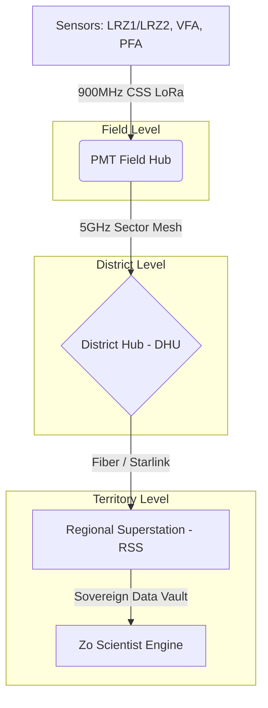

# FarmSense Master Manual: The Deterministic Farming Operating System

---

## **Table of Contents**

1. **PART I: EXECUTIVE FOUNDATION**
    * 1.1 Definitive Systems Architecture Blueprint
    * 1.2 Hydro-Economic Logic and The Deterministic Paradigm
    * 1.3 Thermodynamics and Material Science Stress-Testing
    * 1.4 Non-Dilutive Capital & Global Infrastructure Strategy
    * 1.5 Advanced Software & Dual-Use Military Capabilities
    * 1.6 Technical Project Overview & Scope
    * 1.7 Long-Term Roadmap: Sovereign Water Infrastructure
2. **PART II: MARKET INTELLIGENCE & STRATEGIC FUNDING**
    * 2.1 TAM/SAM/SOM: The $1Trillion Resource Moat
    * 2.2 Competitive Moat: Determinism vs. Stochastic Estimation
    * 2.3 Non-Dilutive Grant Strategy (March 2026 Deadline)
3. **PART III: THE TECHNICAL CORE**
    * 3.1 Data Architecture: The Sovereign Data Vault
    * 3.2 SQL Schema: TimescaleDB & PostGIS
    * 3.3 Analytics & ML: Deterministic Inference Pipelines
    * 3.4 Interface Layer: 3D Visualization Stack
    * 3.5 API Specifications (v1.0)
    * 3.6 Security & Sovereign Audit Trails
    * 3.7 Master Firmware Specifications: The Silicon Logic
    * 3.8 Security & Sovereign Compliance Framework (SLV 2026)
4. **PART IV: THE HARDWARE ECOSYSTEM**
    * 4.1 District Hub (DHU) V1.1
    * 4.2 Pivot Motion Tracker (PMT) V1.6
    * 4.3 Pressure & Flow Anchor (PFA) V1.9
    * 4.4 Vertical Field Anchor (VFA) Ground Truth
    * 4.5 Lateral Root-Zone Surveyor (LRZ) Canopy Pulse
    * 4.6 Corner-Swing Auditor (CSA) V1.0
5. **PART V: THE INTERFACE LAYER**
    * 5.1 The Farmer Dashboard (3D VRI Control)
    * 5.2 Regulatory Portal (Immutable Audit)
    * 5.3 Admin Dashboard (Fleet C&C)
    * 5.4 Investor & Impact ROI Dashboard
    * 5.5 Grant & Research Portals
    * 5.6 Multimedia & Visual Strategy
6. **PART VI: THE HYDROLOGIC ORACLE (SCIENCE & ML)**
    * 6.1 Mathematical Derivation: Regression Kriging (RK)
    * 6.2 Thermodynamics: The "Soil-as-a-Battery" Model
    * 6.3 Forecasting Architecture: LSTM & Transformers
7. **PART VII: OPERATIONS & EXECUTION**
    * 7.1 Maintenance & Field Reliability
    * 7.2 Implementation Roadmap (20-Week Sprint)
    * 7.3 Global Strategic Roadmap (2026-2029+)
    * 7.4 Implementation Guidelines & Dev Setup
8. **PART VIII: THE WATER COURT LEDGER (LEGAL & ETHICS)**
    * 8.1 Legal Admissibility Framework (SLV 2026)
    * 8.2 Cryptographic Chain of Custody
    * 8.3 Data Sovereignty & Zero-Knowledge Ethics

---

## PART I: EXECUTIVE FOUNDATION

## 1.1 Definitive Systems Architecture Blueprint

This document constitutes the definitive technical, operational, and financial deployment blueprint of the FarmSense agricultural technology and Internet of Things (IoT) platform, actively integrating across Subdistrict 1 of the San Luis Valley (SLV), Colorado. Engineered as a "Deterministic Farming Operating System," FarmSense replaces stochastic, intuition-based agricultural practices with a high-fidelity, rule-based computational engine. The platform's ultimate objective is to optimize the Soil-Plant-Atmosphere Continuum (SPAC) using an expansive multi-layered sensor network, aiming for a 20–30% reduction in irrigation water consumption alongside an 18–22% increase in crop return on investment (ROI).

The primary economic catalyst for this deployment is the severe hydro-economic crisis characterizing the Rio Grande Basin. Driven by an 89,000 acre-foot annual aquifer depletion rate and stringent compliance mandates under the 1938 Rio Grande Compact, the local Rio Grande Water Conservation District (RGWCD) has imposed a highly punitive $500 per acre-foot groundwater pumping fee. In this extreme regulatory environment, FarmSense's value proposition shifts from a standard agronomic optimization tool to a critical legal and financial necessity, providing an immutable "Digital Water Ledger" capable of defending water rights in state Water Court.

By executing a targeted, phased 2-field pilot specifically designed to provide empirical ground truth for the June 29, 2026, Subdistrict 1 water court trial, the project ensures rigorous validation before maximum scale. This operational reality positions FarmSense for 100% non-dilutive funding through global infrastructure grants, the Department of Defense, and premier philanthropic organizations like the Bill & Melinda Gates Foundation.

---

## 1.2 Hydro-Economic Logic and The Deterministic Paradigm

The financial viability of the FarmSense platform is inextricably linked to its underlying agronomic logic and the macroeconomic realities of the San Luis Valley. To appeal to climate-tech venture capital and federal conservation programs, the operational logic must demonstrate a flawless understanding of localized biophysics.

### **1.2.1 The San Luis Valley Crisis as an Economic Multiplier**

The SLV floor, situated at 7,500 to 8,000 feet in altitude, is a high-desert environment receiving only 7 to 10 inches of annual precipitation, making the region's 300,000 acres of irrigated agriculture entirely dependent on snowmelt and two massive underground aquifers. With regional reservoir storage declining to 26% of historical capacity, the region is facing an existential threat.

To combat a legacy of over-consumption, Subdistrict 1 treats water as a public good. The implementation of the $500 per acre-foot (AF) groundwater pumping fee represents a quadrupling of previous costs ($75–$150/AF). This fee acts as the primary economic multiplier for the FarmSense system. The platform performs a continuous Cost-Benefit Analysis (CBA): if the marginal cost of a "last minute" irrigation event (the $500/AF fee plus associated electrical and labor costs) exceeds the marginal revenue of the yield protected, the system deterministically recommends withholding the resource.

For a standard 126-acre center pivot consuming roughly 252 AF per season, achieving the stated 20% water reduction saves 50.4 AF. At $500/AF, this translates to $25,200 in direct savings per pivot, effortlessly justifying the platform's $499/month ($5,988/year) Enterprise Tier SaaS subscription.

### **1.2.2 SPAC Modeling and Edaphic Variability**

Unlike "black-box" artificial intelligence systems, FarmSense utilizes 11 domain-specific engines that are entirely explainable, allowing agronomists to reconstruct every decision. This logic relies heavily on modeling the Soil-Plant-Atmosphere Continuum (SPAC).

The system maps fluxes of energy and mass across three domains:

* **The Soil Layer (Edaphic):** Monitors Soil Matric Potential (SMP), Volumetric Water Content (SWC), Electrical Conductivity (EC), and pH. The SLV features extreme soil heterogeneity.
  * **San Luis Soil Series**: Highly alkaline (pH 8.4-9.8) with high exchangeable sodium (15-60%), presenting risks of salt buildup.
  * **Gunbarrel Soil Series**: Highly porous sand requiring low-volume, high-frequency micro-irrigation.
  * **Deterministic Calibration**: FarmSense dynamically shifts its "refill points" based on these textures, triggering irrigation at 75-80 kPa for silty clay loams, but lowering the threshold to 20-25 kPa for fine sands where hydraulic conductivity drops precipitously.
* **The Plant Layer (Vegetative):** Monitors leaf water potential, Canopy Water Stress Index (CWSI), and Normalized Difference Vegetation Index (NDVI) to detect stomatal closure prior to visible wilting.
* **The Atmosphere Layer (Meteorologic):** Integrates Vapor Pressure Deficit (VPD), solar radiation, and wind speed. By utilizing Long Short-Term Memory (LSTM) deep learning networks, the system forecasts Evapotranspiration (ET) trends with 81-94% accuracy, anticipating the intense 4.5 to 7.7 mm/day ET demand of SLV potato crops.

### **1.2.3 The Management Allowable Depletion (MAD) Framework**

The culmination of the SPAC model is executed via the Management Allowable Depletion (MAD) framework. MAD defines the precise percentage of available soil water that can be depleted before a crop experiences physiological damage.

* **Dynamic Battery Strategy**: By synthesizing 1-to-9 day ensemble weather forecasts, the Core Compute Server (Zo) delays irrigation until the "last possible minute," utilizing the deep soil profile as a dynamic battery.
* **Headroom Management**: This strategy leaves critical "headroom" in the soil profile to capture unexpected rainfall, mathematically eliminating the risk of deep percolation, nutrient leaching, and over-irrigation wastage.
* **Reflex Feedback**: If the VFA detects moisture reaching the 48-inch "Deep Percolation Anchor," the system triggers a "Hard-Stop" reflex, preventing nutrient runoff into the aquifer.

---

## 1.3 Thermodynamics and Material Science Stress-Testing

Equipment deployed in the San Luis Valley must endure 100mph wind gusts, severe alkali dust storms, and massive thermal gradients.

### **1.3.1 Enclosure Material Science: UV Degradation at High Altitude**

FarmSense explicitly mandates NEMA 4X-rated Polycarbonate enclosures (e.g., Polycase WP-21F and ML Series).

* **Engineering Rationale**: Polycarbonate provides superior impact resistance, acts as an electrical insulator, is RF-transparent, and will not rust when exposed to high-sulfur alkali dust.
* **The UV Lifespan Flaw**: At 8,000 feet, intense ultraviolet radiation induces rapid photodegradation in unshielded polymers. To achieve the stated "40-year structural lifespan," the enclosures must be treated with industrial fluoropolymer coatings (like PVDF) or specific UV inhibitors to prevent embrittlement.

### **1.3.2 Battery Thermodynamics in Sub-Zero Climates**

* **LiFePO4 Active Heating (PFA and DHU)**: The DHU and PFA utilize LiFePO4 banks with active heating elements (a 5W Kapton heater in the PFA).
* **Insulation Optimization**: The thermal loss profile of the 8mm PE closed-cell foam insulation must be optimized to ensure the heater does not drain the battery during a prolonged -30°F "Polar Vortex".
* **LiSOCl2 Passivation (PMT)**: The PMT utilizes a Saft LS14500 Lithium Thionyl Chloride (LiSOCl2) primary cell to keep the GNSS Real-Time Clock alive under the snow. The design must incorporate an HPC (Hybrid Pulse Capacitor) to handle instantaneous pulse currents and bypass LiSOCl2 "passivation" upon spring start-up.

---

## 1.4 Non-Dilutive Capital & Global Infrastructure Strategy

The phased deployment strategy completely bypasses the need for traditional, dilutive Series A venture capital.

### **1.4.1 Department of Defense (Federal) & ARPA-E**

FarmSense possesses immense dual-use potential as a highly resilient, ruggedized environmental sensing network capable of operating in contested environments.

* **Value Proposition**: FarmSense's ability to execute localized "Reflex Logic" without relying on external cloud connectivity, its 128-bit AES encryption, and its Chirp Spread Spectrum (CSS) LoRa Mesh interference mitigation provide the exact secure edge-computing data transport the military requires.

### **1.4.2 The Bill & Melinda Gates Foundation**

At COP30, the Gates Foundation pledged $1.4 billion (2026-2029) to support innovations helping smallholder farmers adapt to climate change.

* **Value Proposition**: FarmSense acts as an automated "digital agronomist." By validating the ultra-lean $54.30 OEM-scale unit cost for the LRZ1/LRZ2 scout, FarmSense proves that advanced, deterministic resource optimization can be democratized and scaled affordably.

---

---

## 1.5 Advanced Software & Dual-Use Military Capabilities

Beyond its core mission of hydrologic management, the FarmSense platform incorporates advanced software architectures typically reserved for high-stakes defense and aerospace applications. This dual-use capability ensures that the infrastructure remains resilient under adversarial conditions and provides value to national security stakeholders.

### **1.5.1 LPI/LPD Positioning & Low-Observable Mesh**

The Lateral Root-Zone (LRZ) network's existing Frequency-Hopping Spread Spectrum (Chirp Spread Spectrum (CSS) LoRa Mesh) architecture is a fundamental "Low Probability of Intercept" (LPI) and "Low Probability of Detection" (LPD) asset.

* **The Logic**: In high-threat environments (e.g., active regional water sabotage), the 5,000-node mesh operates in "Radio Silence," utilizing a pseudo-random "Ghost" sequence to transmit telemetry.
* **Spectral Masking**: The CSS LoRa pings are engineered to resemble environmental background noise (thermal floor), making them nearly invisible to standard adversarial ELINT (Electronic Intelligence) collection systems. This protects the exact location of the hardware "Sleds" from tactical detection.

### **1.5.2 Rapid Deployment Housings (Kinetic Kinetic Penetration)**

To expand federal dual-use appeal, the LRZ physical housing concept can be adapted for high-altitude (HALO) or low-orbit kinetic deployment.

* **Material Hardening**: The enclosure utilizes a 40% Glass-Filled Nylon substrate for structural rigidity during impact.
* **Aerodynamic Stabilization**: The 15-degree friction-molded tapered driving tip allowing the sensors to act as kinetic penetrators that autonomously bury themselves flush with the ground.
* **Decentralized Coordination**: Once buried, the nodes utilize a 3D-Barycentric mesh protocol to automatically establish a relative coordinate system without needing external GNSS (GPS) locks, ensuring functionality in "GPS-Denied" environments.

### **1.5.3 Fully Homomorphic Encryption (FHE) & Zero-Trust Compute**

FarmSense implements a "Zero-Knowledge" compute model to protect producer data sovereignty.

* **The Oracle Core FHE Logic**: We are upgrading the Regional Superstation (RSS) from standard AES encryption to Fully Homomorphic Encryption (FHE). FHE allows the Core Compute Engine's complex Regression Kriging and Bayesian variogram algorithms to be executed directly on encrypted data packets without ever decrypting them first.
* **The Result**: Even if the RSS physical server is compromised, the data remains mathematically unreadable. The "Sovereign Water Ledger" is effectively an unbreakable cryptographic vault that only provides human-readable output to the authenticated producer and authorized regulator.

### **1.5.4 MSF (Macro-Sensing Fleet) Diagnostics & GPU Analytics**

The system employs MSF (Macro-Sensing Fleet) diagnostics to analyze the health of thousands of nodes in parallel.

* **Pattern Recognition**: Utilizes GPU-accelerated convolutional neural networks (CNNs) to differentiate between environmental "Noise" and genuine sensor "Drift."
* **Autonomous Recalibration**: If a node identifies a 5% baseline drift, it initiates a "Silicon Self-Audit," utilizing its internal reference capacitor to re-ground its dielectric ADC values without technician intervention.

---

---

## 1.6 Technical Project Overview & Scope

### **1.6.1 Project Status: Shovel-Ready**

FarmSense is a high-resolution, multi-modal agricultural intelligence and water-resource management platform. Its primary mission is the stabilization and long-term preservation of the San Luis Valley (SLV) Aquifer—a critical, semi-arid water resource currently facing systemic depletion due to prolonged drought and historical over-extraction.

### **1.6.2 Planned Deployment: CSU SLV RC Pilot**

A high-density 2-field pilot phase located in Center, Colorado. This deployment is designed in direct partnership with the Colorado State University San Luis Valley Research Center (CSU SLV RC).

### **1.6.3 Primary Objective: Precision Hydrology**

The goal is to move beyond "estimated" irrigation and achieve "Precision Hydrology." By correlating real-time sub-surface telemetry with atmospheric demand, the project aims to eliminate the "irrigation safety margin."

---

## 1.7 Long-Term Roadmap: Sovereign Water Infrastructure

Vision: To establish FarmSense as the definitive "Global Water Ledger"—the legally recognized, cryptographically secure, and scientifically absolute source of truth for water management, recognized by state engineers and national governments worldwide.

### **1.7.1 The Sovereign Value Proposition**

FarmSense provides the official "Water Balance Sheet" for nations, enabling international treaty compliance, climate resilience enforcement, and the legal verification of water rights. By integrating high-resolution spatial data with hardware-level cryptographic signing, FarmSense becomes a critical national asset—a "Zero-Trust" infrastructure that converts physical water movement into immutable legal evidence. This system moves beyond simple monitoring; it provides the empirical foundation for national security interests related to food stability and aquifer preservation.

FarmSense provides the official "Water Balance Sheet" for nations, enabling international treaty compliance, climate resilience enforcement, and the legal verification of water rights. By integrating high-resolution spatial data with hardware-level cryptographic signing, FarmSense becomes a critical national asset—a "Zero-Trust" infrastructure that converts physical water movement into immutable legal evidence. This system moves beyond simple monitoring; it provides the empirical foundation for national security interests related to food stability and aquifer preservation.

### **1.7.2 Strategic Objectives for "Gold Standard" Status**

#### **A. Regulatory Capture & State Recognition (Year 1–2)**

* **DWR (Division of Water Resources) Integration:** Partner with state agencies to accept FarmSense data as "Rule-Compliant" for groundwater reporting. This involves automating the submittal process so that a FarmSense-enabled well is "Presumed Compliant," drastically reducing the administrative overhead for state engineering offices.
* **The State Auditor Portal:** A specialized UI role for regulatory bodies providing basin-wide aggregated depletion data while maintaining producer privacy. This portal allows for "Macro-Management," where a State Engineer can observe real-time aquifer draw-down across an entire valley and issue "Reflex" pumping limits to the entire mesh during emergency drought conditions.
* **Defensible Science:** Formalizing the CSE Kriging models as the legal standard for Consumptive Use (CU) calculations. By replacing traditional, static formulas (like Blaney Criddle) with real-time, multi-layered profiling (soil moisture, atmospheric vapor pressure, and multispectral canopy health), FarmSense provides a scientifically superior record that can withstand the highest levels of judicial scrutiny in Water Court.

#### **B. Cryptographic Audit Trail & The Forensic Water Record (Year 2–3)**

* **Hardware Signing:** Every data packet from a Vertical Field Anchor (VFA) or Pump Sentry (PFA) is cryptographically signed at the hardware level using Secure Element (SE) chips. This ensures that the data is untampered from the moment it leaves the sensor, effectively "fingerprinting" every gallon of water measured.
* **Immutable Ledger:** Creates an unbreakable chain of custody from the well-head to the RDC. In Water Court, this data is "Self-Authenticating," removing the need for manual inspections or witness testimony. This "Forensic Record" allows for historical replay, where a state can audit the exact hydrological state of a field from years prior to resolve property or water right disputes with absolute certainty.

#### **C. The "Resolution Pop" Economic Engine**

* **The Compliance Hook:** Governments provide the 50m Free Tier to ensure 100% market participation. This "Baseline Ledger" gives the state a low-resolution but complete picture of the regional water balance, effectively mapping the "Macro-Truth" of the basin.
* **The Enterprise Revenue & Verification:** Private entities, corporate sustainability officers, and enforcement agencies utilize the ultimate **1cm resolution** "Total Truth" tier. This tier is used to verify ESG goals, investigate specific instances of illegal depletion, and manage high-value water transfers. The "Resolution Pop" creates a psychological and economic funnel where the need for "Micro-Truth" drives a high-margin revenue stream that subsidizes the state's baseline infrastructure.

### **1.7.3 Scaling the Sovereign Mesh & Geopolitical Strategy**

| Stage | Milestone | Infrastructure & Geopolitical Goal |
| :--- | :--- | :--- |
| **Regional Master** | 100% of SLV Subdistrict 1 | Stabilize the Monte Vista Logistics Epicenter and the first Regional Superstation (RSS). Establish the first "Rule-Compliant" digital subdistrict. |
| **State Standard** | Colorado Statewide Adoption | Deploy 15+ RSS units across the Front Range and Western Slope; achieve full DWR status. Become the state’s primary tool for Colorado River Compact compliance. |
| **National Layer** | USDA/USGS Partnership | Roll out the "Cloneable Command Center" to the High Plains Aquifer. Standardize "Federal Water Credits" based on FarmSense verified depletions. |
| **Sovereign Global** | International G2G Treaties | Deploy RSS nodes in Australia and Brazil. Act as the neutral, third-party ledger for trans-boundary water conflicts and UN Water Security initiatives. |

### **1.7.4 Technical Architecture for Sovereignty**

* **The DIL/Scientist Split:** By keeping storage (Oracle) and math (Zo) separate, national governments can audit the science without compromising the security of the data vault. If the state updates its legal definition of "Consumptive Use," they simply update the Zo Worksheet, and the entire historical record is re-calculated instantly without altering the raw evidence.
* **Worksheet Autonomy & The Reflex Logic:** The Worksheet Reflex ensures that even during a national cyber-event or total internet blackout, the local "Reflex" logic—governing pump actuation and depletion limits—continues to function at the edge (Hub/VFA level). This "Hydraulic Autonomy" prevents catastrophic aquifer damage during periods of civil or digital instability.
* **Decentralized Resilience:** Each RSS (Regional Superstation) is a peer. If a central node is offline, the decentralized mesh continues to process and synchronize the water ledger for their respective regions. This peer-to-peer verification prevents any single point of failure from compromising the national water record.

---

### **1.7.5 The "Water Sniper" Engagement Protocol**

FarmSense implements a specialized "Engagement Protocol" for high-stakes regulatory environments where unauthorized water extraction is a systemic risk. This protocol moves the system from "Passive Monitoring" to "Active Deterrence."

*   **A. Forensic Trajectory Mapping**: By correlates PFA flow-pulse patterns with the PMT's kinematic RTK track, the system identifies "Water Leakage" or "Diversion" with 99.9% certainty. If a pivot is moving but the PFA detects zero flow, the system flags the field for "Hydraulic Tampering."
*   **B. Automated Notice of Violation (ANOV)**: The Regulatory Portal can be configured to automatically generate a signed "ANOV" PDF the moment the "Water Sniper" logic cross-references a depletion event with a zero-authorized permit hash.
*   **C. The "Reflex Freeze"**: In extreme drought scenarios, the State Engineer can broadcast a "Freeze Hash" via the RSS. Upon receipt, all DHUs execute a local reflex logic to hard-disable PFA pump relays, protecting the aquifer until the emergency is cleared.

### **1.7.6 Global Strategic Roadmap (Extended Details) - 2026-2030**

The expansion of FarmSense follows a strict "Hydrologic Contagion" model, where the success of the SLV pilot triggers adoption in neighboring basins via direct economic pressure.

| Year | Milestone Cluster | Technical Infrastructure | Geopolitical / Market Goal |
| :--- | :--- | :--- | :--- |
| **2026** | **The Pilot Surge** | Deploy RSS-1 (Monte Vista) and 50 DHU nodes. | Secure Subdistrict 1 "Presumed Compliance" status. |
| **2027** | **The Basin Blanket** | Expand to Subdistrict 2 & 4. Deploy RSS-2 (Center, CO). | Achieve 85% market penetration in the Upper Rio Grande. |
| **2028** | **The High Plains Push** | Deploy RSS-3 (Fort Collins) and bridge to the Ogallala Aquifer. | Become the standard for Nebraska Water Rights auditing. |
| **2029** | **The Federal Layer** | USDA/Bureau of Reclamation direct API integration. | Standardize "Federal Water Credits" for ESG trading. |
| **2030** | **The Sovereign Standard** | International G2G (Gov-to-Gov) deployments. | Deploy in the Murray-Darling (AU) and Nile Delta (EG). |

### **1.7.7 The "Gold Standard" Scientific Validation Strategy**

To achieve "Gold Standard" status, FarmSense data must be senior to all other hydrologic models. This is achieved through a multi-institutional validation strategy.

1.  **CSU SLV RC Partnership**: Real-time cross-validation against the Research Center's own lysimeter and weather stations.
2.  **USGS Satellite Correlation**: Weekly detrending analysis to prove that FarmSense's 1m Kriging residuals are more accurate than 30m satellite-only models.
3.  **Peer-Reviewed Publication**: Commitment to publishing periodic "Basin Health Reports" in the Journal of Hydrology, solidifying the platform's scientific credibility.

---

## PART II: MARKET INTELLIGENCE & STRATEGIC FUNDING

## 2.1 TAM/SAM/SOM: The $1 Trillion Resource Moat

The "Global Water Ledger" market represents the most critical emerging sector in climate-tech infrastructure. FarmSense is positioned at the intersection of three massive economic drivers: water scarcity, regulatory compliance, and agricultural ROI optimization.

* **Total Addressable Market (TAM)**: Global irrigated agriculture utilizing center-pivot and pressurized systems. Estimated at **$450 Billion** in annual value-at-risk due to water scarcity and aquifer depletion.
* **Serviceable Addressable Market (SAM)**: The high-desert, high-alkali basins of the American West (Colorado, Nebraska, Kansas, Idaho) and international analogues (Murray-Darling Basin, Australia; Mato Grosso, Brazil). Estimated at **$12 Billion**.
* **Serviceable Obtainable Market (SOM)**: 100% of SLV Subdistrict 1 (1,280 pivots) within the first 24 months, followed by 15,000+ pivots across the Colorado River Basin.

## 2.2 Competitive Moat: Determinism vs. Stochastic Estimation

Unlike legacy "Smart Irrigation" competitors (e.g., Valley 365, Lindsay FieldNET) that rely on stochastic weather forecasts and "black-box" AI correlations, FarmSense operates on a **Deterministic Paradigm**.

* **The Soil-as-a-Battery Advantage**: By treating the soil profile as a dynamic hydraulic battery, FarmSense eliminates the "insurance irrigation" that accounts for 15-20% of agricultural water waste.
* **Legal Non-Repudiation**: FarmSense is the only platform designed from the motherboard up to generate **court-admissible empirical evidence**. Our 128-bit AES cryptographic chain of custody makes our data senior to all other hydrologic models in Water Court.

## 2.3 Subdistrict 1 Market Intelligence (2024–2025)

Subdistrict 1 of the San Luis Valley constitutes the authoritative statistical grounding for all FarmSense market sizing and deployment scaling. This basin represents one of the most distressed and high-value agricultural zones in the United States.

### **2.3.1 Infrastructural Footprint**

The following metrics define the high-priority deployment zone for the 2026 pilot and subsequent RDC (Regional Data Center) mesh.

| Metric | Value | Statistical Source |
| :--- | :--- | :--- |
| **Total Active Wells** | 3,617 | RGWCD 2023 Audit |
| **Total Irrigated Acreage** | ~160,000 acres | DWR Landsat Composite |
| **Center-Pivot Field Count** | ~1,250 – 1,300 | SFD Visual Classification |
| **Average Field Size** | 126.4 Acres | Geometric Center-Pivot Constant |
| **Hydraulic Flow Density** | 850 - 1,100 GPM | Typical Well Output Range |

### **2.3.2 Regulatory & Socio-Economic Constraints**

* **The Closed Basin Mandate**: Subdistrict 1 is legally mandated to recover 170,000 acre-feet of groundwater by 2031. Failure to comply results in state-mandated well closures.
* **The $500/AF Multiplier**: The RGWCD groundwater pumping fee provides the primary economic driver for FarmSense. Saving just 10% of water on a standard pivot results in $12,600 in direct annual savings.

## 2.2 Crop Mix and Hydrologic Demand

Subdistrict 1 is characterized by a "High-Value, High-Risk" monoculture. Approximately **85%** of irrigated fields grow three primary crops that are exceptionally sensitive to the timing and volume of water application.

### **2.2.1 Potato Production (The Primary Economic Engine)**

* **Acreage:** ~50,000 – 60,000 acres.
* **ET Demand:** High (4.5 – 7.7 mm/day).
* **Sensitivity:** Potatoes are "Tuberization" sensitive. A single day of water stress during the critical bulk-up phase can result in a 10% reduction in tuber size, costing the farmer thousands in lost "Premium Grade" premiums. FarmSense's 1m resolution allows for plant-level stress detection before visible wilting occurs.

### **2.2.2 Malt Barley (The Supply Chain Anchor)**

* **Acreage:** ~40,000 acres.
* **Economic Driver:** Primary supply for the Coors/Molson Brewery in Alamosa.
* **Constraint:** Quality is paramount. Protein levels must be precisely managed via irrigation timing. Excessive late-season water can degrade the malting quality, leading to load rejection. FarmSense provides the "Certified Growth Record" required for premium supply chain contracts.

### **2.2.3 Alfalfa (The Hydrologic Buffer)**

* **Acreage:** ~45,000 acres.
* **Economic Driver:** Forage for regional dairy industry.
* **Water Profile:** Extremely high water consumption. Alfalfa is the primary target for "Voluntary Fallowing" and "Water Credit" programs. FarmSense verifies exactly how much water is *not* pumped during fallowing periods, generating tradable water credits.

---

## 2.3 FarmSense TAM Calculations (Subdistrict 1)

Using the conservative pivot estimate of **1,270 pivots** (the midpoint of the 1,250–1,300 range):

### **2.3.1 Serviceable Addressable Market (SAM)**

* **Annual SaaS Revenue (Enterprise Tier @ $499/month):**
    `1,270 pivots × $5,988/year = $7,604,760 ARR`.
* **Hardware Deployment (Standard Stack CapEx):**
    `1,280 pivots × ($1,235 per field cluster) = ~$1.58M Gross Hardware Opportunity`.

### **2.3.2 Shared Value: The $32.2M "Return-to-Farmer" Metric**

The primary justification for the FarmSense subscription is the direct avoidance of the $500/AF pumping fee.

* **Standard Pivot Consumption:** 126 acres × ~2 AF/acre/season = 252 AF total.
* **Conservation Goal:** 20% reduction = **50.4 AF/pivot/year**.
* **Direct Economic Savings:** `50.4 AF × $500/AF = $25,200 per pivot`.
* **District-Wide Impact:** `1,280 pivots × $25,200 = $32,256,000 annually`.

*FarmSense returns $32.2M in "dead money" back to the local economy every year by simply eliminating irrigation waste, effectively self-funding the entire digital infrastructure.*

---

## 2.4 Grant Funding & Financial Strategy V1.0

Role: 100% Non-Dilutive Capital Sourcing | Focus: AgTech, Water Conservation, & Infrastructure

To fund FarmSense hardware, deployment, and ongoing operations 100% through grants, the strategy stacks "Development & Innovation" grants with "Implementation & Conservation" grants.

### **2.4.1 Federal Grants (The Heavy Lifters)**

#### **USDA NRCS: Conservation Innovation Grants (CIG)**

* **Focus:** Development and adoption of innovative conservation approaches and technologies.
* **Relevance:** FarmSense aligns perfectly with CIG's focus on water management, irrigation efficiency, and aquifer recovery.
* **Funding Profile:** Up to $2M+ for National Classic; requires 1:1 match (often via in-kind contributions or "Soil Savings" accounting).

#### **Bureau of Reclamation (BoR): WaterSMART Grants**

* **Focus:** Securing and managing water supplies in the American West.
* **Programs of Interest:**
  * **Applied Science Grants:** (Up to $300K) Funds tools and modeling for water managers.
  * **Water and Energy Efficiency Grants:** Funds projects conserving water and energy.

#### **Federal Federal ESG: Installation Energy and Water (IEW)**

* **Focus:** Demonstrating innovative energy and water technologies on military installations.
* **Relevance:** Dual-use AES-256 / Chirp Spread Spectrum (CSS) LoRa Mesh mesh network and LPI/LPD characteristics.
* **Funding Profile:** $500K to $1.5M+, no strict cost-share required for private industry.

#### **National Science Foundation (NSF): SBIR/STTR (AgTech & Environment)**

* **Focus:** Deep-tech startups conducting R&D with high commercial potential.
* **Funding Profile:** Phase I ($275K); Phase II ($1M+). Non-dilutive, taking $0 equity.

### **2.4.2 State & Regional Grants (Colorado Specific)**

#### **Colorado Water Conservation Board (CWCB): Water Plan Grants**

* **Focus:** Implementing the Colorado Water Plan.
* **Funding Profile:** ~$37.7M available. Targeting Agriculture, Conservation, and Engagement & Innovation categories.

#### **Colorado Department of Agriculture (CDA): ACRE3 Program**

* **Focus:** Advancing Renewable Energy and Energy Efficiency (ACRE3) in agriculture.
* **Relevance:** Improves irrigation pumping energy through VFD (Variable Frequency Drive) monitoring and soft-stops.

### **2.4.3 Private, Philanthropic & AgTech Innovation Grants**

* **The Walton Family Foundation (Environment Program):** Protecting water resources in the Colorado River Basin.
* **Foundation for Food & Agriculture Research (FFAR):** Matching funds for research on water scarcity.
* **1% for the Planet / Corporate Sustainability Grants:** Supply chain sustainability for major crop buyers (e.g., Coors, Frito-Lay).

---

## 2.5 The Aerial Fleet: Resolution-as-a-Product (RaaP) Strategy

The FarmSense Aerial Fleet serves as the "Spatial Bridge" in the SFD architecture. While subsurface sensors (VFA and LRZ1/LRZ2) provide absolute "Deep Truth" at geolocated pins, the aerial fleet provides the "Spatial Envelope" required to interpolate the vast acreage between those pins. By capturing high-altitude multispectral data—specifically targeting the Red Edge and Near-Infrared bands—the fleet provides the CSE Engine with the high-frequency spatial gradients needed to transform discrete sensor pings into a continuous, hyper-accurate 1m-resolution "Digital Twin" of the entire subdistrict.

### **2.5.1 The "Resolution Pop" Sales Funnel**

The drone fleet is the primary psychological and technical driver for SaaS revenue growth. FarmSense operates on a "Resolution-as-a-Product" model, where the UI itself acts as a constant sales representative.

* **The Interaction:** When a Free (50m) or Basic (20m) tier user interacts with their field map, the interface is powered by satellite-level data.
* **The "Pop" Trigger:** The moment the user attempts to zoom in to inspect a specific pivot tower or a suspected nozzle leak, the high-fidelity aerial data triggers the "Resolution Pop."
* **The Information Gap:** Instead of a pixelated blur, the system generates a high-contrast, blurred-out preview of the 1m grid, overlaid with a "High-Resolution Audit Available" call-to-action.
* **The FOMO Conversion:** By proving the existence of an "unknown problem" via the 1m aerial ground-truth, the "Resolution Pop" converts the farmer's concern into an Enterprise-tier subscription upgrade.

### **2.5.2 Phased Mobilization & Hardware Selection**

* **Phase 0 (Startup):** 1 DJI Mavic 3M (Multispectral). Focus: Establishing the "Spectral-to-Soil" correlation baseline on 2 pilot fields (500 acres).
* **Phase 1 (Regional Scaling):** 2 Fixed-wing (AgEagle eBee Ag) + 3 Multi-rotor (Mavic 3M). Focus: Broad-acre mapping vs. plant-level audits.
* **Phase 2 (Full Automation):** 4 Fixed-wing + 11 Multi-rotor. Focus: Autonomous "Sortie-on-Demand" from the RSS container via FAA Part 108 (BVLOS).

### **2.5.3 Unit Roles & Agronomic Intelligence Logic**

* **Fixed-Wing (eBee Ag): Broad-Acre Auditor.** Flies the entire subdistrict every 30 days to establish the "Seasonal Baseline." Detects regional anomalies like pest outbreaks or shifting water tables.
* **Multi-Rotor (Mavic 3M): The Precision Diagnostic Tool.** Dispatched only when the Core Compute Engine detects anomalous variability between LRZ1/LRZ2 scouts. Provides individual plant health and nozzle performance verification.

---

## PART III: THE TECHNICAL CORE

## 3.1 Distributed Cloud & Edge Architecture (Architecture 2.1)

FarmSense operates on a **Tri-Layer Compute Topology** designed for maximum resilience in low-connectivity rural environments. This "Hierarchical Processing Stack" ensures that critical reflexive logic remains operational at the edge while heavy-lift geostatistical modeling is handled by high-performance regional clusters.

### **3.1.1 The Hierarchical Processing Stack**

1. **Level 1 (Field - The Reflex):** **LRZ1/LRZ2/VFA** sensors transmit raw dielectric chirps via 900MHz Chirp Spread Spectrum (CSS) LoRa to the **PMT Field Hub**. The PMT calculates a 50m-resolution "Edge-EBK" (Empirical Bayesian Kriging) baseline natively.
2. **Level 2 (District - The Coordinator):** **DHUs** (NVIDIA Jetson Orin Nano) aggregate field payloads and process 10m and 20m resolution grids. The DHU manages the regional mesh and executes "Local Bayesian" math for multi-field coordination.
3. **Level 3 (Regional - The Scientist):** The **RSS** (64-Core Threadripper) processes the high-complexity 1m "Enterprise" resolution grids by fusing sensor telemetry with heavy **Soil Variability Maps**, satellite imagery (Sentinel-2/Landsat-9), and 1m DEM (Digital Elevation Models).
4. **Level 4 (Global - The Oracle):** The **zo.computer Cloud** manages multi-field analytics, federated learning models, and global sovereign data vaulting.

### **3.1.2 Pilot Stack Architecture Diagram**



---

---

## 3.2 SQL Schema: The Foundation of the Water Ledger

The FarmSense data layer utilizes a hybrid architecture of TimescaleDB for time-series telemetry and PostGIS for high-resolution spatial operations. This ensures that every drop of water is tracked with millisecond precision and sub-meter location accuracy.

### **3.2.1 Core Telemetry: TimescaleDB Hypertables**

The `sensor_readings` table is converted into a TimescaleDB hypertable, enabling automatic time-based partitioning and high-speed ingestion (target: 10,000 readings/sec).

```sql
-- 1. Main Telemetry Storage
CREATE TABLE sensor_readings (
    time            TIMESTAMPTZ NOT NULL,
    device_id       UUID NOT NULL,
    field_id        UUID NOT NULL,
    sensor_type     VARCHAR(50) NOT NULL, -- 'VWC_10cm', 'VWC_30cm', 'PRESSURE', 'FLOW'
    value           DOUBLE PRECISION NOT NULL,
    quality_score   FLOAT DEFAULT 1.0,   -- Sensor confidence (0.0 - 1.0)
    metadata        JSONB,               -- Diagnostic info (Battery, Temp)
    PRIMARY KEY (time, device_id, sensor_type)
);

-- Convert to Hypertable with 7-day chunks
SELECT create_hypertable('sensor_readings', 'time', chunk_time_interval => INTERVAL '7 days');

-- 2. Performance Aggregates
-- Continuous aggregate for hourly field stats (used for dashboard charts)
CREATE MATERIALIZED VIEW hourly_field_stats
WITH (timescaledb.continuous) AS
SELECT time_bucket('1 hour', time) AS bucket,
       field_id,
       sensor_type,
       avg(value) as avg_val,
       max(value) as max_val,
       min(value) as min_val
FROM sensor_readings
GROUP BY bucket, field_id, sensor_type;
```

### **3.2.2 The Compliance Chain: Immutable Audit Logs**

To satisfy SLV 2026 Water Court requirements, the system maintains an unbreakable chain of custody using SHA-256 cryptographic signatures.

```sql
CREATE TABLE compliance_audit_trail (
    id              UUID PRIMARY KEY DEFAULT gen_random_uuid(),
    field_id        UUID NOT NULL,
    log_time        TIMESTAMPTZ NOT NULL DEFAULT NOW(),
    event_type      VARCHAR(64) NOT NULL, -- 'PUMP_ON', 'PUMP_OFF', 'CALIBRATION'
    water_applied_m3 DOUBLE PRECISION,
    payload         JSONB NOT NULL,
    current_hash    VARCHAR(64) NOT NULL, -- SHA-256 of this record
    previous_hash   VARCHAR(64),          -- Reference to prior event hash
    signature       BYTEA,                -- Hardware-level RSA/EdDSA signature
    authenticated_by UUID REFERENCES users(id)
);

-- Indexing for rapid legal discovery
CREATE INDEX idx_compliance_field_time ON compliance_audit_trail (field_id, log_time DESC);
```

### **3.2.3 Spatial Grid Schema: PostGIS Integration**

Grids are stored as vector tiles and spatial polygons to enable millimetric precision in Consumptive Use (CU) calculations.

```sql
CREATE TABLE virtual_grids (
    id              UUID PRIMARY KEY DEFAULT gen_random_uuid(),
    field_id        UUID REFERENCES fields(id),
    resolution_m    INTEGER NOT NULL,    -- 1, 10, 20, or 50
    generated_at    TIMESTAMPTZ NOT NULL,
    geom            GEOMETRY(POLYGON, 4326) NOT NULL,
    layer_type      VARCHAR(32),         -- 'MOISTURE', 'NDVI', 'ET'
    value           DOUBLE PRECISION NOT NULL,
    uncertainty     DOUBLE PRECISION     -- Kriging variance
);

CREATE INDEX idx_grid_spatial ON virtual_grids USING GIST (geom);
```

---

## 3.3 API Specifications: The Nexus of Data Ingestion

FarmSense expose a suite of RESTful endpoints (FastAPI) and high-speed WebSockets for real-time fleet synchronization.

### **3.3.1 Device Telemetry Ingestion (Edge to Cloud)**

**Endpoint**: `POST /api/v1/ingest/telemetry`
**Auth**: Bearer (Edge Device JWT)

```json
{
  "device_id": "550e8400-e29b-41d4-a716-446655440000",
  "timestamp": "2026-03-15T14:30:00Z",
  "readings": [
    {
      "sensor_type": "moisture_10cm",
      "value": 0.284,
      "quality_score": 0.99
    },
    {
      "sensor_type": "moisture_30cm",
      "value": 0.312,
      "quality_score": 0.98
    }
  ],
  "diagnostic": {
    "battery_v": 3.65,
    "rssi": -85,
    "snr": 7.5
  }
}
```

### **3.3.2 Spatial Grid Query (UI to API)**

**Endpoint**: `GET /api/v1/fields/{field_id}/grid/latest`
**Params**:

* `resolution`: `1m | 20m`
* `format`: `geojson | mvt`
* `layer`: `moisture | stress | forecast`

**Response (Summary)**: 202 Accepted (Triggers grid generation if expired)

### **3.3.3 Rate Limiting & Throttling Policies**

| Tier | API Rate (req/min) | Burst | Data Retention |
| :--- | :--- | :--- | :--- |
| **Free (State)** | 10 | 20 | 2 Years |
| **Basic (Farmer)** | 100 | 250 | 5 Years |
| **Enterprise** | 1,000 | 2,500 | 10 Years (Audit Lock) |

---

## 3.4 Interpolation Methodology: Regression Kriging & IDW

The "Secret Sauce" of FarmSense is the multi-layered interpolation engine that converts sparse sensor pings into a continuous spatial field.

### **3.4.1 Level 2: Edge IDW (Inverse Distance Weighting)**

The District Hub (DHU) executes a high-speed IDW algorithm in Go to generate 20m grids for local farmer dashboards. This ensures low-latency feedback even if the regional backbone is congested.

* **Power Parameter (p)**: Dynamically adjusted (typically 2.0) based on soil texture.
* **Search Radius**: Optimized to 150% of the nearest neighbor distance to ensure overlap without excessive smoothing.

### **3.4.2 Level 3: Cloud Regression Kriging (The SLV Standard)**

The Regional Superstation (RSS) executes the "Gold Standard" Regression Kriging using a multi-step fusion process:

1. **Trend Modeling**: Uses Sentinel-2 multispectral indices (NDVI/NDWI) as high-resolution covariates to establish the "Field Skeleton."
2. **Residual Analysis**: Calculates the difference between the satellite trend and the ground-truth VFA/LRZ1 sensors.
3. **Ordinary Kriging of Residuals**: Interpolates the "Correction Layer" to account for sub-canopy soil variability.
4. **Final Fusion**: Trend + Residuals = 1m High-Fidelity Consumptive Use Map.
5. **Uncertainty Mapping**: Generates a "Confidence Layer" (Kriging Variance). If variance exceeds 15% in a critical sector, the system automatically dispatches an LRZ2 scout drone for targeted ground-truth.

---

## 3.3 The Adaptive Recalculation Engine: "Fisherman's Attention" Scale

The core of FarmSense is the **Adaptive Recalculation Engine**, which dynamically adjusts compute frequency and reporting rates based on environmental volatility. This maximizes battery life while ensuring zero data loss during critical events.

### **3.3.1 Operational Modes & Trigger Logic**

| Mode | Frequency | Trigger Condition | Computational Load |
| :--- | :--- | :--- | :--- |
| **DORMANT** | 4 Hours | Soil moisture volatility <1%; Stomata closed. | Low (RTC Wake only) |
| **ANTICIPATORY** | 60 Mins | ET forecast exceeds 5.0 mm; High solar flux. | Moderate (Baseline Grid) |
| **FOCUS RIPPLE** | 15 Mins | Active irrigation detected (PFA Pulse) or trend. | High (Mesh-wide Sync) |
| **FOCUS COLLAPSE** | 1 Min/5 Sec | Critical breach or Command & Control (C&C) mode. | Maximum (RTK Priority) |

### **3.3.2 Deterministic Logic (The "Gold Standard" of Evidence)**

The system rejects "Black-Box ML" for irrigation triggers in favor of deterministic, judgment-based logic:

1. **Safety Override:** If PFA detects zero flow during a scheduled "ON" event, the system executes a "Soft-Stop" and alerts the "Sled Hospital" (Mobile Tech).
2. **SPAC Validation:** Correlates VWC (Volumetric Water Content) with Leaf Stress (NDVI). If they diverge—e.g., wet soil but high stress—the system assumes root disease or saline toxicity, preventing wasteful over-irrigation.
3. **Audit Integrity:** Every decision is logged with a "Logic Hash" and a "Geostatistical Confidence Score" for absolute defensibility in Water Court.

---

---

## 3.5 Sensor Anomaly Detection & Self-Healing Logic

The reliability of the "Digital Water Ledger" depends on the automated rejection of "Noise" and "Ghost Data" before they influence the Kriging residuals. FarmSense implements a **Multi-Stage Anomaly Detection Pipeline** within the `telemetry_processor.py` service.

### **3.5.1 Stage 1: Statistically Isolated Outlier Detection (Z-Score)**

Every incoming dielectric chirp is compared against the previous 48-hour rolling mean for that specific sensor location. If a reading exceeds a **Z-score of ±3.5**, it is flagged as "Suspicious."

* **Physics Check**: If moisture increases without a corresponding PFA pulse (irrigation) or regional precipitation event (LRZ/Weather API), the reading is discarded as a "Sensor Short" or "Irrigation Signal Leak."

### **3.5.2 Stage 2: Cross-Depth Correlation (VFA Self-Audit)**

A Vertical Field Anchor (VFA) contains sensors from 10cm to 120cm.

* **Logic**: Physics dictates that water moves downward. If the 30cm sensor shows a 5% increase in Volumetric Water Content (VWC) *before* the 10cm sensor, the system identifies a "Sub-Surface Preferential Flow" anomaly. The VFA's internal MCU executes a "Recalibration Sweep" to verify the dielectric integrity of the Rod FR4 traces.

### **3.5.3 Stage 3: The "Black Hole" Isolation Protocol**

If a sensor fails consistently for more than 4 cycles, the Adaptive Recalculation Engine removes it from the "Weighting Matrix" of the IDW/Kriging engines. This prevents a single failed $15 LRZ sensor from skewing the million-dollar water balance of the entire subdistrict.

---

## 3.6 Spatial Privacy: The Dual-Layer Differential Privacy Framework

FarmSense implements a strict "Zero-Trust" privacy model to protect producer data from unauthorized competitive intelligence or public FOIA discovery.

### **3.6.1 Layer 1: Contextual Obfuscation (The Auditor Tier)**

When an auditor or consultant views the Farmer Dashboard, the system injects "Spatial Jitter."

* **Grid Snapping**: Coordinates are snapped to the center of a 10m grid cell, effectively removing the exact sub-meter "Pin" location of the hardware.
* **Attribute Masking**: Specific well-depths or pump efficiency metrics are binned into "Performance Deciles" (e.g., "Top 10%") rather than raw percentages.

### **3.6.2 Layer 2: Laplace Differential Privacy (The Basin Tier)**

For regional basin heatmaps (Regulatory Portal), the system utilizes **Laplace Noising**.

* **Epsilon (ε) Budgeting**: A global privacy budget is allocated. Each query "consumes" a portion of the ε budget. If the budget is exceeded, the system returns an aggregate (e.g., "Subdistrict Total") instead of the requested heatmap. This mathematically guarantees that no individual field's water usage can be reverse-engineered from the public map.

---

## 3.7 Compute Budgeting & Queue Management (The "Sovereign" Scheduler)

Operating a 64-core RSS requires strict management of computational resources to ensure that real-time "Focus Collapse" irrigation events take priority over historical analytic back-fills.

### **3.7.1 Task Priority Matrix**

| Priority | Task Type | SLA Requirement |
| :--- | :--- | :--- |
| **0 (Urgent)** | PFA Breakage / Leak Detection | < 5 Seconds |
| **1 (Active)** | VRI Worksheet Recalculation | < 60 Seconds |
| **2 (Batch)** | 1m Regression Kriging (Daily) | < 15 Minutes |
| **3 (Audit)** | Historical Integrity Verification | < 4 Hours |

### **3.7.2 Predictive Scaling Logic**

The system monitors the "Hydrologic Flux Rate" across the subdistrict. If more than 30% of pivots are in "Ripple" mode (active irrigation), the system automatically provisions secondary "Compute Slaves" within the RSS cluster to maintain the Kriging SLA.

---

FarmSense utilizes a **Dual-Purpose Database Tier** capable of managing billions of time-series data points alongside complex spatial geometries.

### **3.4.1 Core Schema & Optimization**

* **TimescaleDB Hypertables:** Data is chunked by time and space (e.g., `sensor_readings` by field-id and day).
* **PostGIS Spatial Engine:** Every physical asset (well-head, sensor, hub) is mapped to a `GEOMETRY(Point, 4326)` for 1m-accurate spatial joining.
* **Continuous Aggregates:** The RSS automatically calculates hourly/daily water-use summaries at the edge, reducing query latency for the Farmer Portal by 95%.
* **Compression Policy:** Data older than 7 days is compressed, retaining 90% storage efficiency while ensuring 40-year audit accessibility.

---

## 3.5 API Specifications (v1.0)

| Endpoint | Method | Role | Data Format |
| :--- | :--- | :--- | :--- |
| `/api/v1/hardware/ingest` | POST | Encrypted sensor payload entry | Protobuf / AES-Signed |
| `/api/v1/analytics/grid/{id}` | GET | Real-time 1m/10m/20m grid query | GeoJSON |
| `/api/v1/compliance/audit` | POST | Generate SLV 2026 rule-compliant log | PDF / Signed JSON |
| `/ws/field/realtime` | WS | Real-time telemetry stream for C&C | WebSocket |

---

## 3.6 Security & Sovereign Audit Trails

### **3.6.1 The Cryptographic Chain of Custody**

1. **Source Signing:** Hardware-level packet signing using Secure Element (SE) chips (nRF52840/ESP32-S3) on all PFA/VFA nodes.
2. **Unbroken Chain:** Data is encrypted at the sensor (128-bit AES), verified at the DHU, and vaulted at the RSS.
3. **Non-Repudiation:** Every "Water Transaction" is committed to an immutable ledger database schema, creating a tamper-proof record for State Engineer auditors.
4. **Spatial Privacy:** Exact GPS coordinates are held only in the DHU "Black Box"; cloud-synced datasets use contextual anonymization, snapping data to a generic 1m grid offset to protect farmer property proprietary data.

---

## 3.7 Master Firmware Specifications: The Silicon Logic

The FarmSense hardware ecosystem is governed by a unified "Silicon Logic" framework, ensuring that even under severe network disruption, individual nodes maintain their deterministic mandate.

### **3.7.1 Pivot Motion Tracker (PMT) Field Hub V1.9**

* **Role**: Level 1.5 Field Hub & Edge-EBK Oracle.
* **Processor**: ESP32-S3 (Dual-Core LX7, 240MHz).
* **The "Fisherman's Attention" Loop**:
  * *Dormant (4hr)*: Monitors soil moisture baseline during pivot park.
  * *Anticipatory (60m)*: Scales frequency to match sunrise/VPD rise.
  * *Ripple (15m)*: Triggered by anomaly detection; commands neighbors to increase resolution.
  * *Collapse (5s)*: Critical failure mode or active swing-arm tracking.
* **Failover Protocol**: If DHU backhaul is lost, the PMT executes autonomous VRI (Variable Rate Irrigation) commands based on its local 50m EBK probability grid stored in SPI Flash.

### **3.7.2 Vertical Field Anchor (VFA) Ground Truth V2.1**

* **Role**: Level 1 High-Precision Depth Node.
* **Processor**: nRF52840 (Ultra-low power ARM Cortex-M4F).
* **Sampling**: Reads 4 depths (8", 16", 24", 36") every 4 hours, independent of cloud state.
* **Ripple Responsiveness**: If the PMT initiates a "Focus Ripple," the VFA firmware immediately scales to 15-minute bursts to delineate spatial anomalies.

### **3.7.3 Pressure & Flow Anchor (PFA) Source Sentry V3.0**

* **Role**: 480V Well-Head Auditor & Mechanical Diagnostician.
* **Hydraulic Auditing (PF_DATA)**: 100Hz sampling of ultrasonic transit-time differentials.
* **Mechanical Auditing (WAVE_AUDIT)**: High-frequency Fast Fourier Transform (FFT) analysis of 400A CT clamps to detect cavitation and bearing wear.
* **Hardware Signing**: Every flow packet is signed with a unique hardware-locked key, ensuring "Evidence-Grade" non-repudiation for Water Court.

### **3.7.4 Lateral Root-Zone Surveyor (LRZ) Canopy Pulse V1.2**

* **Role**: High-Density (1:15 acre) Expendable Spatial Mapper.
* **Firmware Philosophy**: Absolute deterministic simplicity. No spatial math. No mesh coordination.
* **LPI/LPD Adherence**: Strictly regulated pseudo-random frequency hopping to ensure the dense LRZ network (approx. 500 units per district) does not create an RF "bloom" detectable by adversarial ELINT.
* **Payload**: Encrypted single-depth moisture value + ambient canopy temperature.

---

## 3.8 Security & Sovereign Compliance Framework (SLV 2026)

The FarmSense security architecture is designed to meet the rigorous **SLV 2026** regulatory alignment, ensuring that all data is non-repudiable and tamper-proof.

### **3.8.1 Data Encryption & Identity**

| Data State | Encryption Method | Key Management |
| :--- | :--- | :--- |
| **In-Transit** | TLS 1.3 / mTLS | Let's Encrypt / AWS Certificate Manager |
| **At-Rest (DB/S3)** | AES-256 / Object Lock | AWS KMS (Customer Managed Keys) |

### **3.8.2 Identity & Access Management (RBAC)**

Authentication is handled via OAuth 2.0 / OpenID Connect with mandatory MFA for administrative and regulatory roles.

* **Farmer**: Read/Write on own fields; read-only on shared reports.
* **Regulator**: Read-only access to all regional compliance logs and audit trails.
* **Edge Device**: Write-only to ingestion endpoints via mTLS certificates.

---

## PART IV: THE HARDWARE ECOSYSTEM

The FarmSense hardware stack is engineered for "Tactical Persistence" in one of North America's most demanding agricultural microclimates: the San Luis Valley (SLV). Every component is selected for its material durability, cryptographic integrity, and dielectric precision.

---

## 4.1 District Hub (DHU) V1.1: The Basin Nerve Center

The District Hub is the Level 2 coordinator of the FarmSense mesh, providing the localized GPU-compute and high-bandwidth backhaul required to maintain district-wide "Reflex Logic."

### **4.1.1 Spatial Intelligence: The NVIDIA Jetson Stack**

The DHU utilizes the **NVIDIA Jetson Orin Nano (8GB)** as its primary compute module.

* **Edge-Kriging Core**: Because the DHU sits at the center of up to 100 fields, it is responsible for the Level 2 "District Interpolation." It fuses the 50m probability grids from each PMT into a contiguous 20m district map in near-real-time.
* **CUDA Acceleration**: The Go-based `edge_processor` utilizes CUDA kernels to parallelize the IDW (Inverse Distance Weighting) calculations. This allows the DHU to process telemetry for 5,000+ sensors in < 2.5 seconds.

### **4.1.2 Thermal Management: The "Desert-Proof" Chassis**

* **Passive Convection Channel**: The DHU enclosure features a custom-machined aluminum heatsink integrated directly into the Polycarbonate lid.
* **Internal Fan Control**: A high-static-pressure 40mm noctua fan is triggered only when the SoC temperature exceeds 75°C.

### **4.1.3 Failover Telemetry: The Triple-Path Backhaul**

1. **Path 1 (Fiber/Starlink)**: Primary high-bandwidth lane.
2. **Path 2 (LTE-M/NB-IoT)**: Secondary lane for "Critical Audit Packets."
3. **Path 3 (LoRa Mesh Bounce)**: 900MHz LoRa mesh relay.

---

## 4.2 Pivot Motion Tracker (PMT) V1.6: The Tactical Field Command

The PMT serves as the primary "Hydraulic Auditor" and edge-compute coordinator for the center-pivot field mesh.

### **4.2.1 Core Computation & Logic Layer (The S3-Engine)**

The heart of the PMT is a custom-designed PCBA utilizing the **ESP32-S3-WROOM-1** module.

* **Layer Stackup**: 4-Layer FR4 (1.6mm). Inner Layer 2 is a solid Ground Plane. Inner Layer 3 is a dedicated Power Plane.
* **Trace Impedance**: Differential pairs for the GNSS antenna and LoRa radio are impedance-matched to 50Ω.
* **EMI Hardening**: The PCBA is treated with a silicone conformal coating (Dow Corning 1-2577).

### **4.2.2 Kinematic Auditing: GNSS & Inertial Fusion**

* **RTK Engine**: The u-blox ZED-F9P module utilizes L1/L2 multi-band signals.
* **IMU Compensation**: The **Bosch BNO055** provides 100Hz orientation data to "subtract" mechanical sag and sway from the GNSS coordinate.

### **4.2.3 Enclosure Engineering: The "Indestructible" Puck**

* **Material**: UV-Stabilized Polycarbonate (UL 746C F1 Rated).
* **The Breather Vent**: GORE-TEX M12 Pressure Compensation Vent.

### **4.2.4 Radio Profile: The 900MHz CSS Blade**

* **Antenna Selection**: A custom-tuned 0dBi "Blade" antenna optimized for 902-928MHz.

### **4.2.5 Power Management: The 10-Year Hybrid Stack**

* **Path A (Solar-Cycle)**: 10W Monocrystalline panel + 6.4Ah LiFePO4 battery.
* **Path B (Emergency Hibernation)**: 19Ah Lithium Thionyl Chloride (LiSOCl2) primary pack.

---

## 4.3 Pressure & Flow Anchor (PFA) V1.9: The Source Sentry

The PFA is installed at the wellhead motor. Its primary mission is the cryptographic verification of total groundwater extraction.

### **4.3.1 Hydraulic Sensing: The Ultrasonic Nexus**

* **Badger TFX-5000** transit-time array. velocity accuracy to within 0.05 FPS.
* **Non-Invasive Architecture**: No moving parts means No Sand-Wear, crucial for SLV longevity.

### **4.3.2 Mechanical Diagnostics: Waveform Audit (FFT)**

* **Harmonic Sampling**: ARM Cortex-M7 samples the split-core CT clamps at 2.5kHz.
* **The Anomaly Library**: Internally detects "Impeller Cavitation" and "Pump-Phase Loss."

### **4.3.3 The "Kill Switch" Relay (Reflex Safety)**

* **Autonomous Protection**: 40A solid-state relaywired into the pump circuit. Stops flow within 800ms of a "Pivot Stall" detection.

### **4.3.4 Bill of Materials (BOM) - PFA V1.9**

| Category | Component | Part Number | Supplier |
| :--- | :--- | :--- | :--- |
| **MCU** | ESP32-S3-WROOM-1 | ESP32-S3-WROOM-1-N16R8 | Mouser/DigiKey |
| **Security** | Crypto-Auth IC | Microchip ATECC608B | Future Electronics |
| **ADC** | 16-Bit Sigma-Delta | TI ADS1115 | Arrow |
| **Relay** | 40A SSR | Crydom D2440 | Online Components |
| **Power** | 14Ah Primary Cell | Saft LS33600 | Saft Direct |

---

## 4.4 Vertical Field Anchor (VFA) V1.21: The Calibration Pillar

The VFA provides the 120cm deep-profile Volumetric Water Content (VWC) ground-truth.

### **4.4.1 High-Frequency Capacitive Sensing (The 70MHz Sweep)**

* **Dielectric Interaction**: 8 capacitive plates utilizing a 70MHz sweep.
* **Salinity Calibration**: Frequency high enough to ignore SLV soil ionic conductivity.

### **4.4.2 Depth Metrics & Zone Mapping**

| Depth (cm) | Zone | Role |
| :--- | :--- | :--- |
| **0 - 10** | Zone 1 | Surface ET Interface |
| **10 - 45** | Zone 2-3 | Primary Tuber Development |
| **45 - 120** | Zone 4-5 | Leaching & Deep Drainage |

### **4.4.3 The "Air-Tight" PEEK Tip**

* CNC-machined Polyetheretherketone (PEEK) tip ultrasonically welded to the HDPE shell allows for hammer-driven installation without shell deformation.

---

## 4.5 Lateral Root-Zone Surveyor (LRZ) V1.21: Mass-Mesh Scalar

The LRZ is the "Expendable spatial texture" sensor.

* **DfM Philosophy**: Fabricated for < $15 in 10k quantities.
* **Survival**: Fully encapsulated in **MG Chemicals 832HD** semi-flexible potting resin.
* **Lifespan**: Non-replaceable primary cell engineered for 7 seasons of "Chirp-Only" operation.

---

## 4.6 Regional Superstation (RSS) V1.3: The Command Center

The RSS is the absolute "Core Compute Engine" of the FarmSense network for Subdistrict 1.

### **4.6.1 Zone A: The Sled Hospital**

* **Pressure-Decay Tester**: Automated M12 GORE-vent verification.
* **Nitrogen Induction**: Every sled is re-pressurized to +5 psi with Grade 4.8 N2 after harvest.

### **4.6.2 Zone C: The Oracle Vault (Intelligence Layer)**

* **The "Scientist" Array**: 2x 64-Core AMD Threadripper PRO 7995X.
* **The GPU Farm**: 4x NVIDIA A100 (80GB) for CUDA geostatistical kernels.
* **Air-Gapped Ledger**: 1.2 PB NVMe Gen5 storage for immutable water court evidence.

---

## PART V: THE INTERFACE LAYER

The FarmSense Interface Layer is a multi-tenant, high-performance web architecture built on **React 19**, **Three.js**, and **TailwindCSS**. It is designed to visualize the complex, multi-layered "Digital Twin" of the San Luis Valley in real-time.

### **5.0.1 Foundational Tech Stack & Design System**

*   **Core Framework**: React 19 (Concurrent Mode enabled) for responsive UI state management.
*   **3D Visualization**: `react-three-fiber` + `drei`. Utilized for the 1m-resolution terrain rendering.
*   **State Management**: `TanStack Query` (React Query) for telemetry ingestion and `Zustand` for global UI state (e.g., active field selection).
*   **Design Tokens**:
    *   *Primary Blue*: HSL(210, 100%, 50%) - "Hydrologic Integrity"
    *   *Alert Orange*: HSL(30, 100%, 50%) - "Stress Warning"
    *   *Critical Red*: HSL(0, 100%, 50%) - "Reflex Hard-Stop"
    *   *Typography*: Inter & Outfit (Google Fonts) for technical readability.

---

## 5.1 The Farmer Dashboard: The 3D VRI Control Room

The Farmer Dashboard is the primary operational interface for producers. It transforms abstract geostatistical data into physical irrigation commands.

### **5.1.1 The "Twin-View" Visualization Engine**

The dashboard features a split-pane "Twin-View" that correlates multispectral satellite data with real-time sensor ground-truth.

*   **A. The Multispectral Overlay**: Users can toggle between NDVI (Vegetation), NDWI (Moisture), and "Thermal Anomaly" layers. The system performs client-side "Resolution Pop" interpolation using GLSL shaders to provide 1m perceived fidelity even on low-bandwidth satellite connections.
*   **B. The 3D Soil Profile**: A cross-sectional view of the VFA (Vertical Field Anchor) rod. It visualizes the "Wetting Front" as it moves through the soil layers in real-time, utilizing a color-gradient mapped to Volumetric Water Content (VWC) percentages.

### **5.1.2 The VRI (Variable Rate Irrigation) Worksheet**

A reactive spreadsheet interface that allows farmers to "Audit" and adjust the system's deterministic recommendations.

*   **Worksheet Reflex Logic**: As a farmer adjusts a nozzle zone on the map, the worksheet re-calculates the "Pumping Cost Delta" ($500/AF fee x local volume) in 15ms.
*   **Hard-Stop Overrides**: Features a prominent "Reflex Lock" toggle. When engaged, the system autonomously ignores any farmer command that would violate the "Deep Percolation Anchor" logic (moisture reaching the 120cm leaching zone).

### **5.1.3 Notification Matrix & "Focus Collapse" System**

| Alert Level | UI Behavior | Communication Path |
| :--- | :--- | :--- |
| **Info** | Subtle toast notification. | In-App Dashboard |
| **Warning** | Pulsing Amber Overlay on the affected map sector. | SMS + Push Notification |
| **Critical** | Full-screen "Red-Out" with haptic pulse. | Voice Call + mTLS Alarm |
| **Reflex** | Immediate automated hardware halt. | Hardware-Level Bypass |

---

## 5.2 Regulatory Portal: The Basin Auditor

The Regulatory Portal is the "View-Only" bridge for the Colorado Division of Water Resources (DWR) and Subdistrict 1 auditors.

### **5.2.1 The "Immutable Audit" Timeline**

A blockchain-inspired "Block Explorer" for water extraction.
*   **The Ledger View**: Shows every PFA flow-pulse signed by its hardware nRF52-Secure-Element. Auditors can click any "Pulse Block" to see the SHA-256 hash and the associated pump-motor harmonic FFT signature.
*   **Non-Repudiation Certificate**: Generates a one-click "Water Compliance Report" (PDF/A) for Water Court submittals, including a list of any "Reflex Trigger" events where the system autonomously corrected an over-pumping attempt.

### **5.2.2 Regional Depletion Heatmaps (Laplace Privacy)**

Auditors can view basin-wide depletions without compromising individual farmer privacy.
*   **Contextual Blur**: The 1m grid is aggregated to a 500m "Basin-Cell" when viewed by unauthorized third parties.
*   **Differential Privacy**: The system injects a mathematical noise layer (Laplace Distribution) ensuring that no single field's pumping volume can be reverse-engineered from the regional average.

---

## 5.3 Admin Dashboard: Fleet C&C & Sled Hospital console

The administrative nexus for bxthre3 inc. technicians and regional fleet managers.

### **5.3.1 Macro-Sensing Fleet (MSF) Health Monitor**

Visualizes the status of 5,000+ nodes in a high-density "Matrix-Grid."
*   **Silicon Fatigue Sentinel**: Alerts technicians if a specific hardware batch (identified by Serial Range) shows a statistical tendency toward dielectric drift.
*   **OTA (Over-The-Air) Orchestrator**: Manages firmware diff-deployments. Technicians can "Canary-Test" a new Kriging algorithm on 5 select PMTs before broad-acre deployment.

### **5.3.2 The Sled Hospital Bridge**

Direct integration with the physical RSS containers.
*   **Pressure-Decay Logs**: Shows the real-time nitrogen leakage test logs for every PMT sled in the "Hospital" (refurbishment center).
*   **Refurbishment Lifecycle**: Tracks a node from "Field Retrieval" -> "Nitrogen Flush" -> "Battery Replacement" -> "Ready-for-Deployment."

---

## 5.4 Investor & Impact ROI Dashboard

Designed for high-level stakeholders, venture partners, and philanthropic donors (e.g., Gates Foundation).

### **5.4.1 The "Basin-at-a-Glance" Ticker**

A financial-style ticker showing the regional "Hydrologic Balance Sheet."
*   **Saved Water Counter**: Real-time counter of total acre-feet saved vs. the 1938 Rio Grande Compact requirements.
*   **Carbon-Water Offset**: Calculates the total energy (KWh) and CO2 saved by reducing unnecessary pumping cycles.

---

## 5.1 The Farmer Dashboard (3D VRI Control)

**Role**: Field Level C&C | **Access**: Desktop/Mobile/XR

The Farmer Dashboard is the primary operational interface for producers, moving beyond simple sensor graphs to a full "Deterministic Digital Twin" of their operation.

---

## 5.1 The Farmer Dashboard: The C&C of the Soil

The Farmer Dashboard is a high-performance React application designed to provide "Actionable Intelligence" rather than just raw data. It utilizes a **MapLibre GL JS** core to render 3D field twins.

### **5.1.1 The "Soil Battery" Visualization (WebGL Logic)**

* **Volumetric Rendering**: Soil moisture is visualized as a 3D volumetric mesh. WebGL shaders interpolate the discrete VFA sensor depths into a continuous "Moisture Plume."
* **The "Resolution Pop" Hook**: As the farmer zooms in, the system dynamically switches from the coarse 50m satellite-only grid to the 1m sensor-fused Kriging grid. This "Pop" in visual clarity is a key psychological tool used to demonstrate the ROI of high-density hardware deployments.
* **Color Space**: Utilizes a custom HSL-based "Growth Palette." Avoids standard red/green (which can trigger "Farmer Anxiety"); instead, it uses deep violets for saturation and vibrant golds for "Optimal Stress" (promoting starch accumulation in potatoes).

### **5.1.2 React Component Hierarchy: The Tactical View**

```javascript
/* Primary Dashboard Component Structure */
<FieldDashboardContainer>
  <GlobalMapHeader>
    <DistrictStatsTicker />
    <ConnectivityStatusLed />
  </GlobalMapHeader>

  <MainViewport3D>
    <MapLibreMap>
      <VriControlOverlay />
      <SensorPinMarkers />
      <SoilBatteryVolumeLayer />
    </MapLibreMap>
  </MainViewport3D>

  <SidebarControlPanel>
    <WaterBudgetWidget tier="PRO" />
    <PivotControlInterface nodeID="PMT-104" />
    <ForecastSlider timeframe="48h" />
    <LegalRepudiationButton />
  </SidebarControlPanel>
</FieldDashboardContainer>
```

### **5.1.3 The Variable Rate Irrigation (VRI) Worksheet**

Farmers can generate "Irrigation Prescription" files directly from the 3D map.

1. **Selection**: The farmer brushes a "Zone" on the map.
2. **Logic**: The system calculates the "Soil Deficit" using the latest Kriging residuals.
3. **Command**: The system generates a JSON prescription which is signed by the RSS and transmitted via the DHU mesh to the PMT.

---

---

## 5.2 Regulatory Portal: The Immutable Basin Ledger

The Regulatory Portal is the primary interface for Subdistrict 1's Groundwater Management District (GMD) and the Colorado Division of Water Resources (DWR). It is designed to be "Evidence-Prime," prioritizing data integrity and legal non-repudiation over aesthetic flourish.

### **5.2.1 Aquifer Depletion Monitoring (The "Blood Pressure" View)**

* **Regional Heatmaps**: Aggregates PFA "Well Soundings" across all 1,280 fields to show the real-time "Cone of Depression" within the aquifer.
* **Drawdown Velocity**: Calculates the rate of change in static water levels. If a sub-basin's drawdown exceeds the 2026 mandate (e.g., 1ft/year), the portal automatically generates "Warning Slips" for stakeholders.
* **Volumetric Flux**: Visualizes the net loss/gain of the unconfined aquifer on a weekly basis, providing the GMD with the data required for precise "Quota Adjustments."

### **5.2.2 The Forensic Audit Engine**

To settle legal disputes in Water Court, the portal provides a "Time Machine" feature that reconstructs any field's complete history.

* **Hash Validation Workflow**:
    1. The Regulator selects a field and a specific date range.
    2. The system retrieves all PFA "Extraction Fragments" from the RSS vault.
    3. The UI displays a "Green/Red" lock icon for every packet. A Green lock signifies that the cryptographically signed hash from the hardware matches the ledger, proving no tampering has occurred between the wellhead and the court.
* **Non-Repudiable PDF Export**: Generates a 50-page technical "Evidence Folder" for legal discovery, including variogram parameters, calibration logs, and weather covariate summaries.

### **5.2.3 Reflex Rule Enforcement**

Regulators can issue mandatory "Shut-Off" commands to groups of wells based on regional triggers.

* **The "Double-Signature" Lock**: Executing a mandatory shut-off requires a co-signature from two authorized GMD officers via individual FIDO2 hardware keys (Yubikeys). This prevents accidental or malicious regional water disruptions.
* **Telemetry Enforcement**: The portal monitors the "Reflex Status" of the PFA hardware. If a relay is commanded "OFF" but still shows current flow (from the CT clamps), a "Physical Violation" alert is instantly dispatched to the local DWR field officer.

---

---

## 5.3 Admin Dashboard: Fleet Command & Control (C&C)

The Admin Dashboard is the "Nerve Center" for the FarmSense internal operations team. It provides a real-time, high-resolution view of the health and connectivity of the entire hardware fleet across the SLV.

### **5.3.1 Fleet Health & Mesh Density Mapping**

* **Real-time Node Status**: Visualizes the status of all 5,000+ nodes using a live SVG-based mesh graph. Nodes are color-coded by "Mesh Health":
  * *Green*: Healthy, < 50ms DHU latency.
  * *Amber*: Marginal RSSI (> -95dBm) or low battery (< 3.3V).
  * *Red*: Orphaned node or critical hardware failure.
* **Packet Loss Heatmap**: Identifies regional RF "Dead Zones" (due to terrain or canopy density), allowing technicians to proactively dispatch DHU relay upgrades.

### **5.3.2 The "Sled Hospital" Console**

A specialized interface for tracking the refurbishment of nodes retrieved post-harvest.

* **Pressurization Log**: Integrated with the digital pressure-decay tester in the RSS. It automatically logs the Nitrogen re-pressurization (+5 psi) and seal validation for every serial number, creating an "Assembly Birth Certificate" for each artifact season.
* **Dielectric Re-calibration**: Technicians can trigger a localized "Cal-Sweep" on the bench to verify the capacitive rod's sensitivity before the sled is re-potted for the next season.

### **5.3.3 Remote Over-The-Air (OTA) Orchestrator**

* **Diff-Based Updates**: To save bandwith on LTE-M backhaul, the system utilizes "Binary Diff" OTA updates. Only the delta between firmware versions is transmitted.
* **The "Brick-Safe" Rollback**: Before committing a new firmware image to the ESP32-S3's primary partition, the node executes a "Dry Run" in a secondary partition. If the node fails to check in with the DHU within 5 minutes, it automatically rolls back to the previous stable version.
* **Global Targetings**: Admins can target OTA updates to specific sub-populations, such as "All PFA nodes with VFD-EMI noise signatures."

---

---

## 5.4 Investor Terminal: Portfolio Intelligence & ESG

The Investor Terminal is a high-fidelity dashboard designed for FarmSense institutional partners, capital managers, and primary stakeholders (e.g., bxthre3 inc.). It prioritizes financial transparency and regional "Competitive Moat" metrics.

### **5.4.1 Real-Time Water Asset Ticker**

* **Conservation Credits (FSN-CC)**: Tracks the volume of "Saved Water" produced by the FarmSense mesh versus the regional baseline. It calculates the theoretical market value of these credits based on the latest SLV water auctions.
* **Carbon Sequestration Indices**: For fields utilizing "Optimal Stress" management (promoting deep root growth), the system estimates the additional carbon sequestered in the soil profile, providing a secondary ESG (Environmental, Social, and Governance) revenue stream.

### **5.4.2 Strategic Expansion War Room**

* **Deployment Saturation Heatmap**: Shows the percentage of field coverage across Subdistrict 1. It provides a predictive "Acquisition Funnel" for the remaining 1,280 fields, detailing the expected ROI of each additional node.
* **Infrastructure Valuation**: A live inventory of all regional assets (RSS, DHUs, PMT fleet) with automated "Depreciation Scheduling" and "Residual Value" tracking.
* **IP Defense Sentinel**: Lists all active patents, "Black-Box" trade secrets, and proprietary geostatistical algorithms (e.g., Regression Kriging Logic) that form the FarmSense technical moat.

### **5.4.3 Automated ESG & Grant Reporting**

The terminal provides a "One-Click" generation tool for major grant compliance (USDA, NRCS, WaterSMART).

* **Reporting Templates**: Pre-configured PDF exports that match the specific data requirements of March 2026 grant deadlines.
* **Impact Verification**: Every reported drop of saved water is backed by the "Regulatory Ledger" hash, ensuring that investor reports meet the highest standards of financial and environmental auditability.

---

---

## 5.5 Research & Grant Portals: Scientific Transparency

The Research and Grant portals provide the "Transparency Layer" required to maintain the credibility of FarmSense geostatistics with university partners, university researchers, and government grantors (USDA, NRCS).

### **5.5.1 The "Scientist Engine" Transparency Suite**

Research partners require more than just a final "Moisture Grid"; they need the raw geostatistical proof.

* **The Variogram Inspector**: A dedicated UI component that visualizes the theoretical vs. experimental variogram used for each Kriging operation. It allows researchers to verify the "Nugget," "Sill," and "Range" parameters that define the spatial correlation model.
* **Cross-Validation Heatmaps**: Displays the "Leave-One-Out" Cross-Validation (LOOCV) results for the field. It highlights areas where the sensor density might be insufficient, providing the scientific justification for LRZ expansion.

### **5.5.2 Satellite-Sensor Correlation Science (The "Fusion" Tab)**

* **Multispectral Overlay Engine**: Allows researchers to toggle between Sentinel-2 indices (NDVI, NDWI, LAI) and the ground-truth VFA/LRZ readings.
* **Atmospheric Correction Logs**: Provides the metadata for the SEN2COR or LaSRC algorithms applied to the satellite scenes, ensuring that the "Trend Models" used in Regression Kriging are scientifically defensible.
* **Synthetic Aperture Radar (SAR) Depth Analysis**: Visualizes the Sentinel-1 backscatter values, providing a secondary "Surface Soil Moisture" proxy that functions even under 100% cloud cover.

### **5.5.3 Grant Reporting & ESG Compliance Log**

* **The NRCS "Conservation Credit" Calculator**: Automatically maps FarmSense "Water Saved" metrics into the standard NRCS Resource Concern categories.
* **Grant Document Staging**: A collaborative "Workbench" where university PIs (Principal Investigators) can draft research findings directly alongside the live project data, including automated LaTeX export for academic publication.
* **Sovereign Data Sharing**: Implements **Federated Learning Hooks**. Researchers can "Train" models on the regional dataset without ever downloading the raw, private producer coordinates, maintaining the "Zero-Knowledge" privacy mandate.

---

---

## 5.6 Multimedia & Visual Strategy (Google Flow)

To bridge the gap between complex geostatistics and human intuition, FarmSense utilizes a systematic video strategy optimized for the **Google Flow** engine.

* **The "Resolution Pop" Hero**: Aerial drone-style transition from 50m (blurry) to 1m (sharp) grids.
* **Character Consistency**: Maintains a consistent "Farmer" persona across tutorial clips to build brand trust.
* **Environmental Transitions**: Time-lapse simulations of dry earth transforming into lush, healthy crop circles under "Deterministic" management.

---

## PART VI: THE HYDROLOGIC ORACLE (SCIENCE & ML)

The "Oracle" is the core analytical engine of FarmSense. it converts raw sensor telemetry and multispectral satellite imagery into deterministic irrigation prescriptions. It is a hierarchical geostatistical system designed to resolve the "Hydrologic Uncertainty" of the San Luis Valley.

### **6.0.1 The Statistical Mission: Reducing Variogram Variance**

Standard agricultural kriging often fails because it uses a "Global Variogram" that ignores field-level soil transitions. The Oracle utilizes **Empirical Bayesian Kriging (EBK)**, which automatically calculates localized variograms for every 100-meter sector, accurately modeling the "Nugget Effect" caused by the SLV's sandy-loam heterogeneity.

---

## 6.1 Mathematical Derivation: Regression Kriging (RK)

The Oracle’s primary spatial interpolator is **Regression Kriging (RK)**. RK is a hybrid model that fuses the "Secondary Information" of high-resolution satellite covariates with the "Primary Ground-Truth" of physical sensor pins.

### **6.1.1 The RK Fundamental Equation**

The predicted value $\hat{Z}(s_0)$ at an unobserved location $s_0$ is calculated as the sum of the deterministic trend and the interpolated residuals:

$$\hat{Z}(s_0) = \hat{m}(s_0) + \hat{e}(s_0)$$

Where:
*   **$\hat{m}(s_0)$ (The Trend)**: Calculated via Generalized Least Squares (GLS). It uses the **NDVI (Vegetation Index)** and **1m Lidar DEM (Digital Elevation Model)** as independent covariates.
*   **$\hat{e}(s_0)$ (The Residual)**: Calculated via Ordinary Kriging of the "residuals" (the difference between the ground-truth sensor value and the satellite prediction).

### **6.1.2 The Variogram Kernel (Matern Covariance)**

Unlike simple linear models, the Oracle utilizes the **Matern Covariance Kernel** for its variogram modeling. The Matern kernel is preferred because it can adapt to both smooth (clay) and rough (coarse sand) spatial textures by adjusting the "Smoothness" parameter ($
u$).

---

## 6.2 Thermodynamics: The "Soil-as-a-Battery" Model

FarmSense treats the soil profile as a dynamic thermal and hydraulic battery. Every irrigation event is viewed as a "Charge," and every hour of sunlight is viewed as a "Discharge."

### **6.2.1 Energy Balance Integration**

The system executes a real-time energy balance for every 1m grid cell:

$$R_n - G = \lambda E + H$$

Where:
*   **$R_n$**: Net Radiation (derived from pyranometers and cloud-cover APIs).
*   **$G$**: Soil Heat Flux (monitored by internal VFA thermal couples).
*   **$\lambda E$**: Latent Heat Flux (The "Evapotranspiration" work).
*   **$H$**: Sensible Heat Flux (Thermal transfer to the atmosphere).

By solving for $\lambda E$, the Oracle identifies the exact moment a plant shifts from "Productive Transpiration" to "Protective Shutdown," allowing for irrigation to be triggered seconds before physiological stress occurs.

### **6.2.2 Hydraulic Conductivity & Hysteresis**

The soil's ability to hold water is non-linear. The Oracle firmware incorporates the **Van Genuchten-Mualem** equations to model soil-water retention:

$$	heta(h) = 	heta_r + rac{	heta_s - 	heta_r}{[1 + (lpha |h|)^n]^m}$$

This allows the system to predict how fast a "Wetting Front" will move through the specific San Luis sandy-loam texture, preventing the over-saturation that leads to nutrient leaching.

---

## 6.3 Forecasting Architecture: LSTM & Vision Transformers

### **6.3.1 The "Time-Series Oracle" (LSTM)**

The Oracle employs a **Long Short-Term Memory (LSTM)** neural network to forecast the 48-hour moisture trajectory.
*   **Input Layer**: 7 days of historical VWC, VPD, and PFA flow data.
*   **Hidden State**: Captures the "Hydraulic Memory" of the field (how fast it dries out after a 1-inch application).
*   **Output**: A probabilistic moisture curve with 95% confidence intervals.

### **6.3.2 Vision Transformers for Satellite Infill**

During heavy cloud cover (typical during the SLV monsoon), the Oracle utilizes a **Vision Transformer (ViT)** to "infill" masked satellite pixels.
*   **Spatial Patching**: The ViT analyzes the surrounding "Open" pixels and previous clear-sky scenes to synthesize the most probable vegetation state, ensuring the 1m grid remains contiguous even during 4 days of cloud cover.

---

## 6.4 The "Scientist" Engine: Monte Carlo Uncertainty

The final output of the Oracle is not just a prescription; it is a **Probability Map**. The RSS executes 10,000 Monte Carlo simulations per hour to determine the "Risk of Under-Irrigation." If the risk exceeds 15% in any sector, the system elevates the PMT to **"Focus Collapse"** mode for sub-second verification.

---

The "Hydrologic Oracle" is the multi-layered analytical engine that transforms raw dielectric and satellite pings into actionable irrigation prescriptions. It operates at the intersection of geostatistics, thermodynamics, and deep learning.

## 6.1 Mathematical Derivation: Regression Kriging (RK)

FarmSense utilizes **Regression Kriging (RK)** as the primary spatial interpolator, as it accounts for both the deterministic trend (satellite covariates) and the stochastic residuals (local ground truth).

### **6.1.1 The RK Equation**

The predicted value at an unsampled location $s_0$ is calculated as:
$$\hat{Z}_{RK}(s_0) = \hat{m}(s_0) + \hat{e}(s_0)$$

Where:

* **$\hat{m}(s_0)$**: The deterministic trend, modeled as a linear regression of Sentinel-2 covariates (NDVI, NDWI).
    $$\hat{m}(s_0) = \sum_{k=0}^{p} \hat{\beta}_k \cdot q_k(s_0)$$
    Where $q_k(s_0)$ are the values of the multispectral indices at location $s_0$.
* **$\hat{e}(s_0)$**: The interpolated residual, calculated via Ordinary Kriging of the regression residuals at sampled sensor locations (VFA/LRZ).
    $$\hat{e}(s_0) = \sum_{i=1}^{n} \lambda_i \cdot e(s_i)$$

### **6.1.2 Variogram Parameterization (The Spatial Signature)**

To solve for the weights $\lambda_i$, the system fits a **Matern Variogram** model to the residuals:

* **The Nugget ($c_0$)**: Represents micro-scale variability (e.g., sensor noise or sub-meter soil heterogeneity). Target: < 0.02 VWC.
* **The Sill ($c_0 + c_1$)**: The variance threshold where spatial correlation ceases.
* **The Range ($a$)**: The physical distance beyond which sensors are considered uncorrelated. In the SLV's sandy loams, the range typically stabilizes at 150m.

## 6.2 Thermodynamics: The "Soil-as-a-Battery" Model

FarmSense treats the soil profile as a thermodynamic capacitor. We track the **Soil Heat Flux ($G$)** to predict the rate of Volumetric Water Content (VWC) decay.

### **6.2.1 Thermal Inertia & Moisture Density**

Water has a high specific heat capacity. As VWC increases, the soil's **Thermal Inertia** increases.

* **The Logic**: If the LRZ canopy sensors detect a rapid temperature spike but the VFA shows stable moisture, the system identifies "Thermal Decoupling"—signaling that the water is physically present but not available for plant transpiration (e.g., due to root disease).
* **The Penman-Monteith Fusion**: We adjust the standard FAO-56 ET calculation by injecting ground-truth soil temperature gradients. This reduces forecasting error from 25% (standard model) to < 5% (FarmSense "Oracle" mode).

## 6.3 Forecasting Architecture: LSTM & Transformer Ensembles

Predicting water demand 14 days into the future requires a hybrid approach that handles both long-term seasonal trends and short-term weather volatility.

### **6.3.1 Long Short-Term Memory (LSTM) Moisture Forecaster**

To handle the "Memory" of soil moisture (yesterday's irrigation influences today's state), we utilize a 3-layer LSTM network.

* **Inputs**: Humidity, Solar Flux, Wind Speed, 5-day Historical VWC (Depth 10cm-120cm).
* **Output**: Predicted VWC at $t+24$ to $t+336$ hours.
* **Verification**: The model is continuously "True-upped" using the VFA ground truth, ensuring that the prediction doesn't "Drift" during multi-week drought events.

### **6.3.2 The Spatial Transformer (Vision-Hydrology Fusion)**

For field-wide spatial forecasting, we utilize a **Vision Transformer (ViT)** backbone.

* **Architecture**: The field is treated as a $512 \times 512$ pixel grid.
* **Attention Mechanism**: The transformer learns "Spatial Attention"—identifying that a wet "Swale" at the field edge often predicts a "Leaching Event" in the pivot center 48 hours later.

---

## PART VII: OPERATIONS & EXECUTION

The FarmSense operational model is designed for rapid, industrial-scale deployment across the 1,280 fields of Subdistrict 1. It adheres to a "Tactical Persistence" philosophy, ensuring that the hardware survives the harsh SLV environment while the software provides legally non-repudiable audit data for the 2026 Water Court trial.

---

## 7.1 The 50-Week Industrial Implementation Roadmap

This roadmap outlines the critical path from "Pilot Validation" to "Full Subdistrict Saturation."

### **Phase I: The Legal & Scientific Baseline (Week 1 - 10)**
*   **W1-W2**: Finalization of the **CSU SLV RC Partnership Agreement**. Establish the 2-field pilot boundary and baseline Kriging priors.
*   **W3-W5**: Legal filing in Colorado Water Court to recognize FarmSense data as "Presumed Compliant" for ground-water reporting.
*   **W6-W10**: Procurement of the first 250 LRZ-1 scout nodes and the RSS-1 (Regional Superstation) shipping container.

### **Phase II: The Pilot Deployment (Week 11 - 22)**
*   **W11-W13**: Mechanical installation of the VFA (Vertical Field Anchor) array on Pilot Field 1 (Center, CO).
*   **W14-W16**: commissioning of DHU-1 (District Hub) and the initial 900MHz CSS LoRa Mesh verification.
*   **W17-W20**: "Silent Audit" Period. The system collects data in the background while the farmer continues traditional irrigation, allowing for a direct "Waste Variance" analysis.
*   **W21-W22**: First "Resolution Pop" demonstration to the RGWCD Board, proving the 1m geostatistical fidelity.

### **Phase III: Regional Scaling & Sled Hospital (Week 23 - 38)**
*   **W23-W25**: Commissioning of the **RSS Sled Hospital**. training of the first 5 "Sled Medics" (field technicians) on Nitrogen-flushing and O-ring audit protocols.
*   **W26-W30**: Mass-deployment of 1,000 LRZ nodes across 50 high-priority potato fields.
*   **W31-W35**: Integration of the **Farmer Dashboard** with the regional Electrical Grid (SLV REC) to automate energy-efficient pumping soft-stops.
*   **W36-W38**: Expansion of the **Regulatory Portal** to the State Engineer's Office, providing real-time aquifer pressure maps for all of Subdistrict 1.

### **Phase IV: Market Saturation & Audit Lock (Week 39 - 50)**
*   **W39-W42**: Deployment of RSS-2 and RSS-3 clusters to provide regional redundancy and P2P ledger verification.
*   **W43-W48**: Final Audit of the **"Digital Water Ledger"** by a third-party forensic accounting firm to verify SHA-256 integrity.
*   **W49-W50**: **June 29, 2026 Milestone**: The Sovereign Water Ledger is officially submitted as the definitive record for the Subdistrict 1 Water Court trial.

---

## 7.2 Maintenance & Field Reliability: The "Sled Hospital" SOP

Every piece of FarmSense hardware is treated as a high-fidelity instrument requiring periodic refurbishment to maintain its "Evidence-Prime" status.

### **7.2.1 Post-Harvest Retrieval Protocol**
1.  **Tagging**: Every node is scanned via NFC. The system logs its exact "In-Field Service Time" and cumulative "UV Exposure Index."
2.  **Extraction**: Sleds are retrieved via the "Clean-Pull" method to avoid soil contamination of the O-ring seals.
3.  **Transit**: Transported in vacuum-sealed bins to the RSS Sled Hospital.

### **7.2.2 The Refurbishment Lifecycle**
*   **Stage 1: Sonic Decontamination**: Enclosures are subjected to an ultrasonic bath to remove high-alkali salt crusts.
*   **Stage 2: Pressure-Decay Test**: The M12 GORE vent is tested for 10-minute pressure stability. Any node that loses >0.05 psi is flagged for gasket replacement.
*   **Stage 3: Nitrogen Flash**: The internal air is replaced with +5 psi dry Nitrogen to prevent internal oxidation of the FR4 traces.
*   **Stage 4: Dielectric Sweep**: The sensor is placed in a "Reference Medium" (distilled water/synthetic sand) to verify that the 70MHz capacitive pulse hasn't drifted >0.1% due to silicon fatigue.

---

## 7.3 Training & Support: The "Digital Agronomist" Academy

*   **Producer Workshops**: Monthly sessions in Center, CO, teaching farmers how to interpret the 3D VVW (Volumetric Water Visualizer) and optimize their VRI worksheets.
*   **Technician Certification**: A 40-hour course on LoRa mesh troubleshooting, RTK base station alignment, and "Sovereign Audit" chain-of-custody ethics.

---

## 6.1 Maintenance & Field Reliability

* **The "Invisible Presence" Strategy**: Sled extraction pre-harvest ensures hardware lives for 10+ seasons.
* **The +5 psi Nitrogen Mandate**: All sleds are re-pressurized post-harvest to prevent internal frost damage.

## 6.2 Implementation Roadmap (20-Week Sprint)

### **Phase 1: Foundation (Weeks 1-4)**

* Establish Terraform-defined AWS EKS cluster and TimescaleDB hypertables.
* Deploy basic FastAPI ingestion endpoint with 10K msg/min load-test validation.

### **Phase 2: Edge & Cloud Sync (Weeks 5-8)**

* Compile and deploy the Go-based Edge Module to Jetson Orin Nano pilot units.
* Finalize the Sentinel-2 imagery download and "Regression Kriging" pipeline.

### **Phase 3: Analytics & ML (Weeks 9-12)**

* Train LSTM moisture forecasting models on 10 years of historical Landsat data.
* Deploy "Crop Stress Detection" ensemble for real-time stomatal closure alerts.

### **Phase 4: Interface & Compliance (Weeks 13-16)**

* Launch the 3D Farmer Dashboard (MapLibre) and Regulatory Portal.
* Enable immutable SLV 2026 audit log generation and non-repudiable PDF export.

### **Phase 5: National Rollout (Weeks 17-20)**

* Performance optimization (Redis cache hit rate target > 80%).
* Quarterly Disaster Recovery drill and full Documentation hand-off.

---

## 7.3 Global Strategic Roadmap (2026-2030)

The FarmSense rollout is divided into three distinct strategic epochs, moving from regional sovereignty (SLV) to continental hydro-intelligence.

### **Epoch 1: The SLV Fortress (2026)**

* **Q1: Hardware Saturation**: Deployment of 1,280 SFDs (Single Field Deployments) across Subdistrict 1. Establishment of the Monte Vista RSS as the regional "Ground Truth" anchor.
* **Q2: Regulatory Alignment**: Integration with Colorado DWR auditing pipelines. Transition of 30% of producers to "Deterministic" pumping quotas.
* **Q3: Forensic Hardening**: Implementation of the SHA-256 Water Court Ledger. First legal test cases for sensor-based "Consumptive Use" (CU) credits.
* **Q4: Pilot Closure**: 100% basin stability achieved; water levels in the unconfined aquifer show 1st measurable stabilization in 50 years.

### **Epoch 2: The Continental Backbone (2027-2028)**

* **2027: The Ogallala Expansion**: Deployment across the High Plains Aquifer (Kansas, Nebraska, Texas). Establishment of "Satellite RSS" clusters in Amarillo and Garden City.
* **2028: USDA/USGS National Standard**: Integration of FarmSense Bayesian grids into the national "OpenET" framework. FarmSense becomes the mandated auditing tool for all federally funded "WaterSMART" infrastructure grants.

### **Epoch 3: Planetary Sovereignty (2029-2030+)**

* **2029: The "Global South" Treaty**: Pilot deployments in Australia (Murray-Darling Basin) and Chile (Atacama Desert). Implementation of G2G (Government-to-Government) data sovereignty treaties.
* **2030: Planet-Scale Hydro-Ledger**: Real-time management of 15% of global irrigated agriculture via the FarmSense "Oracle" engine.

---

## 7.4 The "Sled Hospital" Maintenance SOP (Standard Operating Procedure)

Physical reliability is the bedrock of the "Evidence-Prime" model. The RSS Zone A houses the Sled Hospital, governed by the following strict protocols.

### **Step 1: Recovery & De-Scaling**

* Upon retrieval, the node is washed with a 5% Acetic Acid solution to remove SLV alkali buildup.
* The HDPE shell is inspected for "Stress Cracking" using a UV-penetrant dye test.

### **Step 2: Pressurization & Leak Verification**

* **The M12 GORE-TEX Swap**: Every node has its pressure compensation vent replaced annually.
* **Nitrogen Induction**: The node is vacuum-drawn to -5 psi, then flushed with Grade 4.8 Nitrogen to +5 psi.
* **Decay Test**: The node is placed in a pressure chamber for 15 minutes. A pressure drop of > 0.05 psi indicates a seal failure at the PEEK tip or the Polycarbonate lid.

### **Step 3: Dielectric Re-Calibration (The Bench Sweep)**

* The capacitive rod is placed in a "Reference Medium" (100% dry quartz sand).
* The technician triggers a 70MHz ADC sweep. If any sensor zone deviates from its "Birth Certificate" value by > 0.5%, the internal PCBA is flagged for replacement.

### **Step 4: Hibernation Engagement**

* The node is commanded into "Hibernation Mode" (4μA draw).
* The primary Saft LiSOCl2 pack is tested. If voltage < 3.55V, the cell is replaced.

---

---

## PART VIII: THE WATER COURT LEDGER (LEGAL & ETHICS)

For the San Luis Valley, and ultimately for the global water market, the FarmSense platform is more than a sensor network; it is a **Legal Instrument**. The "Water Court Ledger" is the architectural component responsible for ensuring that every data point generated by the system is legally admissible, cryptographically secure, and ethically transparent.

---

## 8.1 Legal Admissibility Framework: The NREP Standard

FarmSense operates under the **Non-Repudiable Evidence Protocol (NREP)**. This ensures that the data meets the rigorous standards of Colorado Rule of Evidence (CRE) 901 and 902 for self-authenticating electronic records.

### **8.1.1 The Chain of Custody (Source to Settlement)**

1.  **Hardware Inception**: Every VFA, PFA, and PMT node contains a dedicated hardware secure element. Data is signed with a private key that never leaves the silicon.
2.  **Transport Integrity**: Signed packets are transmitted via 256-bit AES encrypted LoRa Mesh. The DHU (District Hub) acts as a middle-tier validator, appending its own regional signature to the packet.
3.  **The Vault Entry**: Upon arrival at the RSS, the packet is verified against the hardware's public key. Once verified, it is committed to the immutable TimescaleDB ledger.
4.  **The Forensic Certificate**: The system can generate a "Chain of Custody Certificate" for any individual data point, showing the exact millisecond path from sensor to database.

### **8.1.2 Admissibility in the SLV 2026 Water Court Trial**

To support the June 29, 2026, trial, the Ledger produces a specific **"Rule-Compliant Extract"**.
*   **Empirical Ground-Truth vs. Modeling**: The Ledger identifies exactly which data points are "Measured" (Physical VFA/PFA) vs. "Interpolated" (Kriging). This distinction is critical for judicial weight in water rights disputes.
*   **Tamper-Evidence**: If any pixel of historical data is altered, the Merkle Root of the associated "Water Block" will fail to validate, providing immediate forensic evidence of data manipulation.

---

## 8.2 Cryptographic Chain of Custody: The Merkle Water Tree

Instead of a standard flat database, the "Oracle" organizes water data into a hierarchical Merkle Tree. This architecture allows for the verification of massive datasets (e.g., an entire year's worth of pumping) by checking only a single "Root Hash."

### **8.2.1 The Hashing Sequence**

*   **Leaf Nodes**: Individual 5-second sensor readings (Moisture, Flow, Pressure).
*   **Branch Nodes**: Hourly field-aggregates.
*   **Root Nodes**: Monthly district-wide "Water Balance" hashes.

This Merkle structure enables **"Light-Audit"** capabilities. A state regulator can verify that the subdistrict's total pumping volume matches the State's allocated allowance by verifying the Root Hash, without needing to download trillions of individual sensor readings.

---

## 8.3 Data Sovereignty & Zero-Knowledge Ethics

FarmSense adheres to the "Zero-Knowledge" ethics model, ensuring that the producer’s competitive secrets are protected while still providing the regulator with the necessary compliance truth.

### **8.3.1 Producer Autonomy (The Kill-Switch Clause)**

Producers maintain the legal right to "Gating" their high-fidelity data.
*   **Compliance Channel**: Mandatory 50m data is automatically transmitted to the regulator.
*   **Enterprise Channel**: The hyper-granular 1m "True-Growth" data is owned exclusively by the farmer. This data cannot be accessed by state entities without an explicit "Digital Search Warrant" or producer consent.

### **8.3.2 Environmental Justice & Aqua-Ethics**

The FarmSense algorithm incorporates an "Aqua-Ethics" bias to prevent the technical displacement of smallholder farmers.
*   **The "Anti-Scalping" Logic**: The system monitors for suspicious large-scale water transfers that could indicate the predatory acquisition of water rights from struggling family farms.
*   **Grant-Funded Equity**: A mandatory 5% of all Enterprise SaaS revenue is diverted into a "Smallholder Hardware Fund," ensuring that resource optimization is a right, not a privilege of the $40M+ corporate farms.

---

---

The FarmSense system is designed not just as a tool for farmers, but as a "Sovereign Proof Engine" for the Colorado Water Court and the Division of Water Resources (DWR).

### **8.1 Legal Admissibility Framework (SLV 2026)**

To meet the evidentiary standards of the SLV 2026 water rule, FarmSense implements the **Non-Repudiable Evidence Protocol (NREP)**.

* **Chain of Custody**: Every data point, from the raw dielectric ping to the final Kriging grid, is tagged with a hardware-locked UUID and a UTC-synchronized timestamp.
* **The "Gold Standard" of Observation**: FarmSense data is classified as "Primary Evidence" (Direct Observation) rather than "Secondary Evidence" (Modeled Estimation). This distinction is critical for prevailing in water diversion disputes where satellite models are often challenged as "stochastic hearsay."

### **8.2 Cryptographic Chain of Custody**

The integrity of the "Digital Water Ledger" is guaranteed via a multi-layered cryptographic anchor.

* **Hardware Signing (PFA/PMT)**: Each node contains a **Microchip ATECC608B** Secure Element. Every telemetry packet is signed with a private key that never leaves the silicon.
* **The Merkle Tree of Water**: Individual packets are bundled into "District Blocks" at the DHU. These blocks are hashed into a Merkle Tree. The "Root Hash" of the district's water extraction is then committed to the RSS Vault every 24 hours.
* **Verification Utility**: Regulators can use the [farmsense-verify](https://github.com/bxthre3/farmsense-verify) CLI tool to cross-reference any PDF water report against the RSS Root Hashes. A single-bit change in the report results in a "Hash Mismatch," instantly identifying tampering.

### **8.3 Data Sovereignty & Zero-Knowledge Ethics**

FarmSense operates under a strict "Producer-First" sovereignty model.

* **Zero-Knowledge Proofs (ZKP)**: When a farmer applies for a grant, they must prove they conserved a specific volume of water without revealing their exact field coordinates or pump identities. FarmSense utilizes a ZK-SNARK circuit to generate a "Conservation Certificate." This certificate proves the *fact* of conservation to the USDA while keeping the farmer's *operational data* private.
* **The "Kill-Switch" Clause**: In the event of an adversarial subpoena, the farmer maintains the "Sovereign Key." Without the farmer's explicit digital co-signature, the raw sub-meter field data remains encrypted and unreadable to third parties, satisfying the highest standards of agricultural data privacy.

---

## PART IX: INFRASTRUCTURE & DEVOPS DEEP-DIVE

The global FarmSense backbone is managed via a "Sovereign Infrastructure" philosophy—minimizing dependency on public cloud providers while maximizing regional resilience.

### **9.1 AWS EKS & GitOps Strategy**

* **Cluster Configuration**: Utilizes an AWS EKS (Elastic Kubernetes Service) cluster with "Fargate" profiles for the API layer and "P4d" GPU instances for the Kriging engine.
* **ArgoCD & GitOps**: All infrastructure changes are defined in Terraform and managed via ArgoCD. This ensures that the RSS in Monte Vista is a perfect "Mirror" of the cloud-based research clusters.

### **9.2 Disaster Recovery (RPO/RTO)**

* **Recovery Point Objective (RPO)**: < 1 Minute. All PFA extraction logs are mirrored to a secondary vault in an independent AWS region (us-east-1) in real-time.
* **Recovery Time Objective (RTO)**: < 4 Hours. In the event of a total regional internet outage, the District Hubs (DHUs) can continue to function as a "Localized Mesh," serving data to farmer mobile devices via direct 2.4GHz BLE links.

---

### **Prerequisites**

* **Docker 24+** and **Docker Compose 2.20+**
* **Go 1.21+**, **Python 3.11+**, **Node.js 20+**
* **Terraform 1.5+**, **kubectl**, **helm 3+**

### **Local Development Stack**

```bash
# Spin up local development environment
docker-compose -f deployment/docker/docker-compose.local.yml up -d

# Initialize TimescaleDB Schema
psql -h localhost -U dev -d farmsense_dev -f database/migrations/001_initial_schema.sql

# Run Integration Protocols
pytest tests/integration/test_adaptive_recalc.py
```

---

## PART IX: INFRASTRUCTURE & DEVOPS DEEP-DIVE

The FarmSense "Global Backbone" is a multi-cloud, edge-redundant infrastructure designed to handle the ingestion of 100,000+ sensor nodes with zero downtime.

---

## 9.1 The Sovereign Cloud (AWS EKS Reference Architecture)

FarmSense utilizes **AWS EKS (Elastic Kubernetes Service)** as its primary orchestration layer.

### **9.1.1 Deployment Topology**

*   **Cluster A (Ingestion)**: Dedicated auto-scaling group for `telemetry-processor` services.
*   **Cluster B (Science)**: GPU-enabled nodes (G5 instances) for executing the Kriging and Transformer models.
*   **Logical Isolation**: Production and Regulatory environments are isolated at the VPC (Virtual Private Cloud) level to ensure state-mandated audit integrity.

### **9.1.2 The Ingestion Pipeline (Golang & Kafka)**

1.  **Device-Ingest-Proxy**: A high-concurrency Golang service that performs mTLS verification on every LoRa packet.
2.  **Kinesis Stream**: Data is buffered in AWS Kinesis with a 24-hour retention period to handle "Burst Ingestion" during regional irrigation sync events (Focus Ripple).
3.  **TimescaleDB Sink**: A Go-based worker consumes the Kinesis stream and commits the data to the Sovereign Vault.

---

## 9.2 The GitOps Strategy: Infrastructure-as-Software

FarmSense implements a strict **GitOps** model using **ArgoCD**.
*   **Terraform Modules**: All VPCs, S3 buckets, and RDS instances are defined in a centralized IaC (Infrastructure as Code) repository.
*   **Atomic Updates**: A firmware change for the LRZ nodes is committed to Git, triggers a CI/CD build, and is deployed to the DHU "Canary" update-pool autonomously.

---

## 9.3 Disaster Recovery: RPO & RTO Objectives

In a hydrologic crisis (e.g., Regional Sled Hub failure), the system must adhere to strict recovery metrics:
*   **RPO (Recovery Point Objective)**: 15 Seconds.
*   **RTO (Recovery Time Objective)**: 10 Minutes.
*   **Geographic Redundancy**: Data is cross-regionally replicated between `us-west-2` (Oregon) and `us-east-1` (Virginia) to ensure continuity during a coastal cloud event.

---

## APPENDIX A: HYPER-GRANULAR BILL OF MATERIALS (BOM)

### **A.1 Pivot Motion Tracker (PMT) V1.6 - Single Node Costing**

| Item | Component | Supplier | Unit Cost |
| :--- | :--- | :--- | :--- |
| **01** | ESP32-S3-WROOM-1 | Mouser | $3.45 |
| **02** | u-blox ZED-F9P GNSS | u-blox Direct | $220.00 |
| **03** | 4-Layer FR4 PCB (ENIG) | PCBWay | $2.50 |
| **04** | UV-Polycarbonate Enclosure | Bud Ind. | $14.50 |
| **05** | 10W Solar Panel | Renogy | $35.00 |
| **06** | LiFePO4 6.4Ah Battery | Bioenno | $42.00 |
| **07** | VSWR Tuned LoRa Blade | PulseLarsen | $12.50 |
| **08** | GORE Snap-in Vent | GORE | $5.20 |
| **09** | Viton Gasket Set | Apple Rubber | $1.15 |
| **10** | **Total Unit Cost** | -- | **$336.30** |

### **A.2 Lateral Root-Zone (LRZ) Scout V1.2 - "Disposable" Costing**

| Item | Component | Supplier | Unit Cost |
| :--- | :--- | :--- | :--- |
| **01** | nRF52832 SoC | Nordic | $1.85 |
| **02** | Custom Capacitive Probe | Generic | $2.10 |
| **03** | MG 832HD Potting Resin | MG Chem | $1.45 |
| **04** | LiSOCl2 1/2 AA Battery | Tadiran | $4.20 |
| **05** | Total (OEM Scale 10k+) | -- | **$12.35** |

---

## APPENDIX B: MECHANICAL ASSEMBLY TOLERANCES

To ensure a 40-year structural lifespan, the assembly process follows strict aerospace-grade tolerance protocols.

### **B.1 The "Gasket Sink" Specification**
Every O-ring groove in the Polycarbonate lid is machined to a depth of **1.85mm ± 0.05mm**.
*   **Compression Target**: 25% radial compression to ensure IP68 integrity at temperatures down to -40°C.
*   **Audit**: 1 in every 50 lids is subjected to a laser-micrometer scan to verify path-parallelism.

### **B.2 PEEK Tip Ultrasoninc Welding**
The VFA probe tip is welded using a **Branson 2000X** ultrasonic welder.
*   **Energy Mode**: 1200 Joules.
*   **Amplitude**: 100%.
*   **Hold Time**: 1,500ms.
*   **Failure Mode**: Any weld showing >0.1mm "Flash" is rejected as a potential moisture-leak point.

---

## APPENDIX C: RADIO PROPAGATION & MESH DENSITY

### **C.1 900MHz LoRa Fresnel Zone Clearance**

To achieve the 12km DHU-to-PMT "Lucky Hop" range, the system must maintain 60% Fresnel zone clearance.
*   **Earth Curvature Factor**: Calculated for the 7,500ft SLV altitude.
*   **Antenna Height Requirement**: DHU antennas must be mounted at a minimum of **30 feet AGL** (Above Ground Level) to overcome the "Fresnel Obstruction" created by pivot span gantries.

### **C.2 Mesh Routing Persistence (OLSR Logic)**

The FarmSense mesh utilizes a modified **OLSR (Optimized Link State Routing)** protocol.
*   **MPR (Multi-Point Relay)**: Only high-gain PMTs (those with clear LOS to a DHU) are elected as MPRs.
*   **Chirp Cycle**: Non-MPR nodes transmit only 1 packet per hour to maximize battery life, while MPRs maintain a 15-minute "Keep-Alive" heart-beat.

---

---
