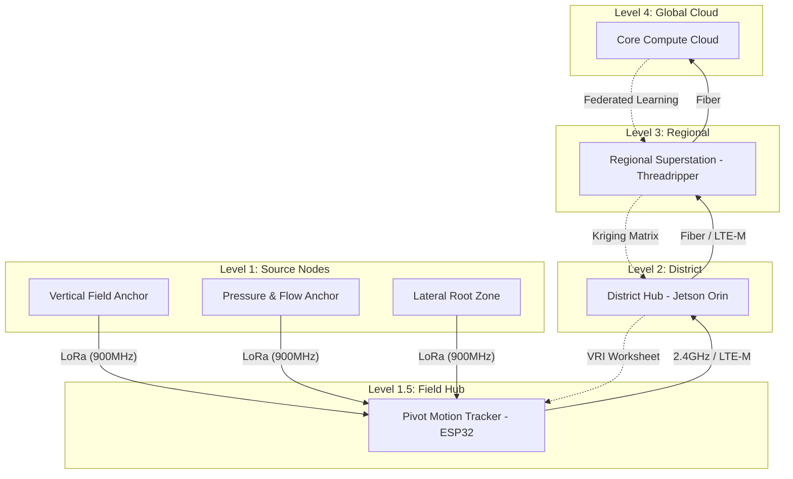

# MASTER SOFTWARE ARCHITECTURE: FarmSense OS & Logic (V2.1)

> **The Single Source of Truth for Software Engines, APIs, and Data Flows**
> Consolidates: ARCHITECTURE.md, BLUEPRINT.md, FEATURESET.md, BACKEND_SERVICE_MAP.md, IMPLEMENTATION_GUIDE.md, and 2 Software KIs.

---

## 1. System Philosophy & Logic Mandate

FarmSense is a **Deterministic Farming Operating System**. It is engineered to replace stochastic "intuition" with a high-fidelity computational engine.

### 1.1 The Deterministic Mandate

- **No Black-Box AI**: All irrigation and trading decisions are deterministic and judgment-based. This is a non-negotiable requirement for **Water Court Admissibility**.
- **Evidence-Grade Tech**: Every packet is signed at the edge (**AES-256**), and every decision is logged in a SHA-256 hash-chained compliance ledger.
- **Explainable Logic**: Operators must be able to audit why a "Soft-Stop" or "VRI-Update" was issued back to raw sensor telemetry.

---

## 2. Tiered Lambda Architecture

FarmSense functions as a decentralized monolithic grid, balancing low-latency edge reflex with high-capacity cloud geostatistics.

### 2.1 Hierarchical Processing Stack

1. **Level 1 (Field):** **LRZ1/LRZ2/VFA/PFA** (LoRa bursts) -> **PMT Hub** (50m Grid, Compliance Baseline). 900MHz **Chirp Spread CSS** security.
2. **Level 2 (District):** **DHUs** (NVIDIA Jetson) -> 20m/10m Grid (Optimization Layer). Localized reflex autonomy.
3. **Level 3 (Regional):** **RSS** (64-Core Threadripper) -> 1m Master Grid + 1cm Point Zoom (Enterprise Tier). Regional DIL vaulting.
4. **Level 4 (Global):** **Core Compute Cloud** -> Multi-field analytics, Federated Learning, global hydro-economics.



### 2.2 Core Software Tier Stack

| Layer | Node | Engine Grade | Role |
| :--- | :--- | :--- | :--- |
| **L0 (Field)** | Sensors | Bare-Metal C | Raw sensing & local deep-sleep management. |
| **L1 (Hub)** | PMT | ESP32-S3 | Reflex Logic (IMU Stall → Stop), 50m Grid Compute. |
| **L2 (District)** | DHU | Orin Nano / Go | 20m/10m Grid Kriging, AllianceChain PBFT Consensus. |
| **L3 (Core Compute Engine)** | RSS / Cloud | Python / FastAPI | 1m Master Grid, Long-term DIL, Legal Vault. |

---

## 3. Data Infrastructure & Schemas

### 3.1 TimescaleDB (Time-Series Telemetry)

Standardized monthly chunking for high-velocity sensor data.

```sql
CREATE TABLE sensor_readings (
    time          TIMESTAMPTZ NOT NULL,
    device_id     UUID NOT NULL,
    field_id      UUID NOT NULL,
    sensor_type   VARCHAR(50), -- 'moisture_10cm', 'moisture_30cm', 'flow_rate'
    value         DOUBLE PRECISION,
    quality_score FLOAT,       -- 0.0 to 1.0 confidence
    metadata      JSONB,       -- RSSI, BatVoltage, ADC_Raw
    PRIMARY KEY (time, device_id, sensor_type)
);
SELECT create_hypertable('sensor_readings', 'time');
```

### 3.2 PostgreSQL (Compliance & Ledger)

Implements blockchain-style hash chaining for tamper-proof regulatory reporting.

```sql
CREATE TABLE compliance_logs (
    id            UUID PRIMARY KEY DEFAULT gen_random_uuid(),
    field_id      UUID REFERENCES fields(id),
    log_time      TIMESTAMPTZ NOT NULL DEFAULT NOW(),
    event_type    VARCHAR(50), -- 'IRRIGATION_EVENT', 'VIOLATION', 'PBFT_COMMIT'
    details       JSONB NOT NULL,
    hash          VARCHAR(64), -- SHA-256 of (details + previous_hash)
    previous_hash VARCHAR(64)
);
```

### 3.3 TimescaleDB Table: `soil_sensor_readings`

(Hypertable chunked by 7 days)

| Column | Type | Index |
| :--- | :--- | :--- |
| `sensor_id` | `UUID` | `BTREE` |
| `timestamp` | `TIMESTAMPTZ` | **Clustered** |
| `field_id` | `VARCHAR(32)` | `HASH` |
| `moisture_surface` | `FLOAT4` | — |
| `moisture_root` | `FLOAT4` | — |
| `location` | `GEOGRAPHY(POINT)` | `GIST` |

---

## 4. Core Software Engines

### 4.1 The Core Compute Engine (Soil-Plant-Atmosphere Continuum Synthesis)

Hosted at `brodiblanco.zo.computer`. Responsible for the **Soil-Plant-Atmosphere Continuum (SPAC)** synthesis and generating the **Unified Freshwater Index (UFI)**.

- **UFI Hex-Fusion**: Real-time synthesis of UN Regulatory Stress, Satellite Moisture, Vapor Pressure Deficit (VPD), AllianceChain Liquidity, and FarmSense Ground-Truth (60% weight).
- **Bayesian Priors**: Establishes moisture probability using historical **Soil Functional Domain (SFD)** profiles and multispectral NDVI baselines.
- **Regression Kriging**: Ordinary Kriging corrects Sentinel-2 trend bias using ground-truth LRZ1/LRZ2/VFA **Dielectric Telemetry**.
- **MAD Framework**: **Management Allowable Depletion (MAD)** — utilizes the soil profile as a "Water Battery" to optimize pumping schedules and prevent permanent wilting points.

### 4.2 Adaptive Recalculation Engine ("Fisherman's Attention")

The PMT continuously executes **Edge-EBK** to generate a 50m-resolution spatial probability grid (16x16 matrix). The execution frequency is dynamically governed by environmental volatility:

| Mode | Trigger Threshold | Logic Execution Frequency |
| :--- | :--- | :--- |
| **Dormant** | Stable soil moisture + Pivot Parked | Every 4 Hours |
| **Anticipatory** | Sunrise / $T > 5^\circ$C rise/hr | Every 60 Minutes |
| **Focus Ripple** | Anomaly detected (>5% deviation) | Every 15 Minutes |
| **Focus Collapse** | Mainline Pressure > 1 PSI / Tower Motion | Every 5 Seconds |

#### Autonomous Edge-EBK Logic

- **FPU Calculation**: The hardware FPU processes **AES-256** chirps from LRZ1/LRZ2/VFA nodes into a localized 16x16 probability matrix.
- **Trajectory Collapse**: In "Collapse" mode, the FPU zeroes calculations on dormant sections, focusing 100% of compute on the active pivot span trajectory.
- **Payload Bundling**: The PMT bundles its own High-Fidelity kinematic data, the processed 50m Edge-EBK arrays, and the intercepted VFA/LRZ intelligence into a unified, encrypted **~187-byte Field State Payload**.
- **LoRa Mesh Backhaul**: Blasts the unified payload to the District Hub (DHU) via 900MHz LoRa Mesh.
- **Zero-Downtime VRI Failover**: Upon loss of DHU mesh-ping, the PMT instantly executes autonomous Variable Rate Irrigation based onlocalized intelligence.
- **Aggregate Harmonic Analysis**: Ingests raw current wave descriptors from the **PFA (Level 1)** and executes **Fast Fourier Transform (FFT)** via vector instructions to detect motor cavitation or bearing failure.
- **Audit Buffering**: Stores all payload state changes to onboard SPI Flash, burst-transmitting the backlog upon reconnection to preserve the State Engineer audit ledger.

### 4.3 Level 1 "Dumb Chirp" Transformation (VFA & PFA)

The Level 1 "Source" nodes (VFA/PFA/LRZ) are optimized for a 10-year battery life and unified silicon (nRF52840):

- **AES-256 Encryption at the Edge**: Independently encrypts the localized payload (Soil Moisture or Wellhead Waveform) before transmission.
- **Dumb Chirp Mode**: Minimizes CPU cycles by transmitting a fixed-length encrypted burst to the overhead PMT Field Hub.
- **Dynamic Ripple Scaling**: Responds to PMT "Ripple" pings, scaling chirp frequency during detected anomalies.
- **LPI/LPD Constraints**: Firmware ensures **Chirp Spread Spectrum (CSS)** conforms to Federal Low Probability of Intercept/Detection standards.

#### Volatility Score Logic (Decision Engine)

`Volatility = (Moisture_Δ_1h * 0.4) + (Irrigation_Active * 0.3) + (VPD_Stress * 0.2) + (Wind_Stress * 0.1)`

- **Score > 0.7** → COLLAPSE
- **Score > 0.3** → ANTICIPATORY
- **Default**    → DORMANT

### 4.3 Decision Engine (Reflex Logic)

Sub-cloud orchestrator evaluation field-state conditions.

- `PMT_STALL` → Issue `ACTUATE_STOP` to PFA Relay.
- `LINE_PRESSURE_MAX` → Issue `REFLEX_STOP`.
- `NOZZLE_DROP` → Trigger VRI recalculation at 1m.

---

## 5. Backend Service Map (`app/services/`)

| Service Module | Function | Algorithm/Tech |
| :--- | :--- | :--- |
| `rss_kriging.py` | 1m Mastering | Scikit-learn GPR (RBF + WhiteKernel) + Spatial Prior Fusion. |
| `csa_alignment.py` | Corner Resolver | Law of Cosines Kinematic Handshake resolving joint elbow to ±0.1°. |
| `trading_service.py` | Water Market | PBFT AllianceChain Consensus on DHU Industrial SSDs. |
| `predictive_maint.py` | Pump Health | Current Harmonic Analysis (NXP M7) detecting torque ripple & cavitation. |
| `spatial_privacy.py` | Data Obfuscation | Contextual Anonymization segregating Legal Ledger from Global Analytics. |
| `globalGAP_compliance` | Certification | Automated 1-click sustainability audit trail generation. |
| `jadc2_adapter.py` | Inter-agency | JADC2 / LPI / LPD tactical environmental tactical translation. |
| `satellite_service` | NDVI/NDWI | Sentinel-2 / Landsat-9 Multi-temporal stack with atmospheric correction. |
| `decision_engine.py` | Reflex Logic | Deterministic rule-based boolean actuation (MAD Framework). |

---

## 6. Security, Authentication & Roles

### 6.1 Authentication (JWT Flow)

- **Backend**: FastAPI + Bcrypt (Cost Rounds = 12).
- **Storage**: `sessionStorage` (Stateless).
- **Secret**: Managed via `JWT_SECRET` environment variable.

### 6.2 Role-Based Access Control (RBAC)

- **INTERNAL**: Full system admin & OTA management.
- **FARMER**: Own field telemetry, VRI command center, trading dashboard.
- **REGULATOR**: Compliance audit viewer, non-repudiable ledger access.
- **INVESTOR**: Regional equity scores, depletion risk, Water-ROI analytics.

---

## 7. Strategic Feature Set

- **UFI (Unified Freshwater Index)**: Proprietary bx3 standard for Fresh Water Availability. Uses Hex-Fusion to prioritize hardware Ground-Truth (60%).
- **Resolution Pop**: Dynamic UI blur/unlock between **50m Compliance (Free/Base)** and **1m Enterprise (Global/Premium)** spatial tiers based on UFI stress levels.
- **AllianceChain**: Peer-to-peer water credit trading rights executed via DHU PBFT consensus.
- **Rapid Deployment/Dual-Use**: JADC2 adapters translate soil trafficability into tactical terrain maps.

---

## 8. 20-Week Implementation Roadmap (SLV Pilot)

### Phase 1: Foundation (Weeks 1-4)

- **Week 1-2**: Deploy unified CSE stack on `brodiblanco.zo.computer`. Setup Monitoring (Prometheus/Grafana).
- **Week 3-4**: Implement JWT Auth & core SQLAlchemy models for sensor readings.

### Phase 2: Ingestion & Kriging (Weeks 5-8)

- **Week 5**: Implement high-velocity Sensor Ingestion API (Target: 10K pings/sec).
- **Week 6-8**: Deploy 20m Edge Kriging on Jetson Hubs. Integrate Sentinel-2 cloud-filtering (30% threshold).

### Phase 3: Analytics & Reflex (Weeks 9-12)

- **Week 9-10**: Adaptive Recalculation Engine validation (Dormant → Collapse).
- **Week 11-12**: Decision Engine "Soft-Stop" field trials.

### Phase 4: Portals & Compliance (Weeks 13-16)

- **Week 13-14**: Farmer Dashboard (React 18 + MapLibre GL JS).
- **Week 15**: Regulatory Portal for SLV 2026 Water Court hearings.
- **Week 16**: Security penetration testing & UAT with pilot farmers.

### Phase 5: Optimization & Rollout (Weeks 17-20)

- **Week 17-18**: Performance tuning (Kriging < 5 min/field).
- **Week 19**: Trainer-the-trainer manual generation.
- **Week 20**: **CSU SLV Research Center Pilot Launch** (2 Center Pivots, Full Stack).

---

## 9. Performance & Health Targets

| Metric | Target | Critical Threshold |
| :--- | :--- | :--- |
| **API Response (p95)** | < 200ms | 500ms |
| **20m Grid Calc** | < 30 sec | 60 sec |
| **1m Grid Master** | < 5 min | 10 min |
| **Sensor Ingestion** | 10,000 / sec | 5,000 / sec |
| **System Uptime** | 99.9% | 99.5% |

---

## 10. CI/CD & Deployment Strategy

Automated deployment is managed via GitHub Actions to the CSE/Zo stack.

### 10.1 Environment Configuration

- **RDC (Oracle)**: Public IP for Map Database. Requires `POSTGRES_USER`, `POSTGRES_PASSWORD`.
- **Core Compute Engine**: Core Application Server. Requires `MAP_DATABASE_URL` pointing to the RDC.

### 10.2 Deployment Workflow

1. **Push to `main`**: Triggers GitHub Action.
2. **Step 1 (Validate)**: Lints and unit tests (Pytest/Jest).
3. **Step 2 (Deploy-RDC)**: Deploys `docker-compose.oracle.yml` to the map stack.
4. **Step 3 (Deploy-Zo)**: Deploys `docker-compose.zo.yml` to the core platform.

---

## 11. AI Agent Coordination (SOP)

This section contains critical invariants for AI Assistants (antigravity/cortex) operating within the FarmSense codebase.

### 11.1 The "Before Creating" Rule

Before creating ANY new file, route, or service:

1. **Audit Documentation**: Start at `README.md` → 4 Masters.
2. **Verify Routes**: Check `app/api/main.py` for existing endpoint definitions.
3. **Grep Search**: Sweep the workspace for similar logic/classes. **Assumption is always that it already exists.**

### 11.2 Core Invariants

- **No Dependencies**: Do not add external Python or JS libraries without explicit architectural review.
- **Deterministic Logic**: Never propose or implement black-box ML for irrigation or ledger decision points.
- **Version Integrity**: Maintain the Master Documents as the *only* authoritative technical specifications. Any engineering change must be reflected in the relevant Master first.

## 12. Hybrid Cloud Deployment (Zo + RDC)

FarmSense utilizes a split-deployment architecture to separate compute-heavy processing from geospatial data services.

### 12.1 RDC Cloud (Map Stack)

Hosts the PostGIS database and tile-service engine.

- **Port 5432**: Database access.
- **Port 8001**: Tile serving.
- **Path**: `farmsense-code/deployment/docker/docker-compose.rdc.yml`

### 12.2 Zo Server (Core Platform)

Hosts the FastAPI engine, React frontend, and Audit ledger.

- **Environment**: `MAP_DATABASE_URL` must point to the RDC instance.
- **Path**: `farmsense-code/deployment/docker/docker-compose.cse.yml`

---
*Classification: Master Software Asset | Single Source of Truth | Approved 2026-03-07*
